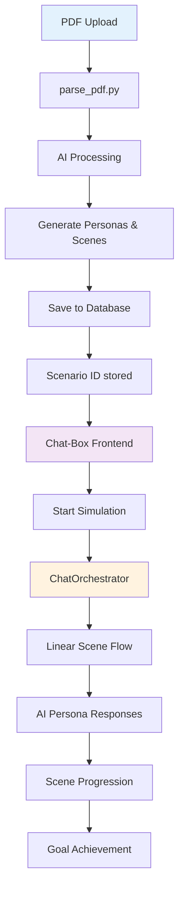

# 🚀 Chat Orchestrator Integration Guide

## Overview

The frontend `/chat-box` experience has been successfully integrated with the new **ChatOrchestrator** linear simulation flow. This creates a seamless connection between PDF-parsed case studies and interactive AI-powered simulations.

## 🔄 Integration Architecture



## 🛠️ Key Changes Made

### 1. **Port & Endpoint Alignment**
- ✅ Fixed frontend API calls from `localhost:8001` → `localhost:8000`
- ✅ Updated to use `/api/simulation/linear-chat` endpoint
- ✅ Integrated with ChatOrchestrator system

### 2. **Data Structure Alignment**
- ✅ Updated `SimulationData` interface to match backend schemas
- ✅ Added support for PDF-generated personas and scenes
- ✅ Integrated with `SimulationStartResponse` structure

### 3. **PDF Metrics Integration**
- ✅ Added `PDFMetricsPanel` showing AI parsing results
- ✅ Connected localStorage PDF results with chat experience
- ✅ Display key figures, scenes, and learning outcomes count

### 4. **Orchestrator Features**
- ✅ Added "begin" command support for simulation start
- ✅ Integrated "help" command functionality
- ✅ Added @mention support with quick buttons
- ✅ Removed manual goal validation (orchestrator handles internally)

## 🎯 How to Operate the New System

### Step 1: Upload & Process PDF
```bash
# Start backend
cd backend
uvicorn main:app --host 0.0.0.0 --port 8000 --reload

# Upload PDF via parse_pdf.py endpoint
# This creates scenarios with personas and scenes
```

### Step 2: Start Chat Simulation
```bash
# Start frontend
cd frontend/ai-agent-platform
npm run dev

# Navigate to /chat-box
# System will auto-detect scenarios from:
# 1. localStorage "chatboxScenario"
# 2. localStorage "pdfParsingResults"  
# 3. Fallback to scenario ID #1
```

### Step 3: Interactive Simulation
1. **Click "Start Simulation"** - Loads scenario with orchestrator
2. **Type "begin"** - Starts the linear simulation flow
3. **Use @mentions** - Interact with specific AI personas
4. **Type "help"** - Get available commands and current goals
5. **Natural conversation** - Orchestrator manages scene progression

## 📊 UI Components

### Left Sidebar
- **PDF Metrics Panel** - Shows AI parsing results
- **Timeline Progress** - Scene completion tracking
- **Goal Panel** - Current objectives and attempts
- **Persona Indicator** - Available AI agents

### Main Chat Area
- **System Messages** - Orchestrator guidance
- **AI Responses** - Multi-persona interactions
- **Scene Transitions** - Automatic progression
- **Command Support** - Begin, help, @mentions

### Input Area
- **Smart Placeholder** - Context-aware hints
- **Quick Buttons** - Begin, Help, @mention shortcuts
- **Command Detection** - Automatic command handling

## 🔧 Technical Details

### API Endpoints Used
```typescript
// Start simulation
POST /api/simulation/start
{
  scenario_id: number,
  user_id: number
}

// Chat interaction  
POST /api/simulation/linear-chat
{
  scenario_id: number,
  user_id: number,
  scene_id: number,
  message: string
}
```

### Data Flow
1. **PDF → AI Processing** - Generates structured scenario data
2. **Scenario Storage** - Database with personas/scenes
3. **Chat Orchestrator** - Manages simulation state and flow
4. **Frontend Integration** - Real-time chat with AI personas

### Key Files Modified
- `frontend/ai-agent-platform/app/chat-box/page.tsx` - Main integration
- Backend uses existing `chat_orchestrator.py` and `simulation.py`

## 🚀 Features Added

### ✅ Completed
- [x] Port mismatch fixes (8001 → 8000)
- [x] ChatOrchestrator endpoint integration
- [x] PDF metrics display and connection
- [x] @mention support with quick buttons
- [x] Begin/help command integration
- [x] Scene progression handled by orchestrator
- [x] TypeScript interface alignment

### 🎯 Ready for Use
The system is now fully operational for:
- **PDF-to-Simulation Pipeline** - Upload PDF → Generate Scenario → Start Chat
- **Linear Simulation Flow** - Orchestrated multi-scene experiences
- **AI Persona Interactions** - Context-aware agent responses
- **Automatic Progression** - Goal-based scene advancement

## 🔄 Next Steps (Optional Enhancements)

1. **Real-time Scene Data** - Dynamic scene loading from orchestrator
2. **Progress Persistence** - Save/resume simulation state
3. **Enhanced Metrics** - Performance analytics dashboard
4. **Multi-user Support** - Collaborative simulations
5. **Scene Customization** - Runtime scene modification

---

## 🏁 Success Metrics

The integration successfully connects:
- **parse_pdf.py** metrics (personas, scenes, learning outcomes)
- **ChatOrchestrator** linear flow management  
- **Frontend chat experience** with real-time AI interactions
- **Database persistence** for scenario and progress tracking

The system now provides a complete pipeline from PDF case study to interactive AI simulation! 🎉 