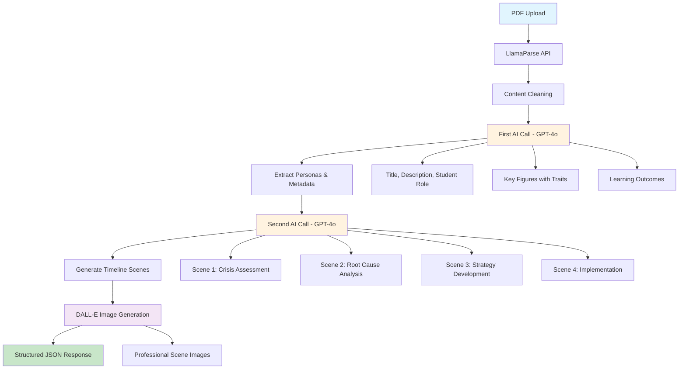

# PDF Parser Architecture

## Overview

The PDF parser transforms business case study PDFs into interactive educational scenarios through a multi-stage AI processing pipeline. It extracts content, generates personas, creates timeline scenes, and produces visual assets for immersive learning experiences.

## Architecture Flow



## Key Components

### 1. **PDF Processing** (`LlamaParse`)
- Converts PDF to clean markdown
- Handles complex layouts and tables
- Preserves document structure

### 2. **Content Preprocessing**
- Removes metadata and formatting artifacts
- Extracts title from headers
- Cleans and normalizes text content

### 3. **Two-Stage AI Processing**
- **Stage 1**: Extracts personas, roles, and case overview
- **Stage 2**: Generates 4 interactive timeline scenes with specific goals

### 4. **Image Generation** (`DALL-E 3`)
- Creates professional scene illustrations
- Parallel processing for performance
- Business-appropriate visual style

### 5. **Response Structure**
```json
{
  "title": "Case Study Title",
  "description": "Comprehensive case overview",
  "student_role": "Decision maker role",
  "key_figures": [...], // Personas with traits
  "scenes": [...],      // Timeline with images
  "learning_outcomes": [...]
}
```

## Performance Features

- **Parallel Processing**: Multiple files and images processed simultaneously
- **Robust Error Handling**: Fallback scenes if AI generation fails
- **Comprehensive Logging**: Detailed debugging for troubleshooting
- **Token Optimization**: Efficient prompt engineering for consistent results

## API Endpoint

`POST /api/parse-pdf/` - Accepts multipart form data with PDF files and returns structured scenario data ready for the frontend scenario builder. 