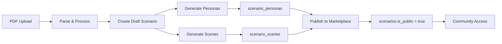

# Current Database Schema Analysis

## Overview

The existing database is designed for a **CrewAI Agent Builder Platform** with comprehensive user management, agent/tool sharing, and simulation execution. It has a solid foundation that we can extend for our **PDF-to-Scenario Publishing** solution.

## Current Schema Structure

### **Core Tables**
- **Users** - User accounts with community features
- **Scenarios** - Business case scenarios (basic structure exists)
- **Agents** - AI agents with sharing/rating capabilities  
- **Tools** - Reusable tools with community features
- **Tasks** - Scenario tasks with dependencies
- **Simulations** - Execution tracking and results

### **Community Features** 
- **Reviews** (AgentReview, ToolReview) - Rating and feedback system
- **Collections** - Curated bundles of content
- **Templates** - Pre-built agent/task templates
- **Favorites** - User bookmarking system

### **Advanced Features**
- **Versioning** - Content version control
- **Fallbacks** - Graceful error handling
- **Public/Private** sharing controls
- **Usage analytics** and community metrics

## Gap Analysis for PDF-to-Scenario Publishing

### ✅ **What We Already Have**

1. **User Management** - Complete authentication and profiles
2. **Scenario Foundation** - Basic scenario structure with sharing
3. **Community Features** - Rating, reviews, public/private controls
4. **Usage Analytics** - Download counts, usage tracking

### ❌ **What's Missing for Our Use Case**

1. **Personas/Characters** - No table for case study personas
2. **Timeline Scenes** - No structure for sequential scenario scenes  
3. **Image Storage** - No handling for AI-generated scene images
4. **PDF Metadata** - Limited PDF processing tracking
5. **Scenario Categories** - No business case categorization
6. **Scene Interactions** - No persona-scene relationships

## Required Schema Extensions

### **New Tables Needed**

```sql
-- Store personas/characters from PDF processing
CREATE TABLE scenario_personas (
    id INTEGER PRIMARY KEY,
    scenario_id INTEGER REFERENCES scenarios(id),
    name VARCHAR NOT NULL,
    role VARCHAR NOT NULL,
    background TEXT,
    correlation TEXT,
    primary_goals JSON,
    personality_traits JSON,  -- {analytical: 8, creative: 7, ...}
    created_at TIMESTAMP DEFAULT NOW()
);

-- Store timeline scenes for scenarios
CREATE TABLE scenario_scenes (
    id INTEGER PRIMARY KEY,
    scenario_id INTEGER REFERENCES scenarios(id),
    title VARCHAR NOT NULL,
    description TEXT NOT NULL,
    user_goal TEXT,
    scene_order INTEGER DEFAULT 0,
    image_url VARCHAR,  -- DALL-E generated image
    estimated_duration INTEGER,  -- minutes
    created_at TIMESTAMP DEFAULT NOW()
);

-- Link personas to scenes (many-to-many)
CREATE TABLE scene_personas (
    scene_id INTEGER REFERENCES scenario_scenes(id),
    persona_id INTEGER REFERENCES scenario_personas(id),
    involvement_level VARCHAR DEFAULT 'participant',  -- key, participant, mentioned
    PRIMARY KEY (scene_id, persona_id)
);

-- Store original PDF files and processing metadata
CREATE TABLE scenario_files (
    id INTEGER PRIMARY KEY,
    scenario_id INTEGER REFERENCES scenarios(id),
    filename VARCHAR NOT NULL,
    file_path VARCHAR,  -- Local storage path
    file_size INTEGER,
    original_content TEXT,  -- Raw PDF content
    processed_content TEXT,  -- Cleaned content
    processing_status VARCHAR DEFAULT 'pending',
    processing_log JSON,  -- AI processing details
    created_at TIMESTAMP DEFAULT NOW()
);
```

### **Schema Modifications Needed**

```sql
-- Extend scenarios table for better categorization
ALTER TABLE scenarios ADD COLUMN category VARCHAR;  -- Leadership, Strategy, Operations, etc.
ALTER TABLE scenarios ADD COLUMN difficulty_level VARCHAR;  -- Beginner, Intermediate, Advanced  
ALTER TABLE scenarios ADD COLUMN student_role VARCHAR;  -- Role student assumes
ALTER TABLE scenarios ADD COLUMN estimated_duration INTEGER;  -- Total scenario time
ALTER TABLE scenarios ADD COLUMN tags JSON;  -- Searchable tags
ALTER TABLE scenarios ADD COLUMN rating_avg FLOAT DEFAULT 0.0;
ALTER TABLE scenarios ADD COLUMN rating_count INTEGER DEFAULT 0;

-- Add PDF processing specific fields
ALTER TABLE scenarios ADD COLUMN pdf_title VARCHAR;  -- Extracted from PDF
ALTER TABLE scenarios ADD COLUMN pdf_source VARCHAR;  -- Harvard, Wharton, etc.
ALTER TABLE scenarios ADD COLUMN processing_version VARCHAR DEFAULT '1.0';  -- AI model version used
```

## Publishing Workflow Integration

### **Existing Features We Can Leverage**

1. **User System** ✅
   - `users.id` for scenario ownership
   - `users.reputation_score` for creator credibility
   - `users.public_agents_count` → extend to `public_scenarios_count`

2. **Sharing Controls** ✅  
   - `scenarios.is_public` for marketplace visibility
   - `scenarios.allow_remixes` for derivative works
   - `scenarios.usage_count` for popularity tracking

3. **Community Features** ✅
   - Review system (can extend to scenario reviews)
   - Collections (can include scenarios)
   - Favorites system (can add scenario favorites)

### **New API Endpoints Needed**

```python
# Publishing endpoints
POST /api/scenarios/publish          # Convert draft to published
GET  /api/scenarios/marketplace      # Browse published scenarios
GET  /api/scenarios/{id}/personas    # Get scenario personas
GET  /api/scenarios/{id}/scenes      # Get scenario timeline
POST /api/scenarios/{id}/clone       # Clone scenario for editing

# Extended endpoints  
POST /api/scenarios/{id}/reviews     # Rate/review scenarios
GET  /api/scenarios/categories       # Get available categories
GET  /api/scenarios/search           # Advanced search with filters
```

## Migration Strategy

### **Phase 1: Core Extensions**
1. Add new tables (personas, scenes, files)
2. Extend scenarios table with new fields
3. Create basic CRUD operations

### **Phase 2: Publishing Features**
1. Implement publish/draft workflow
2. Add marketplace browsing
3. Create scenario cloning system

### **Phase 3: Community Integration**
1. Add scenario reviews/ratings
2. Extend collections to include scenarios
3. Add advanced search and filtering

## Data Flow Integration



The existing schema provides an excellent foundation with user management, sharing controls, and community features already built. We just need to add the scenario-specific tables for personas, scenes, and files to complete the publishing solution. 