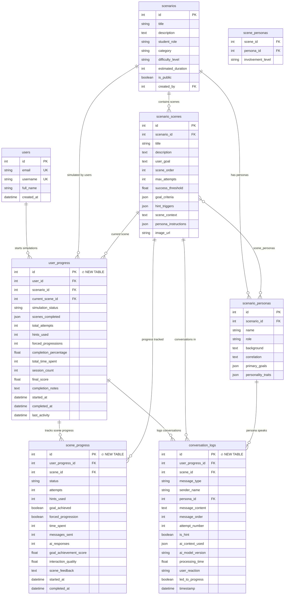
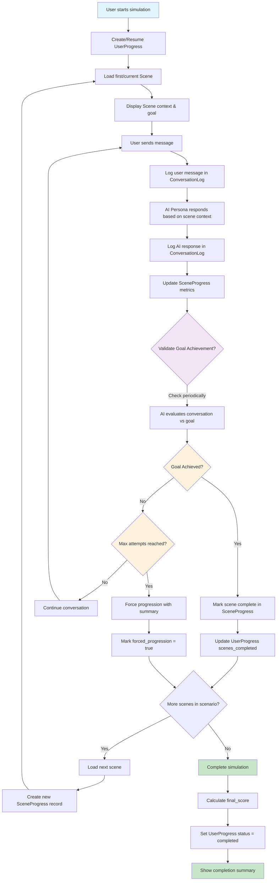

# Database Schema Diagrams

This document contains visual representations of the AI Agent Education Platform database schema, including the new sequential simulation system.

## Complete Database Schema

All tables and relationships in the platform:

```mermaid
erDiagram
    users {
        int id PK
        string email UK
        string full_name
        string username UK
        string password_hash
        text bio
        string avatar_url
        string role
        int public_agents_count
        int public_tools_count
        int total_downloads
        float reputation_score
        boolean profile_public
        boolean allow_contact
        boolean is_active
        boolean is_verified
        datetime created_at
        datetime updated_at
    }
    
    scenarios {
        int id PK
        string title
        text description
        text challenge
        string industry
        json learning_objectives
        string source_type
        text pdf_content
        string student_role
        string category
        string difficulty_level
        int estimated_duration
        json tags
        string pdf_title
        string pdf_source
        string processing_version
        float rating_avg
        int rating_count
        boolean is_public
        boolean is_template
        boolean allow_remixes
        int usage_count
        int clone_count
        int created_by FK
        datetime created_at
        datetime updated_at
    }
    
    scenario_personas {
        int id PK
        int scenario_id FK
        string name
        string role
        text background
        text correlation
        json primary_goals
        json personality_traits
        datetime created_at
        datetime updated_at
    }
    
    scenario_scenes {
        int id PK
        int scenario_id FK
        string title
        text description
        text user_goal
        int scene_order
        int estimated_duration
        json goal_criteria
        int max_attempts
        float success_threshold
        json hint_triggers
        text scene_context
        json persona_instructions
        string image_url
        text image_prompt
        datetime created_at
        datetime updated_at
    }
    
    scene_personas {
        int scene_id FK
        int persona_id FK
        string involvement_level
        datetime created_at
    }
    
    scenario_files {
        int id PK
        int scenario_id FK
        string filename
        string file_path
        int file_size
        string file_type
        text original_content
        text processed_content
        string processing_status
        json processing_log
        string llamaparse_job_id
        datetime uploaded_at
        datetime processed_at
    }
    
    scenario_reviews {
        int id PK
        int scenario_id FK
        int reviewer_id FK
        int rating
        text review_text
        json pros
        json cons
        string use_case
        int helpful_votes
        int total_votes
        datetime created_at
    }
    
    user_progress {
        int id PK
        int user_id FK
        int scenario_id FK
        int current_scene_id FK
        string simulation_status
        json scenes_completed
        int total_attempts
        int hints_used
        int forced_progressions
        float completion_percentage
        float average_attempts_per_scene
        int total_time_spent
        int session_count
        datetime last_activity
        float final_score
        text completion_notes
        datetime started_at
        datetime completed_at
        datetime created_at
        datetime updated_at
    }
    
    scene_progress {
        int id PK
        int user_progress_id FK
        int scene_id FK
        string status
        int attempts
        int hints_used
        boolean goal_achieved
        boolean forced_progression
        int time_spent
        int messages_sent
        int ai_responses
        float goal_achievement_score
        float interaction_quality
        text scene_feedback
        datetime started_at
        datetime completed_at
        datetime created_at
        datetime updated_at
    }
    
    conversation_logs {
        int id PK
        int user_progress_id FK
        int scene_id FK
        string message_type
        string sender_name
        int persona_id FK
        text message_content
        int message_order
        int attempt_number
        boolean is_hint
        json ai_context_used
        string ai_model_version
        float processing_time
        string user_reaction
        boolean led_to_progress
        datetime timestamp
    }

    %% Relationships
    users ||--o{ scenarios : creates
    users ||--o{ scenario_reviews : writes
    users ||--o{ user_progress : tracks
    
    scenarios ||--o{ scenario_personas : contains
    scenarios ||--o{ scenario_scenes : contains
    scenarios ||--o{ scenario_files : has
    scenarios ||--o{ scenario_reviews : receives
    scenarios ||--o{ user_progress : tracked_in
    
    scenario_scenes ||--o{ scene_progress : tracked_in
    scenario_scenes ||--o{ conversation_logs : occurs_in
    scenario_scenes }o--o{ scenario_personas : scene_personas
    
    scenario_personas ||--o{ conversation_logs : speaks_in
    
    user_progress ||--o{ scene_progress : contains
    user_progress ||--o{ conversation_logs : generates
```

## Sequential Simulation System Focus

New tables added for the simulation system:

## Simulation Flow Diagram

How the sequential simulation system works:

## Key Tables Overview

### New Simulation Tables

- **`user_progress`**: Overall simulation tracking per user/scenario
- **`scene_progress`**: Detailed progress per scene with performance metrics  
- **`conversation_logs`**: Complete conversation history with AI personas

### Enhanced Existing Tables

- **`scenario_scenes`**: Added simulation-specific fields (goal_criteria, max_attempts, success_threshold, etc.)
- **`users`**: Linked to progress tracking system

### Core Relationships

1. **User → UserProgress → SceneProgress** (Progress tracking chain)
2. **Scenario → Scenes → Personas** (Content structure)
3. **ConversationLogs** connect to all simulation entities
4. **Performance indexes** for optimal query performance

This schema enables comprehensive user tracking, multi-persona AI interactions, goal-based progression, and detailed analytics for the sequential timeline simulation system. 