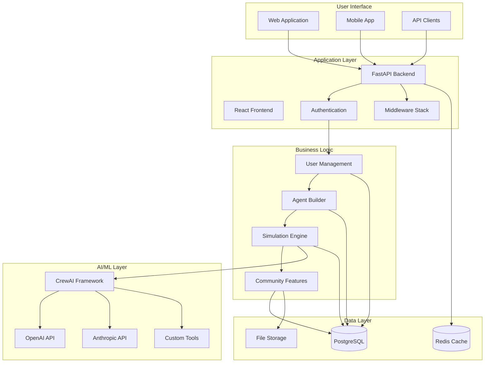
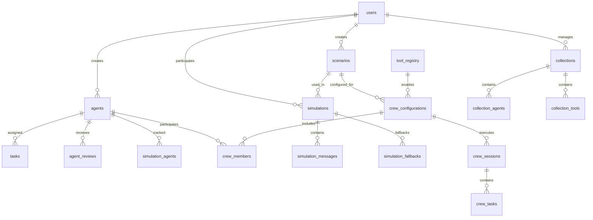
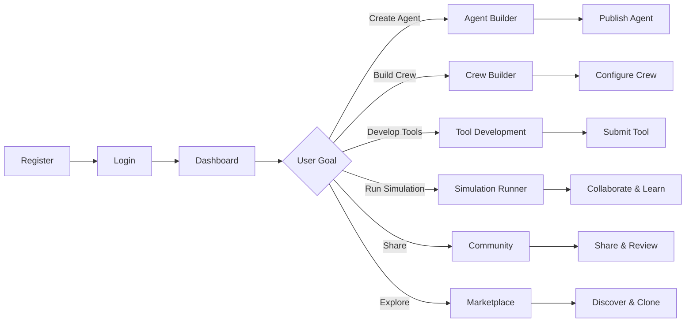
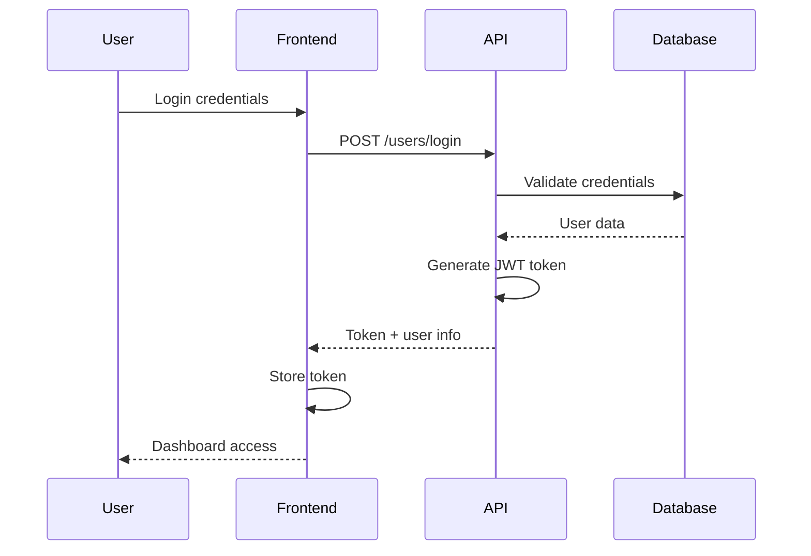
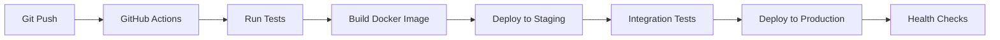

# Architecture Documentation

## Overview

Welcome to the comprehensive architecture documentation for the CrewAI Agent Builder Platform. This documentation provides detailed insights into the system design, database architecture, user workflows, and development guidelines.

## 📚 Documentation Structure

### Core Architecture Documents

| Document | Description | Key Features |
|----------|-------------|--------------|
| **[System Overview](./system-overview.md)** | High-level system architecture and technology stack | Architecture diagrams, scalability considerations, security layers |
| **[Database Schema](./database-schema.md)** | Complete database design with ERD and relationships | 15+ tables, marketplace features, resource tracking |
| **[User Workflows](./user-workflow.md)** | Visual user journey flows and interaction patterns | Mermaid diagrams, persona-based workflows, error handling |

### API & Development

| Document | Description | Key Features |
|----------|-------------|--------------|
| **[API Reference](../API_Reference.md)** | Complete REST API documentation | 25+ endpoints, authentication, examples, SDKs |
| **[Developer Guide](../Developer_Guide.md)** | Development setup, testing, and deployment | Quick start, testing strategy, code standards |
| **[API Testing Guide](../API_Testing_Guide.md)** | Practical API testing examples | PowerShell/curl commands, workflow testing |

## 🚀 Platform Architecture

### System Components



## 🎯 Key Platform Features

### 1. **User Management & Authentication**
- JWT-based authentication system
- Role-based access control (user/admin)
- Profile management with privacy controls
- Email verification and password reset

### 2. **AI Agent Builder (CrewAI-Aligned)**
- Visual agent creation interface focused on roles and capabilities
- Custom tool integration
- Template system for reusable agents
- **Agents are reusable across different scenarios**
- Version control and remixing capabilities

### 3. **Business Scenario Management (Task-Centric)**
- Manual scenario creation with integrated task definition
- **Tasks are defined within scenarios, not tied to individual agents**
- PDF document processing with AI task extraction
- Learning objectives and task dependency configuration
- **Tasks can be assigned to specific agents or handled collaboratively by crews**
- Public/private sharing options

### 4. **CrewAI Multi-Agent System**
- Business crew templates (Launch, Crisis, Innovation, Strategic Planning)
- Sequential, hierarchical, and collaborative processes
- Real-time crew collaboration with role-based interactions
- Advanced tool ecosystem with community contributions

### 5. **Simulation Engine**
- Individual agent and crew-based simulations
- Real-time chat with AI crews
- Resource tracking and fallback strategies
- Session management and collaboration metrics

### 6. **Community Marketplace**
- Public sharing of agents, tools, scenarios, and crew configurations
- Rating and review system
- Collections and favorites
- Content discovery and search
- Community tool contribution framework

## 📊 Database Architecture

### Core Data Models

The platform uses a comprehensive PostgreSQL schema with 20+ interconnected tables:



### Key Database Features
- **Marketplace Support**: Public/private content, ratings, reviews
- **CrewAI Integration**: Crew configurations, sessions, and task tracking
- **Tool Ecosystem**: Community tool registry and contribution framework
- **Resource Tracking**: Snapshots for simulation execution
- **Fallback Strategies**: Handle missing or private resources
- **Version Control**: Track changes and allow remixing
- **Community Features**: Collections, favorites, user reputation

## 🔧 Technology Stack

### Backend Technologies
- **FastAPI** - High-performance web framework
- **SQLAlchemy** - Database ORM with PostgreSQL
- **CrewAI** - Multi-agent AI framework
- **Pydantic** - Data validation and serialization
- **JWT** - Authentication and authorization

### Frontend Technologies
- **React 18** - Modern UI framework
- **TypeScript** - Type-safe JavaScript
- **Material-UI** - Component library
- **React Router** - Client-side routing
- **Axios** - HTTP client

### AI/ML Technologies
- **OpenAI API** - GPT models for text generation
- **Anthropic API** - Claude models for reasoning
- **LangChain** - AI application framework
- **Custom Tools** - Extensible tool system

### Infrastructure
- **PostgreSQL** - Primary database (Neon cloud)
- **Redis** - Caching and session storage
- **Docker** - Containerization
- **GitHub Actions** - CI/CD pipeline

## 🏗️ Development Workflow

### Quick Start for Developers

```bash
# 1. Clone and setup backend
git clone <repo-url>
cd backend
python -m venv venv
source venv/bin/activate
pip install -r requirements.txt

# 2. Configure environment
cp .env.example .env
# Edit .env with your database credentials

# 3. Run backend
uvicorn main:app --reload

# 4. Setup frontend
cd ../frontend
npm install
npm start
```

### Testing Strategy

```bash
# Run all tests
pytest

# Run with coverage
pytest --cov=. --cov-report=html

# Run specific test categories
pytest unit_tests/auth/
pytest unit_tests/api/
pytest unit_tests/core/
```

## 🎨 User Experience Design

### User Personas

1. **Educator** - Creates educational scenarios for classroom use
2. **Student** - Participates in simulations for learning
3. **Developer** - Builds custom agents and tools
4. **Business Professional** - Uses simulations for training

### User Journey Flow



## 🔐 Security Architecture

### Authentication & Authorization
- **JWT Tokens** - Stateless authentication
- **Role-Based Access** - User/admin permissions
- **Rate Limiting** - API abuse prevention
- **Input Validation** - SQL injection prevention

### Data Protection
- **Password Hashing** - Bcrypt encryption
- **Data Encryption** - At rest and in transit
- **Privacy Controls** - User data protection
- **Audit Logging** - Security event tracking

## 📈 Performance & Scalability

### Optimization Strategies
- **Database Indexing** - Optimized query performance
- **Connection Pooling** - Efficient database connections
- **Caching Layer** - Redis for frequently accessed data
- **Async Processing** - Non-blocking operations

### Scalability Considerations
- **Horizontal Scaling** - Multiple server instances
- **Load Balancing** - Request distribution
- **Database Sharding** - Data partitioning
- **CDN Integration** - Static asset delivery

## 🔧 API Architecture

### RESTful API Design
- **Resource-Based URLs** - `/users/`, `/agents/`, `/simulations/`
- **HTTP Methods** - GET, POST, PUT, DELETE
- **Status Codes** - Proper HTTP response codes
- **Error Handling** - Consistent error responses

### Authentication Flow


## 📱 Frontend Architecture

### Component Structure
```
src/
├── components/
│   ├── AgentBuilder/
│   ├── SimulationRunner/
│   ├── Community/
│   └── Common/
├── services/
│   ├── api.ts
│   ├── auth.ts
│   └── storage.ts
├── hooks/
│   ├── useAuth.ts
│   ├── useApi.ts
│   └── useSimulation.ts
└── utils/
    ├── validation.ts
    ├── formatting.ts
    └── constants.ts
```

### State Management
- **React Hooks** - Local component state
- **Context API** - Global state management
- **Custom Hooks** - Reusable logic
- **Local Storage** - Client-side persistence

## 🔍 Testing Architecture

### Test Categories
- **Unit Tests** - Individual component testing
- **Integration Tests** - Component interaction testing
- **API Tests** - Endpoint functionality testing
- **End-to-End Tests** - Complete workflow testing

### Test Structure
```
unit_tests/
├── auth/                    # Authentication tests
├── api/                     # API endpoint tests
├── core/                    # Core functionality tests
└── integration/             # Integration tests
```

## 🚀 Deployment Architecture

### Environment Structure
- **Development** - Local development environment
- **Staging** - Production-like testing environment
- **Production** - Live production environment

### Deployment Pipeline


## 📖 Documentation Navigation

### Getting Started
1. **[Quick Start](../Developer_Guide.md#quick-start)** - Get up and running in 5 minutes
2. **[API Reference](../API_Reference.md)** - Complete API documentation
3. **[Database Schema](./database-schema.md)** - Understand the data model

### Development
1. **[Developer Guide](../Developer_Guide.md)** - Complete development setup
2. **[Testing Guide](../Developer_Guide.md#testing-strategy)** - Testing strategies and examples
3. **[API Testing](../API_Testing_Guide.md)** - Practical API testing examples

### Architecture
1. **[System Overview](./system-overview.md)** - High-level system architecture
2. **[Database Design](./database-schema.md)** - Complete database schema
3. **[User Workflows](./user-workflow.md)** - Visual workflow diagrams

## 🛠️ Development Tools

### Required Tools
- **Python 3.11+** - Backend development
- **Node.js 18+** - Frontend development
- **PostgreSQL** - Database (local or Neon cloud)
- **Git** - Version control

### Recommended Tools
- **VS Code** - Code editor with extensions
- **Postman** - API testing
- **Docker** - Containerization
- **GitHub Desktop** - Git GUI

## 🔄 Continuous Integration

### CI/CD Pipeline
- **GitHub Actions** - Automated testing and deployment
- **Code Quality** - Black formatting, flake8 linting
- **Security Scanning** - Vulnerability detection
- **Performance Testing** - Load testing

### Quality Gates
- **All Tests Pass** - Unit, integration, and API tests
- **Code Coverage** - Minimum 80% coverage
- **Security Scan** - No high-severity vulnerabilities
- **Performance** - Response time under 200ms

## 📊 Monitoring & Analytics

### Application Monitoring
- **Health Checks** - System status monitoring
- **Performance Metrics** - Response time tracking
- **Error Tracking** - Exception monitoring
- **User Analytics** - Feature usage tracking

### Business Metrics
- **User Engagement** - Active users, session duration
- **Content Performance** - Popular agents, scenarios
- **Community Growth** - User acquisition, retention
- **Platform Usage** - Simulation frequency, success rates

## 🤝 Contributing

### Development Process
1. **Fork Repository** - Create your own copy
2. **Create Feature Branch** - Work on isolated features
3. **Follow Standards** - Code style and testing requirements
4. **Submit Pull Request** - Code review process

### Code Standards
- **Python** - Black formatting, type hints, docstrings
- **TypeScript** - Strict typing, ESLint rules
- **Testing** - Minimum 80% test coverage
- **Documentation** - Update relevant documentation

---

## 📞 Support & Community

### Getting Help
- **[GitHub Issues](https://github.com/yourusername/crewai-platform/issues)** - Bug reports and feature requests
- **[Discord Server](https://discord.gg/crewai)** - Community discussions
- **[Documentation](https://docs.crewai-platform.com)** - Comprehensive guides

### Contributing
- **[Contributing Guidelines](../CONTRIBUTING.md)** - How to contribute
- **[Code of Conduct](../CODE_OF_CONDUCT.md)** - Community standards
- **[Security Policy](../SECURITY.md)** - Security vulnerability reporting

---

This documentation is continuously updated as the platform evolves. For the latest information, please check the [GitHub repository](https://github.com/yourusername/crewai-platform) and join our community discussions. 