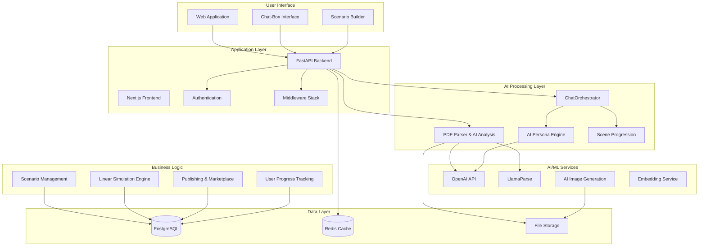
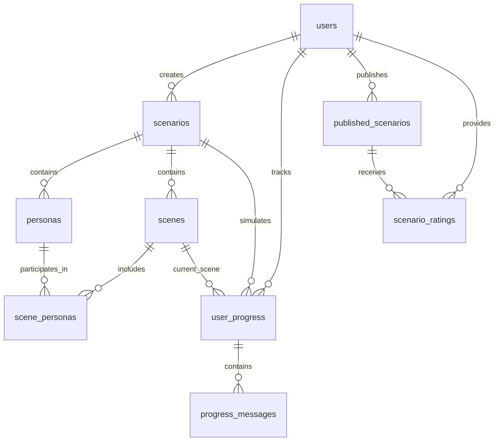
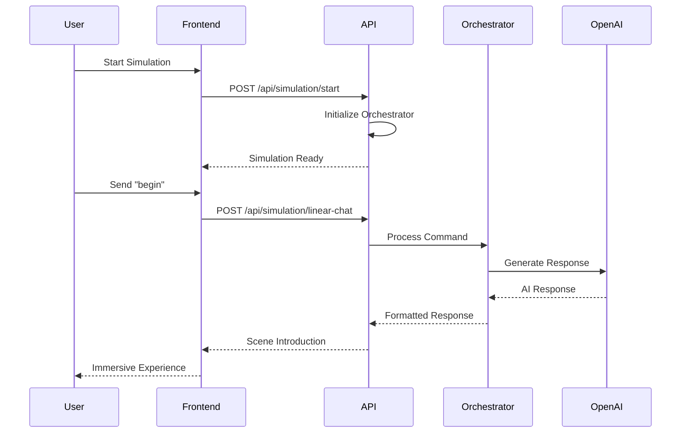
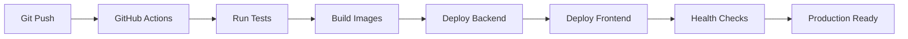

# Architecture Documentation

## Overview

Welcome to the comprehensive architecture documentation for the **AI Agent Education Platform**. This documentation provides detailed insights into the system design, database architecture, user workflows, and development guidelines for our **PDF-to-simulation pipeline** with integrated **ChatOrchestrator** system.

## 📚 Documentation Structure

### Core Architecture Documents

| Document | Description | Key Features |
|----------|-------------|--------------|
| **[System Overview](./system-overview.md)** | High-level system architecture and technology stack | ChatOrchestrator architecture, PDF processing pipeline, linear simulation flow |
| **[Database Schema](./database-schema.md)** | Complete database design with ERD and relationships | Scenario/persona/scene models, user progress tracking, simulation state |
| **[User Workflows](./user-workflow.md)** | Visual user journey flows and interaction patterns | PDF upload → AI processing → simulation creation → linear chat experience |

### API & Development

| Document | Description | Key Features |
|----------|-------------|--------------|
| **[API Reference](../API_Reference.md)** | Complete REST API documentation | PDF processing, linear simulation, ChatOrchestrator endpoints, marketplace publishing |
| **[Developer Guide](../Developer_Guide.md)** | Development setup, testing, and deployment | Quick start, ChatOrchestrator setup, AI service integration |
| **[API Testing Guide](../API_Testing_Guide.md)** | Practical API testing examples | PDF upload testing, simulation flow testing, orchestrator commands |

## 🚀 Platform Architecture

### System Components



## 🎯 Key Platform Features

### 1. **PDF-to-Simulation Pipeline**
- **AI-Powered PDF Processing** - Extract business case studies with LlamaParse
- **Intelligent Content Analysis** - Generate personas, scenes, and learning objectives
- **Automatic Scenario Creation** - Transform PDFs into interactive simulations
- **Image Generation** - Create visual scenes with AI-generated imagery

### 2. **ChatOrchestrator System**
- **Linear Simulation Flow** - Multi-scene progression with clear objectives
- **AI Persona Interactions** - Dynamic character responses based on personality traits
- **Scene Management** - Automatic progression and goal tracking
- **Command System** - Built-in commands (begin, help, @mentions)
- **State Management** - Persistent simulation state across sessions

### 3. **Enhanced User Experience**
- **Immersive Chat Interface** - Natural conversation with AI personas
- **Visual Scene Progression** - Rich imagery and contextual descriptions
- **Goal-Oriented Learning** - Clear objectives and success criteria
- **Progress Tracking** - User journey and completion metrics

### 4. **Publishing & Marketplace**
- **Scenario Sharing** - Publish scenarios to community marketplace
- **Content Discovery** - Search and filter published scenarios
- **Rating System** - Community feedback and quality metrics
- **Usage Analytics** - Track scenario performance and engagement

### 5. **Developer-Friendly Architecture**
- **RESTful API Design** - Clean, documented endpoints
- **Comprehensive Error Handling** - Detailed error responses and logging
- **Integration Examples** - Python and JavaScript SDK examples
- **Testing Framework** - Complete test coverage with examples

## 📊 Database Architecture

### Core Data Models

The platform uses a PostgreSQL schema optimized for educational simulations:



### Key Database Features
- **Scenario Management** - Rich business case storage with metadata
- **Persona System** - AI character definitions with personality traits
- **Scene Progression** - Sequential learning experiences with objectives
- **User Progress Tracking** - Detailed simulation state and completion metrics
- **Publishing System** - Community marketplace with ratings and analytics

## 🔧 Technology Stack

### Backend Technologies
- **FastAPI** - High-performance web framework with automatic API documentation
- **SQLAlchemy** - Database ORM with PostgreSQL integration
- **Pydantic** - Data validation and serialization
- **LlamaParse** - Advanced PDF processing and extraction
- **OpenAI API** - GPT models for content generation and persona interactions

### Frontend Technologies
- **Next.js 14** - React framework with TypeScript
- **Tailwind CSS** - Utility-first CSS framework
- **shadcn/ui** - Modern UI component library
- **React Hook Form** - Form management and validation

### AI/ML Technologies
- **ChatOrchestrator** - Custom multi-scene simulation engine
- **OpenAI GPT-4** - Natural language generation and persona interactions
- **LlamaParse** - Intelligent document processing
- **AI Image Generation** - Scene visualization and immersion

### Infrastructure
- **PostgreSQL** - Primary database with rich JSON support
- **Redis** - Session management and caching
- **File Storage** - PDF documents and generated images
- **GitHub Actions** - CI/CD pipeline

## 🏗️ Development Workflow

### Quick Start for Developers

```bash
# 1. Clone and setup backend
git clone https://github.com/HendrikKrack/ai-agent-education-platform
cd backend
python -m venv venv
venv\Scripts\activate  # Windows
pip install -r requirements.txt

# 2. Configure environment
copy env_template.txt .env
# Edit .env with your API keys:
# OPENAI_API_KEY=your_openai_key
# LLAMAPARSE_API_KEY=your_llamaparse_key

# 3. Run backend
uvicorn main:app --host 127.0.0.1 --port 8000 --reload

# 4. Setup frontend
cd ../frontend/ai-agent-platform
npm install
npm run dev
```

### Testing Strategy

```bash
# Run all tests
pytest

# Run with coverage
pytest --cov=. --cov-report=html

# Test specific components
pytest unit_tests/api/  # API endpoint tests
pytest unit_tests/core/ # Core functionality tests
```

## 🎨 User Experience Design

### User Journey Flow


### Key User Interactions

1. **PDF Upload** - Drag-and-drop business case studies
2. **AI Processing** - Watch real-time extraction of personas and scenes
3. **Simulation Start** - Begin immersive chat experience
4. **Persona Interactions** - Natural conversations with AI characters
5. **Scene Progression** - Advance through structured learning objectives
6. **Publishing** - Share successful scenarios with community

## 🔐 Security Architecture

### Data Protection
- **File Upload Security** - PDF validation and sanitization
- **AI Content Filtering** - Safe content generation policies
- **User Data Privacy** - Secure storage and access controls
- **API Security** - Rate limiting and input validation

### Authentication & Authorization
- **JWT Tokens** - Stateless authentication
- **Role-Based Access** - User permissions and content ownership
- **Session Management** - Secure simulation state tracking

## 📈 Performance & Scalability

### Optimization Strategies
- **Async Processing** - Non-blocking PDF processing and AI generation
- **Intelligent Caching** - Redis for simulation state and user sessions
- **Database Optimization** - Indexed queries and connection pooling
- **CDN Integration** - Fast delivery of generated images and static assets

### Scalability Considerations
- **Horizontal Scaling** - Stateless API design for multiple instances
- **Load Balancing** - Request distribution across servers
- **Database Sharding** - User-based data partitioning
- **AI Service Management** - Rate limiting and quota management

## 🔧 API Architecture

### Core Endpoints

```mermaid
graph TD
    A[API Gateway] --> B[PDF Processing]
    A --> C[Scenario Management]
    A --> D[Linear Simulation]
    A --> E[Publishing]
    
    B --> B1[/api/parse-pdf/]
    C --> C1[/scenarios/]
    D --> D1[/api/simulation/start]
    D --> D2[/api/simulation/linear-chat]
    E --> E1[/api/publishing/publish-scenario]
    E --> E2[/api/publishing/marketplace]
```

### ChatOrchestrator Integration



## 📱 Frontend Architecture

### Component Structure
```
frontend/ai-agent-platform/
├── app/
│   ├── chat-box/           # Linear simulation interface
│   ├── simulation-builder/   # PDF upload and simulation creation
│   ├── marketplace/        # Published scenarios discovery
│   └── dashboard/          # User progress and analytics
├── components/
│   ├── ui/                 # shadcn/ui components
│   ├── PersonaCard.tsx     # AI character display
│   └── SceneCard.tsx       # Scene progression UI
└── lib/
    ├── api.ts              # API client functions
    └── types.ts            # TypeScript definitions
```

### State Management
- **React Hooks** - Local component state and effects
- **Context API** - Global simulation state
- **localStorage** - Persistent user preferences and scenario data
- **Custom Hooks** - Reusable simulation logic

## 🔍 Testing Architecture

### Test Coverage Areas
- **API Endpoints** - Complete endpoint functionality testing
- **PDF Processing** - File upload and AI extraction testing
- **ChatOrchestrator** - Simulation flow and persona interaction testing
- **Frontend Components** - UI component and user interaction testing

### Test Structure
```
unit_tests/
├── api/                    # API endpoint tests
│   ├── test_pdf_processing.py
│   ├── test_simulation.py
│   └── test_publishing.py
├── core/                   # Core functionality tests
│   ├── test_orchestrator.py
│   └── test_persona_engine.py
└── integration/            # End-to-end workflow tests
    └── test_pdf_to_simulation.py
```

## 🚀 Deployment Architecture

### Environment Configuration
- **Development** - Local development with hot reloading
- **Staging** - Production-like testing environment
- **Production** - Scalable cloud deployment

### Deployment Pipeline


## 📊 Monitoring & Analytics

### Application Monitoring
- **Health Endpoints** - System status and service availability
- **Performance Metrics** - Response times and throughput
- **Error Tracking** - Exception monitoring and alerting
- **User Analytics** - Simulation completion rates and engagement

### Business Metrics
- **PDF Processing** - Upload success rates and processing times
- **Simulation Engagement** - Scene completion and user satisfaction
- **Content Performance** - Popular scenarios and user ratings
- **Community Growth** - Publishing activity and user retention

## 🔄 Integration Points

### External Services
- **OpenAI API** - GPT-4 for content generation and persona interactions
- **LlamaParse** - Advanced PDF processing and data extraction
- **Image Generation** - AI-powered scene visualization
- **Email Services** - User notifications and marketing

### Internal Services
- **ChatOrchestrator** - Core simulation engine
- **PDF Processor** - Document analysis and content extraction
- **Publishing System** - Community marketplace and content sharing
- **User Progress** - Learning analytics and completion tracking

## 📖 Documentation Navigation

### Getting Started
1. **[Quick Start Guide](../../QUICK_START.md)** - Get up and running in 5 minutes
2. **[API Reference](../API_Reference.md)** - Complete API documentation
3. **[Integration Guide](../../CHAT_ORCHESTRATOR_INTEGRATION.md)** - ChatOrchestrator setup

### Development
1. **[Developer Guide](../Developer_Guide.md)** - Complete development setup
2. **[Testing Guide](../API_Testing_Guide.md)** - API testing examples
3. **[Database Schema](./database-schema.md)** - Data model documentation

### Architecture
1. **[System Overview](./system-overview.md)** - Detailed system architecture
2. **[User Workflows](./user-workflow.md)** - Visual workflow diagrams
3. **[Database Design](./database-schema.md)** - Complete schema documentation

## 🛠️ Development Tools

### Required Tools
- **Python 3.11+** - Backend development
- **Node.js 18+** - Frontend development
- **PostgreSQL** - Database (local or cloud)
- **Git** - Version control

### Recommended Tools
- **VS Code** - Code editor with Python and TypeScript extensions
- **Postman** - API testing and development
- **Docker** - Containerization for consistent environments
- **GitHub Desktop** - Git GUI for easier repository management

## 🔄 Continuous Integration

### CI/CD Pipeline
- **GitHub Actions** - Automated testing and deployment
- **Code Quality** - Linting, formatting, and security scanning
- **Test Coverage** - Comprehensive unit and integration testing
- **Performance Testing** - Load testing for API endpoints

### Quality Gates
- **All Tests Pass** - Unit, integration, and API tests
- **Code Coverage** - Minimum 80% test coverage
- **Security Scan** - No high-severity vulnerabilities
- **Performance** - API response times under 500ms

## 🤝 Contributing

### Development Process
1. **Fork Repository** - Create your own copy
2. **Create Feature Branch** - Work on isolated features
3. **Follow Standards** - Code style and testing requirements
4. **Submit Pull Request** - Code review and integration

### Code Standards
- **Python** - Black formatting, type hints, comprehensive docstrings
- **TypeScript** - Strict typing, ESLint rules, component documentation
- **Testing** - Minimum 80% test coverage with meaningful tests
- **Documentation** - Update relevant documentation with changes

---

## 📞 Support & Community

### Getting Help
- **[GitHub Issues](https://github.com/HendrikKrack/ai-agent-education-platform/issues)** - Bug reports and feature requests
- **[Documentation](https://github.com/HendrikKrack/ai-agent-education-platform)** - Comprehensive guides and examples
- **[Integration Examples](../../CHAT_ORCHESTRATOR_INTEGRATION.md)** - Implementation guides

### Contributing
- **[Contributing Guidelines](../../CONTRIBUTING.md)** - How to contribute to the project
- **[Code of Conduct](../../CODE_OF_CONDUCT.md)** - Community standards and expectations
- **[Security Policy](../../SECURITY.md)** - Security vulnerability reporting

---

This documentation reflects the current state of the AI Agent Education Platform with integrated ChatOrchestrator system, PDF-to-simulation pipeline, and linear simulation experiences. The platform is designed to provide immersive educational experiences through AI-powered business case study simulations.

For the latest information and updates, please check the [GitHub repository](https://github.com/HendrikKrack/ai-agent-education-platform) and review the comprehensive integration guide in `CHAT_ORCHESTRATOR_INTEGRATION.md`. 