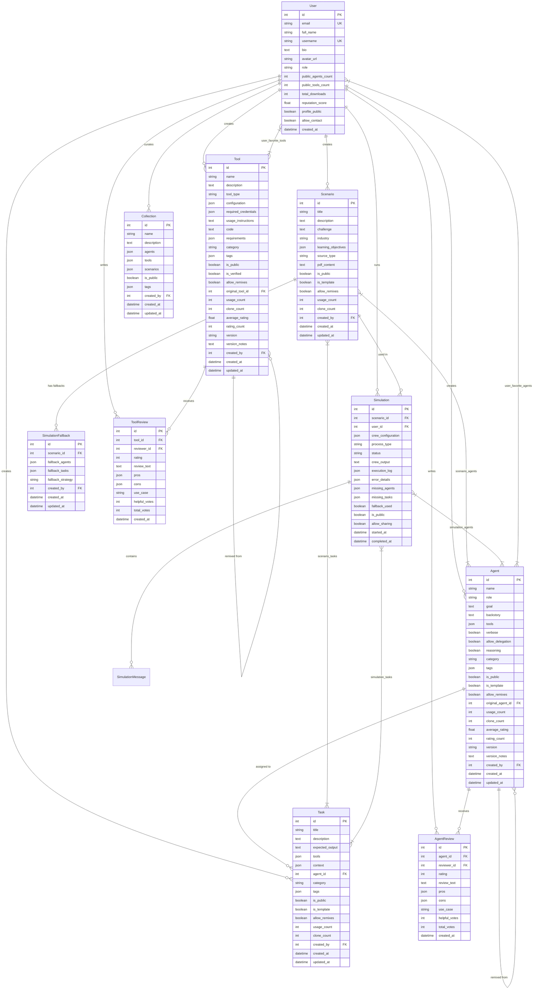

# Database Schema

This Entity Relationship Diagram (ERD) shows the complete database schema for the CrewAI Agent Builder Platform, including all tables, fields, and relationships.

## Core Tables

### User Management
- **User**: Platform users with profiles, reputation, and community stats

### Content Creation
- **Agent**: AI agents with marketplace features (public sharing, ratings, versions)
- **Tool**: Custom tools and integrations with verification system
- **Task**: Task definitions that can be assigned to agents
- **Scenario**: Business scenarios that combine agents and tasks

### Simulation & Execution
- **Simulation**: CrewAI simulation sessions with configuration and results
- **SimulationMessage**: Chat messages during simulation execution

### Community Features
- **AgentReview**: User reviews and ratings for agents
- **ToolReview**: User reviews and ratings for tools
- **Collection**: Curated collections of agents, tools, and scenarios

### Templates & AI Suggestions
- **AgentTemplate**: Pre-built agent templates for AI suggestions
- **TaskTemplate**: Pre-built task templates for AI suggestions

## Key Relationships

### One-to-Many
- Users create multiple agents, tools, tasks, scenarios
- Agents receive multiple reviews
- Scenarios are used in multiple simulations

### Many-to-Many (via Junction Tables)
- Scenarios ↔ Agents (scenario_agents)
- Scenarios ↔ Tasks (scenario_tasks)  
- Users ↔ Favorite Agents (user_favorite_agents)
- Users ↔ Favorite Tools (user_favorite_tools)

### Self-Referential
- Agents can be remixed from other agents (original_agent_id)
- Tools can be forked from other tools (original_tool_id)

## Database Features

### Marketplace Features
- **Public Sharing**: `is_public` flags allow content to be shared
- **Version Control**: Track versions and changes with `version` and `version_notes`
- **Attribution**: `original_agent_id` and `original_tool_id` track remixes
- **Community Metrics**: Usage counts, ratings, and review systems

### Content Organization
- **Categories**: Organize agents and tools by type
- **Tags**: Flexible tagging system for discovery
- **Collections**: User-curated bundles of related content

### User Experience
- **Favorites**: Users can save preferred agents and tools
- **Reputation**: Track user contributions and community impact
- **Reviews**: Detailed feedback system with pros/cons and helpful votes

### AI Features
- **Templates**: Pre-built templates for AI-powered suggestions
- **PDF Processing**: Store original PDF content for scenario creation
- **Execution Logs**: Detailed simulation tracking and debugging

### Graceful Error Handling
- **Resource Tracking**: Junction tables link simulations to actual agents/tasks used
- **Snapshot Storage**: Store agent/task configurations at time of execution
- **Missing Resource Detection**: Track which agents/tasks became unavailable
- **Fallback Strategies**: Automatic substitution with public alternatives
- **Error Transparency**: Detailed error logs and missing resource lists
- **Status Granularity**: Extended status codes for different failure types

## Simulation Resource Management

### The Problem
When a user publishes a public scenario, other users should be able to run it even if:
- Original agents/tasks are made private
- Original agents/tasks are deleted
- Original creator removes access

### The Solution
1. **Execution Snapshots**: Store full agent/task configuration when simulation starts
2. **Junction Tables**: Track which specific database records were used
3. **Fallback System**: Automatically substitute unavailable resources with public alternatives
4. **Transparent Errors**: Clear messaging about what resources were unavailable
5. **Graceful Degradation**: Simulation continues with available resources when possible

### Fallback Strategies
- **substitute**: Replace missing agents/tasks with public alternatives
- **skip**: Skip missing components and continue with available ones  
- **fail**: Stop execution and report missing resources

### Status Codes
- **created**: Simulation configured, ready to run
- **running**: Currently executing
- **completed**: Successfully completed with all resources
- **failed**: Technical failure during execution
- **failed_missing_resources**: Failed due to unavailable agents/tasks 