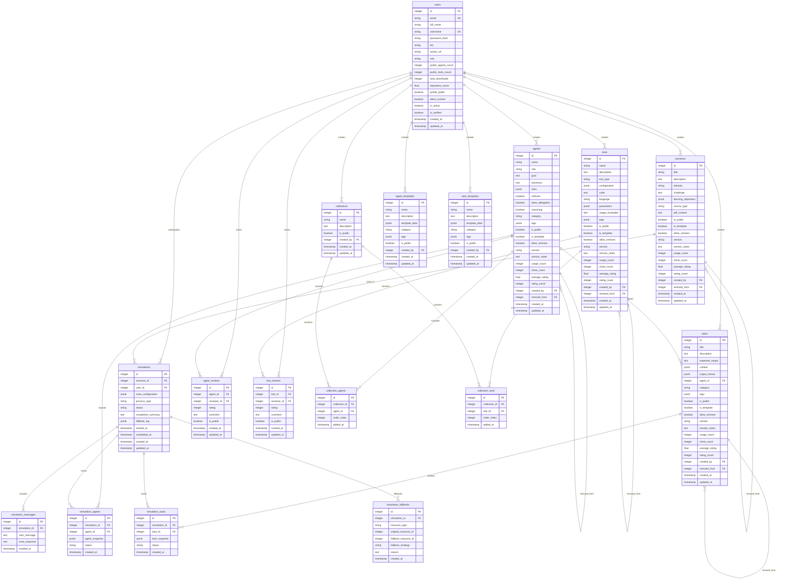

# Database Schema Documentation

## Overview

The CrewAI Agent Builder Platform uses a PostgreSQL database with a comprehensive schema designed to support user management, agent creation, scenario management, and simulation execution with full marketplace and community features.

## Database Architecture



## Table Definitions

### Core Tables

#### Users Table
Stores user account information with authentication and profile data.

**Fields:**
- `id` (Primary Key) - Auto-incrementing user identifier
- `email` (Unique) - User's email address for login
- `full_name` - User's display name
- `username` (Unique) - Unique username for public profile
- `password_hash` - Bcrypt hashed password
- `bio` - User's biography/description
- `avatar_url` - Profile picture URL
- `role` - User role (user/admin)
- `public_agents_count` - Count of public agents created
- `public_tools_count` - Count of public tools created
- `total_downloads` - Total downloads of user's public content
- `reputation_score` - Community reputation score
- `profile_public` - Whether profile is publicly visible
- `allow_contact` - Whether user allows contact from others
- `is_active` - Account active status
- `is_verified` - Email verification status
- `created_at` - Account creation timestamp
- `updated_at` - Last profile update timestamp

**Indexes:**
- `idx_users_email` - Unique index on email
- `idx_users_username` - Unique index on username
- `idx_users_role` - Index on role for admin queries

#### Agents Table
Stores AI agent definitions with marketplace metadata.

**Fields:**
- `id` (Primary Key) - Auto-incrementing agent identifier
- `name` - Agent's display name
- `role` - Agent's role/profession
- `goal` - Agent's primary objective
- `backstory` - Agent's background story
- `tools` (JSONB) - Array of tool names/configurations
- `verbose` - Whether agent should be verbose
- `allow_delegation` - Whether agent can delegate tasks
- `reasoning` - Whether agent uses reasoning
- `category` - Agent category (business, technical, creative, etc.)
- `tags` (JSONB) - Array of searchable tags
- `is_public` - Whether agent is publicly available
- `is_template` - Whether agent serves as a template
- `allow_remixes` - Whether others can remix this agent
- `version` - Agent version string
- `version_notes` - Version update notes
- `usage_count` - Number of times agent has been used
- `clone_count` - Number of times agent has been cloned
- `average_rating` - Average user rating
- `rating_count` - Number of ratings received
- `created_by` (Foreign Key) - Reference to creating user
- `remixed_from` (Foreign Key) - Reference to original agent if remixed
- `created_at` - Creation timestamp
- `updated_at` - Last update timestamp

**Indexes:**
- `idx_agents_created_by` - Index on creator for user queries
- `idx_agents_category` - Index on category for filtering
- `idx_agents_public` - Index on public flag for marketplace
- `idx_agents_tags` - GIN index on tags for search

#### Tools Table
Stores custom tools that agents can use.

**Fields:**
- `id` (Primary Key) - Auto-incrementing tool identifier
- `name` - Tool's display name
- `description` - Tool's description and purpose
- `tool_type` - Type of tool (api, script, service, etc.)
- `configuration` (JSONB) - Tool configuration parameters
- `code` - Tool implementation code
- `language` - Programming language of tool
- `parameters` (JSONB) - Tool parameter definitions
- `usage_examples` - Examples of how to use the tool
- `tags` (JSONB) - Array of searchable tags
- `is_public` - Whether tool is publicly available
- `is_template` - Whether tool serves as a template
- `allow_remixes` - Whether others can remix this tool
- `version` - Tool version string
- `version_notes` - Version update notes
- `usage_count` - Number of times tool has been used
- `clone_count` - Number of times tool has been cloned
- `average_rating` - Average user rating
- `rating_count` - Number of ratings received
- `created_by` (Foreign Key) - Reference to creating user
- `remixed_from` (Foreign Key) - Reference to original tool if remixed
- `created_at` - Creation timestamp
- `updated_at` - Last update timestamp

**Indexes:**
- `idx_tools_created_by` - Index on creator
- `idx_tools_tool_type` - Index on tool type
- `idx_tools_public` - Index on public flag
- `idx_tools_tags` - GIN index on tags

#### Tasks Table
Stores task definitions that agents can execute.

**Fields:**
- `id` (Primary Key) - Auto-incrementing task identifier
- `title` - Task's title
- `description` - Detailed task description
- `expected_output` - Expected output description
- `context` (JSONB) - Task context and background
- `output_format` (JSONB) - Desired output format specifications
- `agent_id` (Foreign Key) - Assigned agent for this task
- `category` - Task category
- `tags` (JSONB) - Array of searchable tags
- `is_public` - Whether task is publicly available
- `is_template` - Whether task serves as a template
- `allow_remixes` - Whether others can remix this task
- `version` - Task version string
- `version_notes` - Version update notes
- `usage_count` - Number of times task has been used
- `clone_count` - Number of times task has been cloned
- `average_rating` - Average user rating
- `rating_count` - Number of ratings received
- `created_by` (Foreign Key) - Reference to creating user
- `remixed_from` (Foreign Key) - Reference to original task if remixed
- `created_at` - Creation timestamp
- `updated_at` - Last update timestamp

**Indexes:**
- `idx_tasks_agent_id` - Index on assigned agent
- `idx_tasks_created_by` - Index on creator
- `idx_tasks_category` - Index on category
- `idx_tasks_public` - Index on public flag

#### Scenarios Table
Stores business scenarios for simulations.

**Fields:**
- `id` (Primary Key) - Auto-incrementing scenario identifier
- `title` - Scenario title
- `description` - Detailed scenario description
- `industry` - Industry context
- `challenge` - Main challenge or problem
- `learning_objectives` (JSONB) - Array of learning objectives
- `source_type` - Source type (manual, pdf, template)
- `pdf_content` - Extracted PDF content if applicable
- `is_public` - Whether scenario is publicly available
- `is_template` - Whether scenario serves as a template
- `allow_remixes` - Whether others can remix this scenario
- `version` - Scenario version string
- `version_notes` - Version update notes
- `usage_count` - Number of times scenario has been used
- `clone_count` - Number of times scenario has been cloned
- `average_rating` - Average user rating
- `rating_count` - Number of ratings received
- `created_by` (Foreign Key) - Reference to creating user
- `remixed_from` (Foreign Key) - Reference to original scenario if remixed
- `created_at` - Creation timestamp
- `updated_at` - Last update timestamp

**Indexes:**
- `idx_scenarios_created_by` - Index on creator
- `idx_scenarios_industry` - Index on industry
- `idx_scenarios_public` - Index on public flag
- `idx_scenarios_source_type` - Index on source type

### Simulation Tables

#### Simulations Table
Stores simulation instances and execution metadata.

**Fields:**
- `id` (Primary Key) - Auto-incrementing simulation identifier
- `scenario_id` (Foreign Key) - Reference to scenario being simulated
- `user_id` (Foreign Key) - Reference to user running simulation
- `crew_configuration` (JSONB) - Crew setup configuration
- `process_type` - CrewAI process type (sequential, hierarchical)
- `status` - Simulation status (ready, running, completed, failed, failed_missing_resources)
- `completion_summary` - Summary of simulation results
- `fallback_log` (JSONB) - Log of fallback strategies used
- `started_at` - Simulation start timestamp
- `completed_at` - Simulation completion timestamp
- `created_at` - Creation timestamp
- `updated_at` - Last update timestamp

**Indexes:**
- `idx_simulations_scenario_id` - Index on scenario
- `idx_simulations_user_id` - Index on user
- `idx_simulations_status` - Index on status

#### Simulation Messages Table
Stores conversation history between users and AI crews.

**Fields:**
- `id` (Primary Key) - Auto-incrementing message identifier
- `simulation_id` (Foreign Key) - Reference to simulation
- `user_message` - User's input message
- `crew_response` - AI crew's response
- `created_at` - Message timestamp

**Indexes:**
- `idx_simulation_messages_simulation_id` - Index on simulation
- `idx_simulation_messages_created_at` - Index on timestamp

### Resource Tracking Tables

#### Simulation Agents Table
Tracks which agents are used in each simulation with snapshots.

**Fields:**
- `id` (Primary Key) - Auto-incrementing identifier
- `simulation_id` (Foreign Key) - Reference to simulation
- `agent_id` (Foreign Key) - Reference to agent
- `agent_snapshot` (JSONB) - Agent configuration at execution time
- `status` - Agent status (active, missing, substituted)
- `created_at` - Creation timestamp

#### Simulation Tasks Table
Tracks which tasks are used in each simulation with snapshots.

**Fields:**
- `id` (Primary Key) - Auto-incrementing identifier
- `simulation_id` (Foreign Key) - Reference to simulation
- `task_id` (Foreign Key) - Reference to task
- `task_snapshot` (JSONB) - Task configuration at execution time
- `status` - Task status (active, missing, substituted)
- `created_at` - Creation timestamp

#### Simulation Fallbacks Table
Tracks fallback strategies used when resources are missing.

**Fields:**
- `id` (Primary Key) - Auto-incrementing identifier
- `simulation_id` (Foreign Key) - Reference to simulation
- `resource_type` - Type of missing resource (agent, task, tool)
- `original_resource_id` - ID of missing resource
- `fallback_resource_id` - ID of substitute resource (if any)
- `fallback_strategy` - Strategy used (substitute, skip, fail)
- `reason` - Reason for fallback
- `created_at` - Creation timestamp

### Review and Rating Tables

#### Agent Reviews Table
Stores user reviews and ratings for agents.

**Fields:**
- `id` (Primary Key) - Auto-incrementing review identifier
- `agent_id` (Foreign Key) - Reference to agent being reviewed
- `reviewer_id` (Foreign Key) - Reference to reviewing user
- `rating` - Numerical rating (1-5)
- `comment` - Review comment
- `is_public` - Whether review is publicly visible
- `created_at` - Review creation timestamp
- `updated_at` - Last update timestamp

**Indexes:**
- `idx_agent_reviews_agent_id` - Index on agent
- `idx_agent_reviews_reviewer_id` - Index on reviewer
- `idx_agent_reviews_rating` - Index on rating

#### Tool Reviews Table
Stores user reviews and ratings for tools.

**Fields:**
- `id` (Primary Key) - Auto-incrementing review identifier
- `tool_id` (Foreign Key) - Reference to tool being reviewed
- `reviewer_id` (Foreign Key) - Reference to reviewing user
- `rating` - Numerical rating (1-5)
- `comment` - Review comment
- `is_public` - Whether review is publicly visible
- `created_at` - Review creation timestamp
- `updated_at` - Last update timestamp

### Collection Tables

#### Collections Table
Stores user-created collections of agents and tools.

**Fields:**
- `id` (Primary Key) - Auto-incrementing collection identifier
- `name` - Collection name
- `description` - Collection description
- `is_public` - Whether collection is publicly visible
- `created_by` (Foreign Key) - Reference to creating user
- `created_at` - Creation timestamp
- `updated_at` - Last update timestamp

#### Collection Agents Table
Junction table for collections and agents.

**Fields:**
- `id` (Primary Key) - Auto-incrementing identifier
- `collection_id` (Foreign Key) - Reference to collection
- `agent_id` (Foreign Key) - Reference to agent
- `order_index` - Order of agent in collection
- `added_at` - Timestamp when agent was added

#### Collection Tools Table
Junction table for collections and tools.

**Fields:**
- `id` (Primary Key) - Auto-incrementing identifier
- `collection_id` (Foreign Key) - Reference to collection
- `tool_id` (Foreign Key) - Reference to tool
- `order_index` - Order of tool in collection
- `added_at` - Timestamp when tool was added

### Template Tables

#### Agent Templates Table
Stores reusable agent templates.

**Fields:**
- `id` (Primary Key) - Auto-incrementing template identifier
- `name` - Template name
- `description` - Template description
- `template_data` (JSONB) - Template configuration data
- `category` - Template category
- `tags` (JSONB) - Array of searchable tags
- `is_public` - Whether template is publicly available
- `created_by` (Foreign Key) - Reference to creating user
- `created_at` - Creation timestamp
- `updated_at` - Last update timestamp

#### Task Templates Table
Stores reusable task templates.

**Fields:**
- `id` (Primary Key) - Auto-incrementing template identifier
- `name` - Template name
- `description` - Template description
- `template_data` (JSONB) - Template configuration data
- `category` - Template category
- `tags` (JSONB) - Array of searchable tags
- `is_public` - Whether template is publicly available
- `created_by` (Foreign Key) - Reference to creating user
- `created_at` - Creation timestamp
- `updated_at` - Last update timestamp

## Database Constraints

### Primary Key Constraints
- All tables have auto-incrementing integer primary keys
- Primary keys are named `id` consistently across all tables

### Foreign Key Constraints
- All foreign key relationships use CASCADE DELETE for dependent records
- Foreign keys are indexed for performance
- Nullable foreign keys allow for optional relationships

### Unique Constraints
- `users.email` - Unique email addresses
- `users.username` - Unique usernames
- `agent_reviews(agent_id, reviewer_id)` - One review per agent per user
- `tool_reviews(tool_id, reviewer_id)` - One review per tool per user

### Check Constraints
- `agent_reviews.rating` - Between 1 and 5
- `tool_reviews.rating` - Between 1 and 5
- `users.reputation_score` - Between 0.0 and 5.0
- `simulations.status` - Valid status values

### JSONB Constraints
- All JSONB fields have proper validation for structure
- Tags arrays contain only string values
- Configuration objects follow defined schemas

## Indexes

### Performance Indexes
- `idx_agents_created_by` - Fast user agent queries
- `idx_agents_category` - Category filtering
- `idx_agents_public` - Public agent marketplace
- `idx_agents_tags` - GIN index for tag searching
- `idx_scenarios_industry` - Industry filtering
- `idx_simulations_user_id` - User simulation history
- `idx_simulation_messages_simulation_id` - Message history queries

### Search Indexes
- `idx_agents_name_trgm` - Trigram index for name search
- `idx_tools_name_trgm` - Trigram index for tool search
- `idx_scenarios_title_trgm` - Trigram index for scenario search

### Composite Indexes
- `idx_agents_public_category` - Public agents by category
- `idx_simulations_user_status` - User simulations by status
- `idx_reviews_agent_rating` - Agent reviews by rating

## Data Types

### Custom Types
- `user_role` - ENUM ('user', 'admin')
- `simulation_status` - ENUM ('ready', 'running', 'completed', 'failed', 'failed_missing_resources')
- `fallback_strategy` - ENUM ('substitute', 'skip', 'fail')
- `source_type` - ENUM ('manual', 'pdf', 'template')

### JSONB Structures

#### Agent Tools Format
```json
[
  {
    "name": "web_search",
    "config": {
      "api_key": "SERPER_API_KEY",
      "results_limit": 10
    }
  }
]
```

#### Scenario Learning Objectives Format
```json
[
  "Understanding market dynamics",
  "Developing pricing strategies",
  "Analyzing competitive landscape"
]
```

#### Crew Configuration Format
```json
{
  "process": "sequential",
  "max_iterations": 5,
  "memory": true,
  "verbose": true
}
```

## Security Considerations

### Data Protection
- All passwords are hashed using bcrypt
- JWT tokens have expiration times
- Sensitive data is not logged
- User data respects privacy settings

### Access Control
- Role-based access control (RBAC)
- Resource ownership validation
- Public/private content controls
- Admin-only endpoints protected

### SQL Injection Prevention
- All queries use parameterized statements
- Input validation at application layer
- JSONB data sanitized before storage

## Backup and Recovery

### Backup Strategy
- Daily full database backups
- Continuous WAL archiving
- Point-in-time recovery capability
- Cross-region backup replication

### Recovery Procedures
- Automated backup validation
- Recovery time objectives (RTO): 4 hours
- Recovery point objectives (RPO): 1 hour
- Disaster recovery testing monthly

## Performance Optimization

### Query Optimization
- Appropriate indexes on frequently queried columns
- JSONB GIN indexes for tag and configuration searches
- Composite indexes for common filter combinations
- Regular VACUUM and ANALYZE operations

### Partitioning Strategy
- Large tables partitioned by date (simulation_messages)
- Archive old data to separate partitions
- Automated partition management

### Connection Pooling
- PgBouncer for connection management
- Connection limits based on load
- Monitoring connection usage

## Monitoring and Maintenance

### Database Monitoring
- Query performance tracking
- Index usage analysis
- Lock contention monitoring
- Connection pool metrics

### Maintenance Tasks
- Regular VACUUM operations
- Index maintenance and rebuilding
- Statistics updates
- Log rotation and cleanup

## Migration Strategy

### Schema Changes
- Alembic for database migrations
- Backward compatibility considerations
- Zero-downtime deployment support
- Rollback procedures

### Data Migration
- Batch processing for large datasets
- Progress tracking and resumption
- Data validation and verification
- Fallback strategies for failed migrations 