# Database Schema Documentation

## Overview

The **AI Agent Education Platform** uses a PostgreSQL database with a comprehensive schema designed to support **PDF-to-simulation pipeline**, **linear simulation experiences**, and **ChatOrchestrator integration**. The schema is optimized for educational simulations where business case studies are transformed into immersive, multi-scene learning experiences with AI persona interactions.

## Database Architecture

```mermaid
erDiagram
    %% Core User System
    users {
        integer id PK
        string email UK
        string full_name
        string username UK
        string password_hash
        text bio
        string avatar_url
        string role
        integer published_scenarios
        integer total_simulations
        float reputation_score
        boolean profile_public
        boolean allow_contact
        boolean is_active
        boolean is_verified
        timestamp created_at
        timestamp updated_at
    }

    %% Scenario System (PDF-to-Simulation Pipeline)
    scenarios {
        integer id PK
        string title
        text description
        text challenge
        string industry
        jsonb learning_objectives
        string source_type
        text pdf_content
        string student_role
        string category
        string difficulty_level
        integer estimated_duration
        jsonb tags
        string pdf_title
        string pdf_source
        string processing_version
        float rating_avg
        integer rating_count
        boolean is_public
        boolean is_template
        boolean allow_remixes
        integer usage_count
        integer clone_count
        integer created_by FK
        timestamp created_at
        timestamp updated_at
    }

    %% AI Persona System
    scenario_personas {
        integer id PK
        integer scenario_id FK
        string name
        string role
        text background
        text correlation
        jsonb primary_goals
        jsonb personality_traits
        timestamp created_at
        timestamp updated_at
    }

    %% Scene Progression System
    scenario_scenes {
        integer id PK
        integer scenario_id FK
        string title
        text description
        text user_goal
        integer scene_order
        integer estimated_duration
        integer max_attempts
        float success_threshold
        jsonb goal_criteria
        jsonb hint_triggers
        text scene_context
        jsonb persona_instructions
        string image_url
        string image_prompt
        timestamp created_at
        timestamp updated_at
    }

    %% Scene-Persona Junction Table
    scene_personas {
        integer scene_id FK
        integer persona_id FK
        string involvement_level
        timestamp created_at
    }

    %% File Processing System
    scenario_files {
        integer id PK
        integer scenario_id FK
        string file_path
        integer file_size
        string file_type
        text original_content
        text processed_content
        string processing_status
        jsonb processing_log
        timestamp uploaded_at
        timestamp processed_at
    }

    %% Linear Simulation System
    user_progress {
        integer id PK
        integer user_id FK
        integer scenario_id FK
        integer current_scene_id FK
        string simulation_status
        jsonb scenes_completed
        integer total_attempts
        integer hints_used
        integer forced_progressions
        jsonb orchestrator_data
        float completion_percentage
        integer total_time_spent
        integer session_count
        float final_score
        timestamp started_at
        timestamp completed_at
        timestamp last_activity
        timestamp created_at
        timestamp updated_at
    }

    %% Scene Progress Tracking
    scene_progress {
        integer id PK
        integer user_progress_id FK
        integer scene_id FK
        string status
        integer attempts
        integer hints_used
        boolean goal_achieved
        boolean forced_progression
        integer time_spent
        integer messages_sent
        integer ai_responses
        float goal_achievement_score
        float interaction_quality
        text scene_feedback
        timestamp started_at
        timestamp completed_at
        timestamp created_at
        timestamp updated_at
    }

    %% ChatOrchestrator Conversation System
    conversation_logs {
        integer id PK
        integer user_progress_id FK
        integer scene_id FK
        string message_type
        string sender_name
        integer persona_id FK
        text message_content
        integer message_order
        integer attempt_number
        boolean is_hint
        jsonb ai_context_used
        string ai_model_version
        float processing_time
        string user_reaction
        boolean led_to_progress
        timestamp timestamp
    }

    %% Community Review System
    scenario_reviews {
        integer id PK
        integer scenario_id FK
        integer reviewer_id FK
        integer rating
        text review_text
        jsonb pros
        jsonb cons
        string use_case
        integer helpful_votes
        integer total_votes
        timestamp created_at
    }

    %% Relationships
    users ||--o{ scenarios : creates
    users ||--o{ scenario_reviews : writes
    users ||--o{ user_progress : tracks

    scenarios ||--o{ scenario_personas : contains
    scenarios ||--o{ scenario_scenes : contains
    scenarios ||--o{ scenario_files : processes
    scenarios ||--o{ scenario_reviews : receives
    scenarios ||--o{ user_progress : simulates

    scenario_personas ||--o{ scene_personas : participates_in
    scenario_personas ||--o{ conversation_logs : speaks_as

    scenario_scenes ||--o{ scene_personas : includes
    scenario_scenes ||--o{ scene_progress : tracks
    scenario_scenes ||--o{ conversation_logs : contains

    user_progress ||--o{ scene_progress : contains
    user_progress ||--o{ conversation_logs : records

    scene_progress ||--o{ scenario_scenes : progresses_through
    scene_progress ||--o{ user_progress : belongs_to
```



## Table Definitions

### Core Tables

#### Users Table
Stores user account information with community engagement metrics.

**Fields:**
- `id` (Primary Key) - Auto-incrementing user identifier
- `email` (Unique) - User's email address for login
- `full_name` - User's display name
- `username` (Unique) - Unique username for public profile
- `password_hash` - Bcrypt hashed password
- `bio` - User's biography/description
- `avatar_url` - Profile picture URL
- `role` - User role (user/admin/teacher/student)
- `published_scenarios` - Count of public scenarios created
- `total_simulations` - Total simulations completed
- `reputation_score` - Community reputation score (0.0-5.0)
- `profile_public` - Whether profile is publicly visible
- `allow_contact` - Whether user allows contact from others
- `is_active` - Account active status
- `is_verified` - Email verification status
- `created_at` - Account creation timestamp
- `updated_at` - Last profile update timestamp

**Indexes:**
- `idx_users_email` - Unique index on email
- `idx_users_username` - Unique index on username
- `idx_users_role` - Index on role for admin queries

#### Scenarios Table
Stores business scenarios created from PDF processing or manual input.

**Fields:**
- `id` (Primary Key) - Auto-incrementing scenario identifier
- `title` - Scenario title
- `description` - Detailed scenario description
- `challenge` - Main business challenge or problem
- `industry` - Industry context
- `learning_objectives` (JSONB) - Array of learning objectives
- `source_type` - Source type (manual, pdf_upload, template)
- `pdf_content` - Original PDF content if applicable
- `student_role` - Role the student plays in simulation
- `category` - Scenario category for marketplace
- `difficulty_level` - Difficulty level (beginner, intermediate, advanced)
- `estimated_duration` - Estimated completion time in minutes
- `tags` (JSONB) - Array of searchable tags
- `pdf_title` - Original PDF title
- `pdf_source` - PDF source information
- `processing_version` - AI processing version used
- `rating_avg` - Average user rating (0.0-5.0)
- `rating_count` - Number of ratings received
- `is_public` - Whether scenario is publicly available
- `is_template` - Whether scenario serves as a template
- `allow_remixes` - Whether others can remix this scenario
- `usage_count` - Number of times scenario has been used
- `clone_count` - Number of times scenario has been cloned
- `created_by` (Foreign Key) - Reference to creating user
- `created_at` - Creation timestamp
- `updated_at` - Last update timestamp

**Indexes:**
- `idx_scenarios_created_by` - Index on creator for user queries
- `idx_scenarios_category` - Index on category for filtering
- `idx_scenarios_public` - Index on public flag for marketplace
- `idx_scenarios_tags` - GIN index on tags for search
- `idx_scenarios_industry` - Index on industry filtering

#### Scenario Personas Table
Stores AI personas extracted from business case studies.

**Fields:**
- `id` (Primary Key) - Auto-incrementing persona identifier
- `scenario_id` (Foreign Key) - Reference to parent scenario
- `name` - Persona's name
- `role` - Persona's role/position in the business case
- `background` - Detailed background information
- `correlation` - Relationship to the business challenge
- `primary_goals` (JSONB) - Array of persona's primary objectives
- `personality_traits` (JSONB) - AI-generated personality traits with numerical scores
- `created_at` - Creation timestamp
- `updated_at` - Last update timestamp

**Personality Traits Structure:**
```json
{
  "analytical": 8,
  "creative": 6,
  "assertive": 7,
  "collaborative": 9,
  "detail_oriented": 8,
  "risk_taking": 4,
  "empathetic": 7,
  "decisive": 6
}
```

**Indexes:**
- `idx_personas_scenario_id` - Index on scenario for efficient lookups
- `idx_personas_name` - Index on name for search
- `idx_personas_role` - Index on role for filtering

#### Scenario Scenes Table
Stores sequential learning scenes for linear simulation progression.

**Fields:**
- `id` (Primary Key) - Auto-incrementing scene identifier
- `scenario_id` (Foreign Key) - Reference to parent scenario
- `title` - Scene title
- `description` - Detailed scene description
- `user_goal` - Specific learning objective for this scene
- `scene_order` - Order in the scene sequence
- `estimated_duration` - Estimated scene completion time in minutes
- `max_attempts` - Maximum attempts before forced progression
- `success_threshold` - Success threshold for goal achievement (0.0-1.0)
- `goal_criteria` (JSONB) - AI-defined success criteria
- `hint_triggers` (JSONB) - Conditions that trigger hints
- `scene_context` - Additional context for ChatOrchestrator
- `persona_instructions` (JSONB) - Specific instructions for AI personas
- `image_url` - URL to scene visualization image
- `image_prompt` - AI prompt used to generate scene image
- `created_at` - Creation timestamp
- `updated_at` - Last update timestamp

**Goal Criteria Structure:**
```json
{
  "key_topics_covered": ["market analysis", "competitive positioning"],
  "interaction_requirements": ["engage with marketing director", "review financial data"],
  "success_indicators": ["demonstrates understanding", "asks relevant questions"]
}
```

**Indexes:**
- `idx_scenes_scenario_id` - Index on scenario
- `idx_scenes_order` - Index on scene order for sequence queries

#### Scene Personas Junction Table
Many-to-many relationship between scenes and personas.

**Fields:**
- `scene_id` (Foreign Key) - Reference to scene
- `persona_id` (Foreign Key) - Reference to persona
- `involvement_level` - Level of persona involvement (key, participant, mentioned)
- `created_at` - Creation timestamp

### Linear Simulation System Tables

#### User Progress Table
Tracks user progress through linear simulations with ChatOrchestrator state.

**Fields:**
- `id` (Primary Key) - Auto-incrementing progress identifier
- `user_id` (Foreign Key) - Reference to user
- `scenario_id` (Foreign Key) - Reference to scenario being simulated
- `current_scene_id` (Foreign Key) - Current scene in progression
- `simulation_status` - Current status (not_started, in_progress, completed, abandoned)
- `scenes_completed` (JSONB) - Array of completed scene IDs
- `total_attempts` - Total attempts across all scenes
- `hints_used` - Total hints used in simulation
- `forced_progressions` - Number of forced scene progressions
- `orchestrator_data` (JSONB) - ChatOrchestrator state and context
- `completion_percentage` - Overall completion percentage (0.0-100.0)
- `total_time_spent` - Total time spent in seconds
- `session_count` - Number of simulation sessions
- `final_score` - Final simulation score (0.0-100.0)
- `started_at` - Simulation start timestamp
- `completed_at` - Simulation completion timestamp
- `last_activity` - Last user activity timestamp
- `created_at` - Creation timestamp
- `updated_at` - Last update timestamp

**Orchestrator Data Structure:**
```json
{
  "current_turn": 15,
  "max_turns": 20,
  "system_prompt_version": "2.1",
  "persona_states": {
    "wanjohi": {
      "engagement_level": "high",
      "topics_discussed": ["seasonal contracts", "market expansion"]
    }
  },
  "scene_context": {
    "key_points_covered": ["crisis assessment", "financial impact"],
    "user_understanding_level": 0.75
  }
}
```

**Indexes:**
- `idx_user_progress_user_id` - Index on user
- `idx_user_progress_scenario_id` - Index on scenario
- `idx_user_progress_status` - Index on simulation status

#### Scene Progress Table
Detailed tracking of progress within individual scenes.

**Fields:**
- `id` (Primary Key) - Auto-incrementing scene progress identifier
- `user_progress_id` (Foreign Key) - Reference to overall user progress
- `scene_id` (Foreign Key) - Reference to scene
- `status` - Scene status (not_started, in_progress, completed, failed)
- `attempts` - Number of attempts for this scene
- `hints_used` - Hints used in this scene
- `goal_achieved` - Whether scene goal was achieved
- `forced_progression` - Whether progression was forced due to max attempts
- `time_spent` - Time spent in this scene (seconds)
- `messages_sent` - Number of user messages sent
- `ai_responses` - Number of AI responses received
- `goal_achievement_score` - AI-assessed goal achievement score (0.0-1.0)
- `interaction_quality` - Quality of user interactions (0.0-1.0)
- `scene_feedback` - AI-generated feedback for the scene
- `started_at` - Scene start timestamp
- `completed_at` - Scene completion timestamp
- `created_at` - Creation timestamp
- `updated_at` - Last update timestamp

**Indexes:**
- `idx_scene_progress_user_progress_id` - Index on user progress
- `idx_scene_progress_scene_id` - Index on scene
- `idx_scene_progress_status` - Index on status

#### Conversation Logs Table
Complete conversation history for ChatOrchestrator interactions.

**Fields:**
- `id` (Primary Key) - Auto-incrementing conversation log identifier
- `user_progress_id` (Foreign Key) - Reference to user progress
- `scene_id` (Foreign Key) - Reference to scene
- `message_type` - Type of message (user, ai_persona, system, hint)
- `sender_name` - Name of message sender
- `persona_id` (Foreign Key) - Reference to persona if AI message
- `message_content` - Full message content
- `message_order` - Order of message in conversation
- `attempt_number` - Scene attempt number when message was sent
- `is_hint` - Whether message was a hint
- `ai_context_used` (JSONB) - AI context and prompt information
- `ai_model_version` - AI model version used
- `processing_time` - AI processing time in seconds
- `user_reaction` - Categorized user reaction (positive, negative, neutral)
- `led_to_progress` - Whether message led to scene progression
- `timestamp` - Message timestamp

**AI Context Structure:**
```json
{
  "system_prompt_version": "2.1",
  "persona_context": {
    "name": "Wanjohi",
    "current_mood": "concerned",
    "topics_aware_of": ["seasonal contracts", "financial pressure"]
  },
  "scene_context": {
    "turn_number": 8,
    "user_understanding": 0.6,
    "key_points_needed": ["market diversification", "risk mitigation"]
  }
}
```

**Indexes:**
- `idx_conversation_logs_user_progress_id` - Index on user progress
- `idx_conversation_logs_scene_id` - Index on scene
- `idx_conversation_logs_timestamp` - Index on timestamp for chronological queries

### Supporting Tables

#### Scenario Files Table
Tracks uploaded PDF files and processing status.

**Fields:**
- `id` (Primary Key) - Auto-incrementing file identifier
- `scenario_id` (Foreign Key) - Reference to scenario
- `file_path` - Path to stored file
- `file_size` - File size in bytes
- `file_type` - File type (application/pdf)
- `original_content` - Original extracted text content
- `processed_content` - AI-processed and structured content
- `processing_status` - Status (pending, processing, completed, failed)
- `processing_log` (JSONB) - Detailed processing log and errors
- `uploaded_at` - File upload timestamp
- `processed_at` - Processing completion timestamp

**Processing Log Structure:**
```json
{
  "llamaparse_status": "success",
  "openai_analysis": "completed",
  "personas_extracted": 3,
  "scenes_generated": 5,
  "processing_time": 45.2,
  "errors": [],
  "warnings": ["Low confidence on persona background for John Smith"]
}
```

#### Scenario Reviews Table
Community reviews and ratings for scenarios.

**Fields:**
- `id` (Primary Key) - Auto-incrementing review identifier
- `scenario_id` (Foreign Key) - Reference to scenario being reviewed
- `reviewer_id` (Foreign Key) - Reference to reviewing user
- `rating` - Numerical rating (1-5)
- `review_text` - Detailed review text
- `pros` (JSONB) - Array of positive aspects
- `cons` (JSONB) - Array of negative aspects
- `use_case` - Specific use case or context
- `helpful_votes` - Number of helpful votes
- `total_votes` - Total votes received
- `created_at` - Review creation timestamp

## Database Constraints

### Primary Key Constraints
- All tables have auto-incrementing integer primary keys
- Primary keys are named `id` consistently across all tables

### Foreign Key Constraints
- All foreign key relationships use CASCADE DELETE for dependent records
- Foreign keys are indexed for performance
- Nullable foreign keys allow for optional relationships

### Unique Constraints
- `users.email` - Unique email addresses
- `users.username` - Unique usernames
- `scenario_reviews(scenario_id, reviewer_id)` - One review per scenario per user

### Check Constraints
- `scenario_reviews.rating` - Between 1 and 5
- `users.reputation_score` - Between 0.0 and 5.0
- `scene_progress.goal_achievement_score` - Between 0.0 and 1.0
- `user_progress.completion_percentage` - Between 0.0 and 100.0

### JSONB Constraints
- All JSONB fields have proper validation for structure
- Tags arrays contain only string values
- Personality traits contain numerical values between 0-10
- Learning objectives are arrays of strings

## Indexes

### Performance Indexes
- `idx_scenarios_created_by` - Fast user scenario queries
- `idx_scenarios_category` - Category filtering for marketplace
- `idx_scenarios_public` - Public scenario marketplace queries
- `idx_user_progress_user_id` - User simulation history
- `idx_conversation_logs_timestamp` - Chronological message queries
- `idx_scene_progress_status` - Scene completion tracking

### Search Indexes
- `idx_scenarios_tags` - GIN index for tag-based search
- `idx_personas_name_trgm` - Trigram index for persona name search
- `idx_scenarios_title_trgm` - Trigram index for scenario title search

### Composite Indexes
- `idx_scenarios_public_category` - Public scenarios by category
- `idx_user_progress_user_status` - User simulations by status
- `idx_scene_progress_scene_status` - Scene progress tracking

## Data Types

### Custom Types
- `user_role` - ENUM ('user', 'admin', 'teacher', 'student')
- `simulation_status` - ENUM ('not_started', 'in_progress', 'completed', 'abandoned')
- `scene_status` - ENUM ('not_started', 'in_progress', 'completed', 'failed')
- `message_type` - ENUM ('user', 'ai_persona', 'system', 'hint')
- `source_type` - ENUM ('manual', 'pdf_upload', 'template')

### JSONB Structures

#### Learning Objectives Format
```json
[
  "Analyze market dynamics and competitive landscape",
  "Develop strategic recommendations for business growth",
  "Evaluate financial implications of strategic decisions"
]
```

#### Personality Traits Format
```json
{
  "analytical": 8,
  "creative": 6,
  "assertive": 7,
  "collaborative": 9,
  "detail_oriented": 8,
  "risk_taking": 4,
  "empathetic": 7,
  "decisive": 6
}
```

#### Scenes Completed Format
```json
[1, 3, 5, 7]
```

#### Goal Criteria Format
```json
{
  "key_topics": ["market analysis", "financial planning"],
  "required_interactions": ["@ceo", "@cfo"],
  "success_threshold": 0.75,
  "completion_indicators": ["demonstrates understanding", "asks strategic questions"]
}
```

## Security Considerations

### Data Protection
- All user passwords are hashed using bcrypt
- JWT tokens have expiration times
- Sensitive conversation data is encrypted at rest
- User data respects privacy settings

### Access Control
- Role-based access control (RBAC)
- Resource ownership validation
- Public/private content controls
- Admin-only endpoints protected

### SQL Injection Prevention
- All queries use parameterized statements
- Input validation at application layer
- JSONB data sanitized before storage

## Backup and Recovery

### Backup Strategy
- Daily full database backups with point-in-time recovery
- Continuous WAL archiving for transaction log backup
- Automated backup validation and integrity checks
- Cross-region backup replication for disaster recovery

### Recovery Procedures
- Automated backup validation and testing
- Recovery time objectives (RTO): 2 hours
- Recovery point objectives (RPO): 15 minutes
- Monthly disaster recovery testing and validation

## Performance Optimization

### Query Optimization
- Appropriate indexes on frequently queried columns
- JSONB GIN indexes for complex data searches
- Composite indexes for common filter combinations
- Regular VACUUM and ANALYZE operations

### Partitioning Strategy
- Large tables partitioned by date (conversation_logs)
- User-based partitioning for user_progress table
- Archive old data to separate partitions
- Automated partition management and cleanup

### Connection Pooling
- PgBouncer for connection management and pooling
- Connection limits based on application load
- Monitoring connection usage and optimization

## Monitoring and Maintenance

### Database Monitoring
- Query performance tracking and optimization
- Index usage analysis and maintenance
- Lock contention monitoring and resolution
- Connection pool metrics and tuning

### Maintenance Tasks
- Regular VACUUM operations for table maintenance
- Index maintenance and rebuilding as needed
- Statistics updates for query optimization
- Log rotation and cleanup procedures

## Migration Strategy

### Schema Changes
- Alembic for database migrations with version control
- Backward compatibility considerations for API changes
- Zero-downtime deployment support for production
- Rollback procedures for failed migrations

### Data Migration
- Batch processing for large dataset migrations
- Progress tracking and resumption capabilities
- Data validation and verification procedures
- Fallback strategies for failed migrations

This database schema provides a robust foundation for the AI Agent Education Platform, supporting PDF-to-simulation pipeline, linear simulation experiences, ChatOrchestrator integration, and community marketplace features. The schema is designed to scale efficiently while maintaining data integrity and supporting complex educational simulation workflows. 