# System Architecture Overview

This diagram shows the high-level architecture of the CrewAI Agent Builder Platform, including all major components and their relationships.

## Architecture Components

### Frontend (React/TypeScript)
- **AgentBuilder Component**: Main agent creation interface
- **ScenarioBuilder Component**: Scenario creation and PDF upload
- **HomePage Component**: Dashboard and navigation
- **AgentCreator Component**: Legacy agent configuration
- **SimulationRunner Component**: CrewAI simulation execution

### Backend API (FastAPI)
- **main.py**: FastAPI application with all endpoints
- **schemas.py**: Pydantic models for API validation
- **database.py**: PostgreSQL connection management

### Database Models (SQLAlchemy)
- **Core Models**: User, Agent, Tool, Task, Scenario, Simulation
- **Community Models**: AgentReview, ToolReview, Collection
- **Template Models**: AgentTemplate, TaskTemplate

### Features
- **Community Features**: Marketplace, ratings, sharing, favorites
- **Core Features**: Agent builder, scenario creator, AI suggestions, CrewAI simulator

```mermaid
graph TB
    subgraph "Frontend (React/TypeScript)"
        UI[User Interface]
        AB[AgentBuilder Component]
        SB[ScenarioBuilder Component]
        HP[HomePage Component]
        AC[AgentCreator Component]
        SR[SimulationRunner Component]
    end
    
    subgraph "Backend API (FastAPI)"
        API[main.py - FastAPI App]
        SCHE[schemas.py - Pydantic Models]
        DB_CONN[database.py - DB Connection]
    end
    
    subgraph "Database Models (SQLAlchemy)"
        USER[User Model]
        AGENT[Agent Model]
        TOOL[Tool Model]
        TASK[Task Model]
        SCENARIO[Scenario Model]
        SIM[Simulation Model]
        REV_A[AgentReview Model]
        REV_T[ToolReview Model]
        COLL[Collection Model]
        TEMP_A[AgentTemplate Model]
        TEMP_T[TaskTemplate Model]
    end
    
    subgraph "Database (PostgreSQL)"
        TABLES[(Database Tables)]
        JUNCTION[(Junction Tables)]
    end
    
    subgraph "Community Features"
        MARKET[Agent Marketplace]
        TOOL_MARKET[Tool Marketplace]
        RATING[Rating System]
        SHARING[Public Sharing]
        FAVORITES[Favorites & Collections]
    end
    
    subgraph "Core Features"
        BUILDER[Agent Builder]
        CREATOR[Scenario Creator]
        SIMULATOR[CrewAI Simulator]
        AI_SUGGEST[AI Suggestions]
    end
    
    %% Frontend to Backend connections
    UI --> API
    AB --> API
    SB --> API
    HP --> API
    AC --> API
    SR --> API
    
    %% Backend internal connections
    API --> SCHE
    API --> DB_CONN
    DB_CONN --> TABLES
    
    %% Models to Database
    USER --> TABLES
    AGENT --> TABLES
    TOOL --> TABLES
    TASK --> TABLES
    SCENARIO --> TABLES
    SIM --> TABLES
    REV_A --> TABLES
    REV_T --> TABLES
    COLL --> TABLES
    TEMP_A --> TABLES
    TEMP_T --> TABLES
    
    %% Junction tables for many-to-many relationships
    AGENT -.-> JUNCTION
    SCENARIO -.-> JUNCTION
    TASK -.-> JUNCTION
    USER -.-> JUNCTION
    
    %% Feature connections
    AGENT --> MARKET
    TOOL --> TOOL_MARKET
    REV_A --> RATING
    REV_T --> RATING
    AGENT --> SHARING
    TOOL --> SHARING
    SCENARIO --> SHARING
    USER --> FAVORITES
    
    AGENT --> BUILDER
    SCENARIO --> CREATOR
    SIM --> SIMULATOR
    TEMP_A --> AI_SUGGEST
    TEMP_T --> AI_SUGGEST
    
    %% Styling
    style API fill:#4CAF50
    style TABLES fill:#2196F3
    style MARKET fill:#FF9800
    style TOOL_MARKET fill:#FF9800
    style BUILDER fill:#9C27B0
    style CREATOR fill:#9C27B0
    style SIMULATOR fill:#F44336
```

## Key Features

- **Community-Driven**: Public marketplace for agents and tools
- **AI-Powered**: Smart suggestions based on scenario analysis
- **Version Control**: Track agent/tool versions and remixes
- **Rating System**: Community feedback and quality control
- **Flexible Architecture**: Modular design for easy extension 