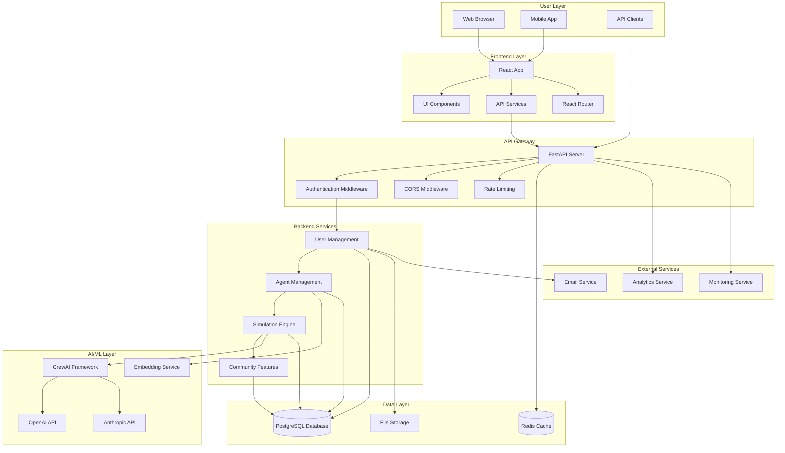
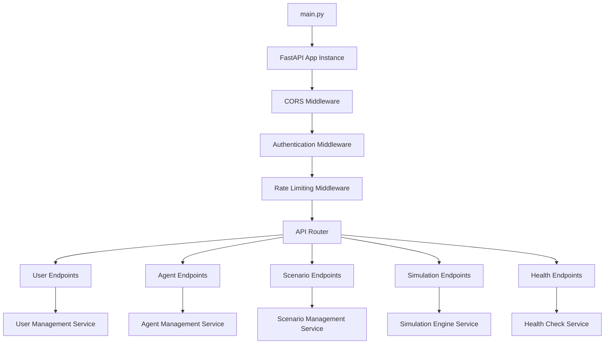
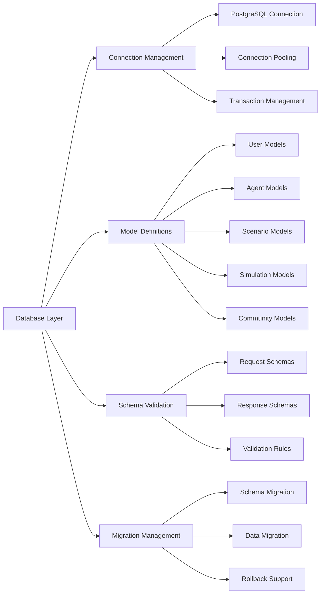
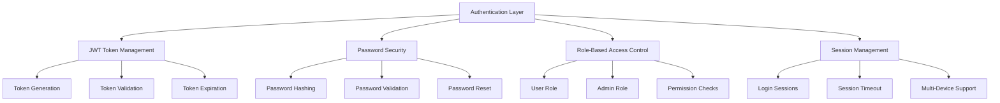
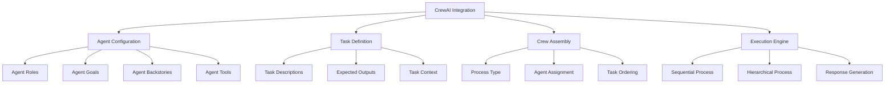
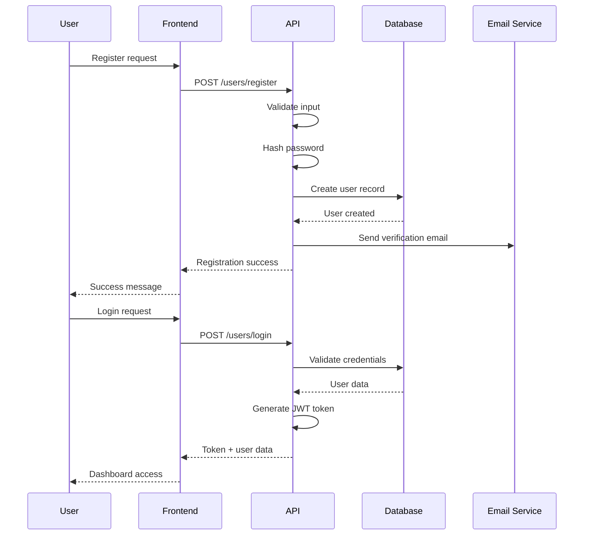
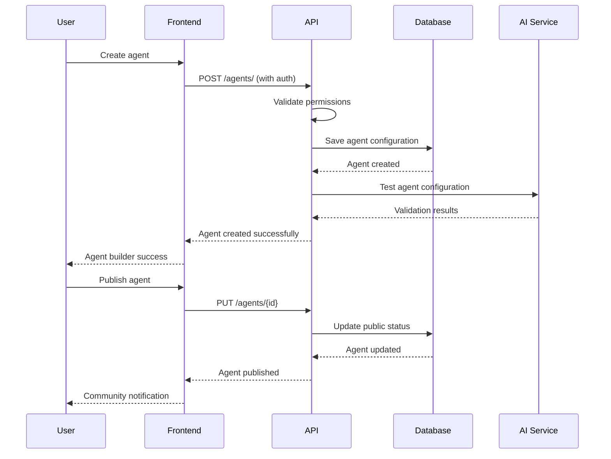
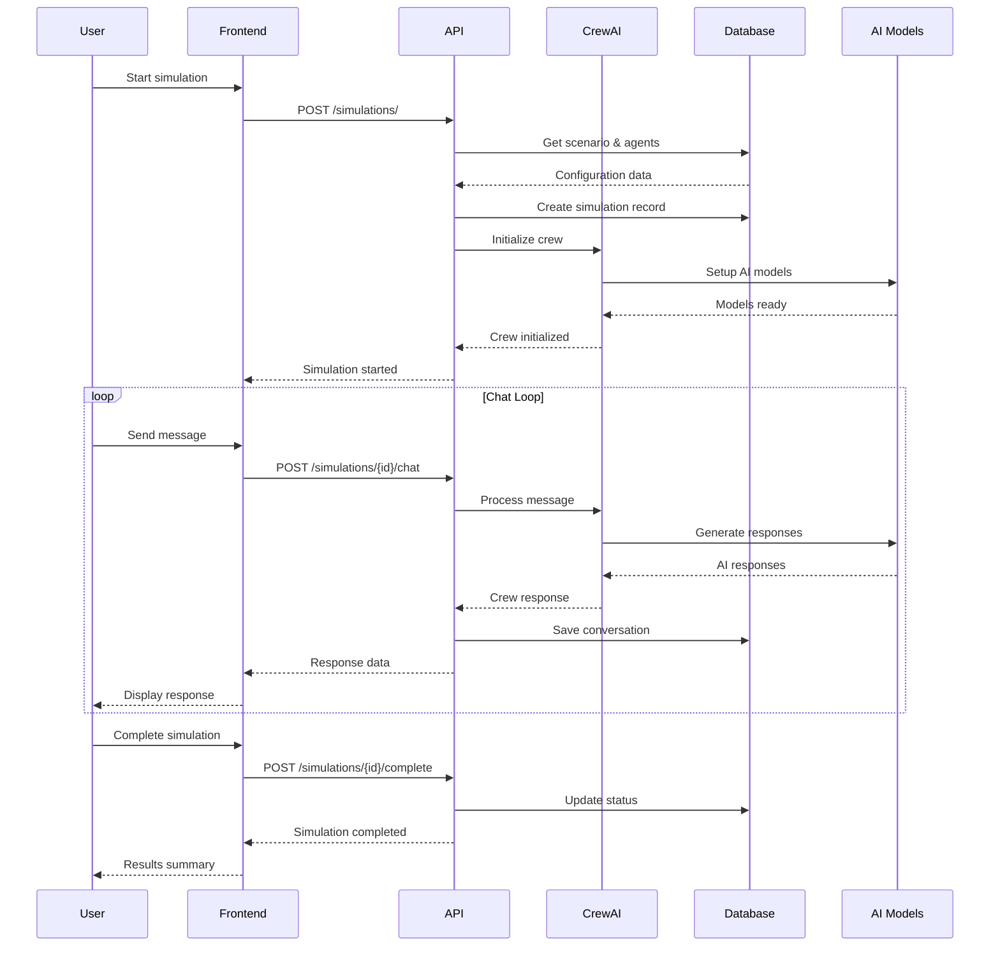

# System Architecture Overview

## Platform Vision

The CrewAI Agent Builder Platform is a comprehensive community-driven marketplace and educational platform where users can create, share, and simulate with AI agents. It combines the power of CrewAI framework with a robust community ecosystem, enabling business professionals, educators, and developers to collaborate on AI-powered solutions.

## High-Level Architecture



## Detailed Backend Architecture

### Organized File Structure

```
backend/
├── main.py                      # FastAPI application entry point
├── requirements.txt             # Python dependencies
├── pytest.ini                  # Test configuration
├── 
├── database/                    # Database layer
│   ├── __init__.py
│   ├── connection.py           # Database connection setup
│   ├── models.py               # SQLAlchemy models
│   ├── schemas.py              # Pydantic schemas
│   └── migrations/             # Database migrations
│       ├── __init__.py
│       ├── fix_database.py     # Migration scripts
│       └── fix_test_database.py
│
├── utilities/                   # Shared utilities
│   ├── __init__.py
│   └── auth.py                 # Authentication utilities
│
├── api/                        # API layer organization
│   └── __init__.py
│
├── crews/                      # CrewAI configurations
│   ├── business_crew.py        # Business agent crew
│   └── config/                 # Agent/task configurations
│       ├── agents.yaml         # Agent definitions
│       └── tasks.yaml          # Task definitions
│
├── unit_tests/                 # Comprehensive test suite
│   ├── conftest.py            # Test fixtures and configuration
│   ├── README.md              # Test documentation
│   ├── 
│   ├── auth/                  # Authentication tests
│   │   ├── __init__.py
│   │   └── test_authentication.py
│   │
│   ├── api/                   # API endpoint tests
│   │   ├── __init__.py
│   │   ├── test_scenarios.py
│   │   ├── test_agents.py
│   │   └── test_simulations.py
│   │
│   └── core/                  # Core functionality tests
│       ├── __init__.py
│       ├── test_health.py
│       └── test_root.py
│
└── docs/                      # Comprehensive documentation
    ├── API_Reference.md       # Complete API documentation
    ├── API_Testing_Guide.md   # API testing examples
    └── architecture/          # Architecture documentation
        ├── README.md
        ├── system-overview.md
        ├── database-schema.md
        └── user-workflow.md
```

## Component Details

### 1. FastAPI Application Layer



### 2. Database Layer Architecture



### 3. Authentication & Security Layer



### 4. CrewAI Integration Layer



## Data Flow Architecture

### 1. User Registration & Authentication Flow



### 2. Agent Creation & Management Flow



### 3. Simulation Execution Flow



## Technology Stack

### Frontend Technologies
- **React 18** - Modern UI framework
- **TypeScript** - Type-safe JavaScript
- **React Router** - Client-side routing
- **Axios** - HTTP client
- **Material-UI** - UI component library
- **React Hook Form** - Form management

### Backend Technologies
- **FastAPI** - High-performance web framework
- **Python 3.11+** - Programming language
- **SQLAlchemy** - ORM for database operations
- **Pydantic** - Data validation and serialization
- **Alembic** - Database migration tool
- **JWT** - Authentication tokens

### AI/ML Technologies
- **CrewAI** - Multi-agent orchestration framework
- **OpenAI API** - GPT models for text generation
- **Anthropic API** - Claude models for advanced reasoning
- **LangChain** - AI application framework
- **Embedding Models** - Vector search and similarity

### Database & Storage
- **PostgreSQL** - Primary database (Neon cloud)
- **Redis** - Caching and session storage
- **AWS S3** - File storage for documents/images
- **Vector Database** - Embedding storage for search

### DevOps & Infrastructure
- **Docker** - Containerization
- **GitHub Actions** - CI/CD pipeline
- **Pytest** - Testing framework
- **Black** - Code formatting
- **Flake8** - Code linting

## Security Architecture

### Authentication Security
- **JWT Tokens** - Stateless authentication
- **Bcrypt Hashing** - Password security
- **Token Expiration** - Session timeout
- **Refresh Tokens** - Secure token renewal

### API Security
- **Rate Limiting** - Prevent abuse
- **Input Validation** - Data sanitization
- **SQL Injection Prevention** - Parameterized queries
- **CORS Configuration** - Cross-origin security

### Data Security
- **Encryption at Rest** - Database encryption
- **Encryption in Transit** - HTTPS/TLS
- **Privacy Controls** - User data protection
- **Audit Logging** - Security event tracking

## Performance Optimization

### Database Optimization
- **Connection Pooling** - Efficient database connections
- **Query Optimization** - Indexed queries
- **Caching Strategy** - Redis for frequently accessed data
- **Database Partitioning** - Large table optimization

### API Performance
- **Async Processing** - Non-blocking operations
- **Response Compression** - Reduced bandwidth
- **CDN Integration** - Static asset delivery
- **Load Balancing** - Request distribution

### Frontend Performance
- **Code Splitting** - Lazy loading
- **Bundle Optimization** - Webpack optimization
- **Image Optimization** - Compressed images
- **Progressive Web App** - Offline capabilities

## Monitoring & Observability

### Application Monitoring
- **Health Checks** - System status monitoring
- **Performance Metrics** - Response time tracking
- **Error Tracking** - Exception monitoring
- **User Analytics** - Usage pattern analysis

### Infrastructure Monitoring
- **Server Metrics** - CPU, memory, disk usage
- **Database Metrics** - Query performance
- **Network Monitoring** - Traffic analysis
- **Log Aggregation** - Centralized logging

### Business Metrics
- **User Engagement** - Feature usage tracking
- **Content Performance** - Agent/scenario popularity
- **Community Growth** - User acquisition metrics
- **Revenue Tracking** - Subscription metrics

## Scalability Considerations

### Horizontal Scaling
- **Microservices Architecture** - Service decomposition
- **Load Balancing** - Request distribution
- **Database Sharding** - Data partitioning
- **API Versioning** - Backward compatibility

### Vertical Scaling
- **Resource Optimization** - CPU/memory tuning
- **Database Optimization** - Index optimization
- **Caching Strategy** - Multi-layer caching
- **Connection Pooling** - Resource management

### Cloud Scaling
- **Auto-scaling Groups** - Dynamic resource allocation
- **Container Orchestration** - Kubernetes deployment
- **CDN Distribution** - Global content delivery
- **Multi-region Deployment** - Geographic distribution

## Future Architecture Enhancements

### Phase 1: Enhanced AI Integration
- **Custom Model Training** - User-specific models
- **Advanced Analytics** - AI-powered insights
- **Real-time Collaboration** - Multi-user simulations
- **Voice Integration** - Speech-to-text capabilities

### Phase 2: Enterprise Features
- **SSO Integration** - Enterprise authentication
- **Team Management** - Organization support
- **Advanced Permissions** - Granular access control
- **Audit Trail** - Compliance tracking

### Phase 3: Platform Expansion
- **Mobile App** - Native mobile experience
- **API Marketplace** - Third-party integrations
- **Webhook Support** - Event-driven architecture
- **GraphQL API** - Flexible data fetching

## Deployment Architecture

### Development Environment
- **Local Development** - Docker Compose setup
- **Hot Reloading** - Fast development iteration
- **Local Database** - PostgreSQL in Docker
- **Mock Services** - AI service mocking

### Staging Environment
- **Cloud Deployment** - Production-like setup
- **Continuous Integration** - Automated testing
- **Database Migration** - Schema synchronization
- **Performance Testing** - Load testing

### Production Environment
- **High Availability** - Multi-zone deployment
- **Disaster Recovery** - Backup strategies
- **Monitoring** - Comprehensive observability
- **Security Hardening** - Production security

This architecture provides a robust, scalable, and secure foundation for the CrewAI Agent Builder Platform, supporting both current requirements and future growth. 