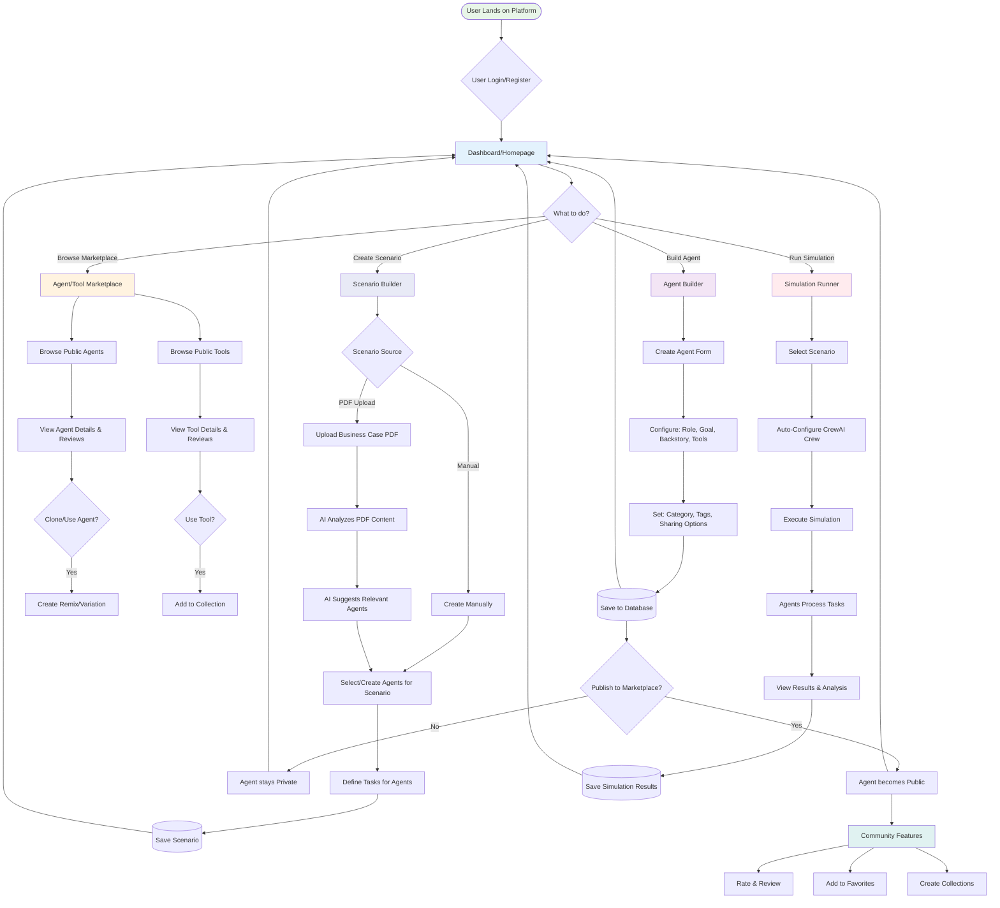

# User Workflow

This flowchart shows the complete user journey through the CrewAI Agent Builder Platform, from initial login to content creation, marketplace interaction, and simulation execution.

## Main User Paths

### 1. Agent Building Journey
Users can create custom AI agents with specific roles, goals, and capabilities:
- **Agent Configuration**: Define role, goal, backstory, and tools
- **Marketplace Options**: Set sharing preferences, categories, and tags
- **Publishing**: Choose to keep private or publish to community marketplace

### 2. Marketplace Discovery
Users can explore and interact with community-created content:
- **Browse Agents**: Discover public agents with ratings and reviews
- **Browse Tools**: Find custom tools and integrations
- **Clone & Remix**: Create variations of existing agents
- **Collections**: Organize favorite content into curated collections

### 3. Scenario Development
Users can create business scenarios for agent simulations:
- **Manual Creation**: Build scenarios from scratch
- **PDF Upload**: Upload business cases for AI analysis
- **AI Suggestions**: Get recommended agents based on scenario content
- **Agent/Task Assignment**: Link specific agents to scenario tasks

### 4. Simulation Execution
Users can run CrewAI simulations with their configured agents:
- **Crew Configuration**: Automatically assemble CrewAI crews
- **Simulation Runtime**: Execute multi-agent collaborative tasks
- **Results Analysis**: View detailed outputs and agent interactions
- **Result Sharing**: Save and optionally share simulation results

### 5. Community Engagement
Users can participate in the platform community:
- **Rating & Reviews**: Provide feedback on agents and tools
- **Favorites**: Save preferred content for easy access
- **Collections**: Create themed bundles of related content
- **Reputation Building**: Earn reputation through quality contributions

## Workflow Benefits

### For Individual Users
- **Easy Agent Creation**: Intuitive interface for building custom agents
- **Rich Discovery**: Explore community creations with detailed reviews
- **Flexible Scenarios**: Support both manual and AI-assisted scenario creation
- **Powerful Simulations**: Run complex multi-agent collaborations

### For the Community
- **Knowledge Sharing**: Public marketplace encourages collaboration
- **Quality Control**: Rating and review system maintains high standards
- **Attribution**: Proper credit for original creators and remixes
- **Collective Intelligence**: Community-driven improvement of agents and tools

### For Platform Growth
- **Network Effects**: More users create more valuable content
- **Viral Loops**: Great agents attract more users who create more agents
- **Retention**: Rich feature set keeps users engaged long-term
- **Scalability**: Decentralized content creation scales with user base

## Key User Interactions

1. **Create → Share → Discover**: Users create content, share it publicly, others discover and build upon it
2. **Upload → Analyze → Suggest**: AI analyzes uploaded content and suggests relevant platform resources
3. **Configure → Execute → Analyze**: Seamless flow from setup to execution to results analysis
4. **Rate → Review → Improve**: Community feedback loop drives continuous improvement
5. **Favorite → Collect → Organize**: Personal organization tools help users manage growing content libraries 