# User Workflow Documentation

## Overview

This document outlines the complete user journey through the CrewAI Agent Builder Platform, from initial registration to advanced community participation. The platform is designed to align with CrewAI's architecture where **scenarios contain tasks**, **agents provide capabilities**, and **crews organize collaborative work**. The platform supports multiple user personas and workflows.

## User Personas

### 1. **Educator** - Creates educational scenarios and manages classroom simulations
### 2. **Student** - Participates in simulations and learns from AI agent interactions
### 3. **Developer** - Builds custom agents and tools for the community
### 4. **Business Professional** - Uses simulations for training and decision-making

## CrewAI Architecture Alignment

The platform follows CrewAI's architectural principles where:

- **Scenarios** define the business context and contain the tasks that need to be completed
- **Agents** are specialized team members with specific roles, goals, and capabilities
- **Tasks** are scenario-specific work items that can be handled by individual agents or collaboratively by the crew
- **Crews** organize agents to work together on completing scenario tasks

This alignment ensures that:
1. **Tasks are contextual** - They belong to specific business scenarios
2. **Agents are reusable** - The same agent can work on different scenarios
3. **Collaboration is natural** - Multiple agents can work together on complex tasks
4. **Flexibility is maintained** - Tasks can be assigned to specific agents or handled by the collective crew

## Complete User Journey

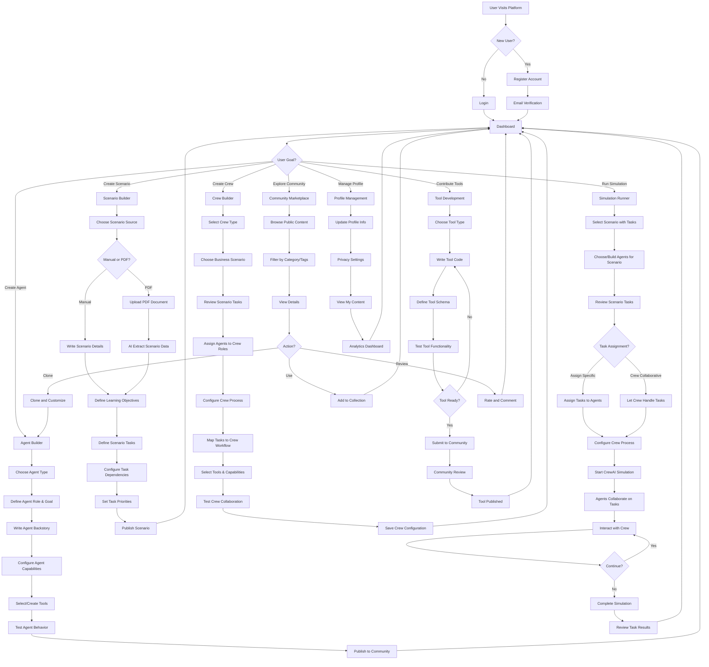

## Detailed Workflow Breakdown

### 1. Authentication & Onboarding Flow

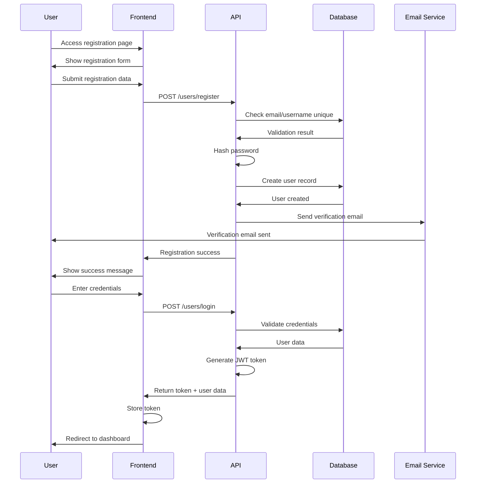

### 2. Agent Creation Workflow

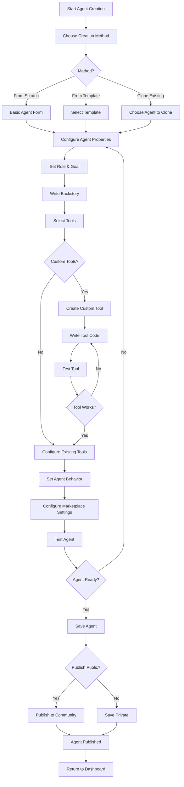

### 3. CrewAI-Aligned Scenario Building

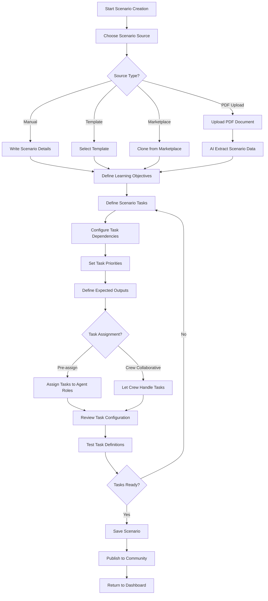

### 4. Crew Configuration Workflow

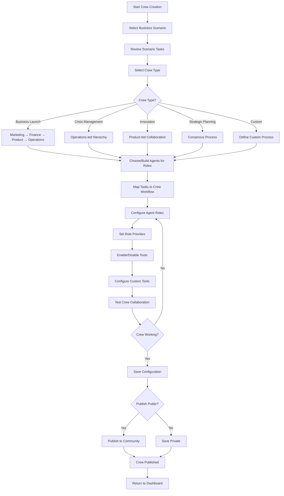

### 4. CrewAI Simulation Execution Flow

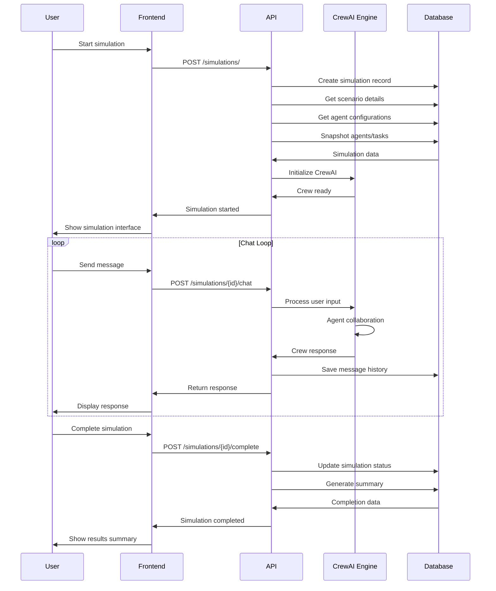

### 5. Tool Development Workflow

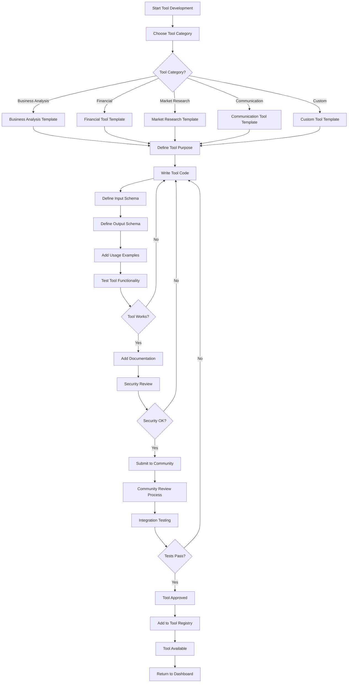

### 6. Community Interaction Flow

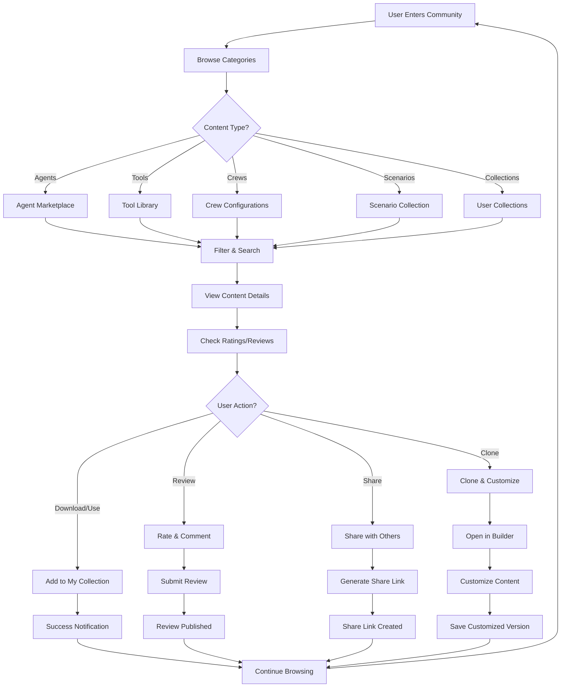

## Resource Management Workflow

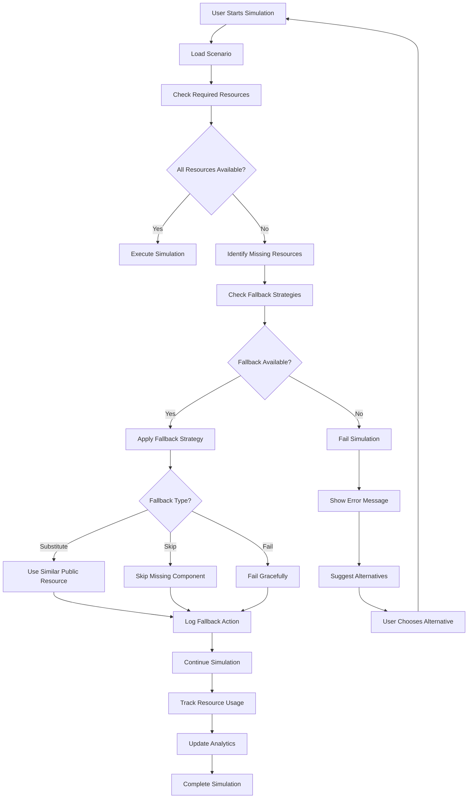

## User Dashboard Workflow

```mermaid
graph TB
    A[User Dashboard] --> B[Quick Stats]
    A --> C[Recent Activity]
    A --> D[My Content]
    A --> E[Recommendations]
    A --> F[Community Updates]
    
    B --> B1[Agents Created: 5]
    B --> B2[Simulations Run: 12]
    B --> B3[Community Score: 4.2]
    B --> B4[Downloads: 150]
    
    C --> C1[Last Simulation]
    C --> C2[Recent Reviews]
    C --> C3[New Followers]
    C --> C4[Updated Content]
    
    D --> D1[My Agents]
    D --> D2[My Scenarios]
    D --> D3[My Collections]
    D --> D4[My Tools]
    
    D1 --> D1A[Edit Agent]
    D1 --> D1B[View Analytics]
    D1 --> D1C[Manage Visibility]
    
    E --> E1[Trending Agents]
    E --> E2[Popular Scenarios]
    E --> E3[New Tools]
    E --> E4[Featured Collections]
    
    F --> F1[Platform Updates]
    F --> F2[Community Events]
    F --> F3[New Features]
    F --> F4[Success Stories]
```

## Error Handling Workflow

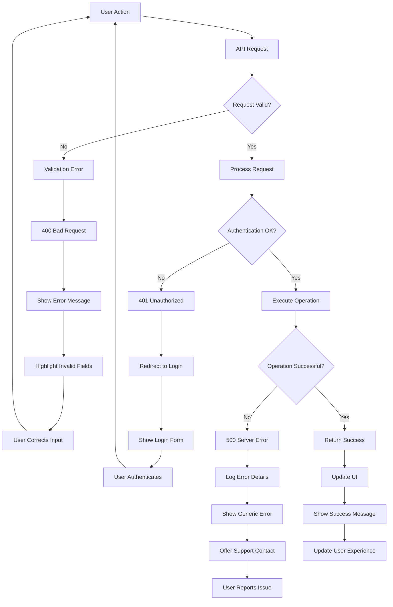

## Mobile Responsiveness Flow

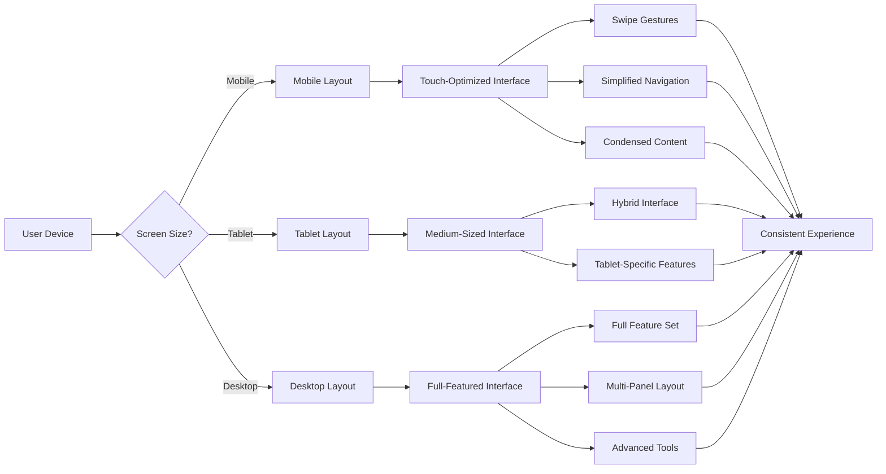

## Performance Optimization Flow

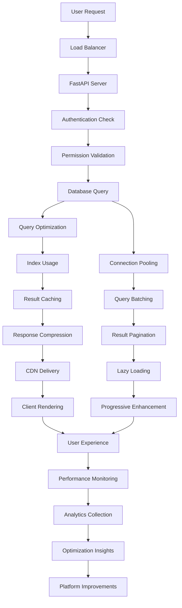

## Integration Points

### External Service Integration

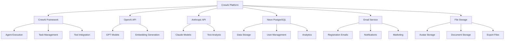

## Security Workflow

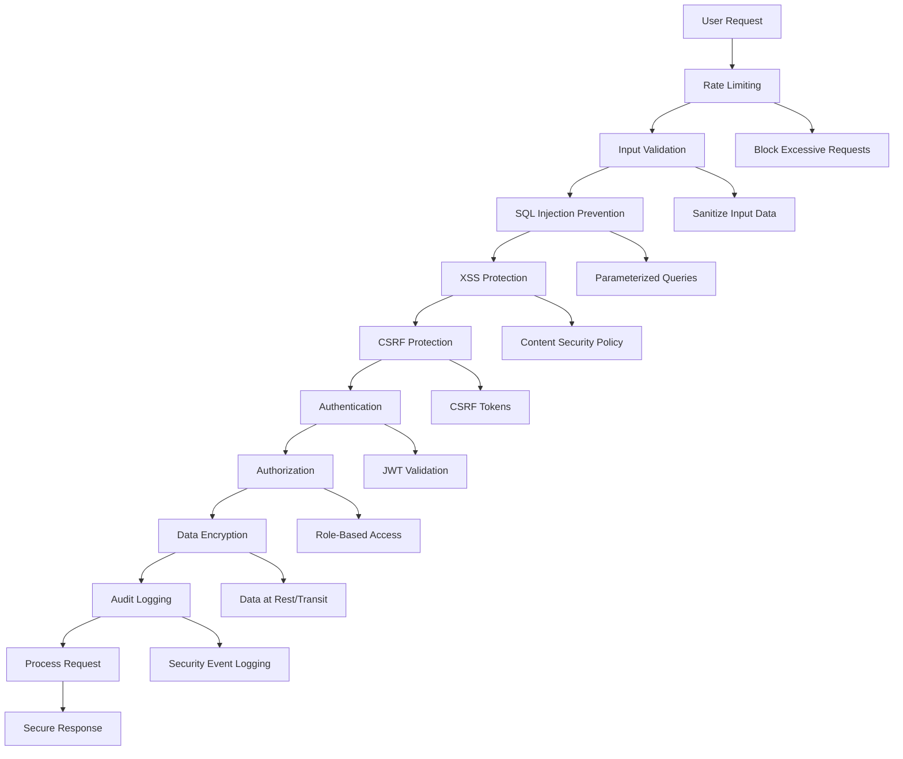

## User Feedback Loop

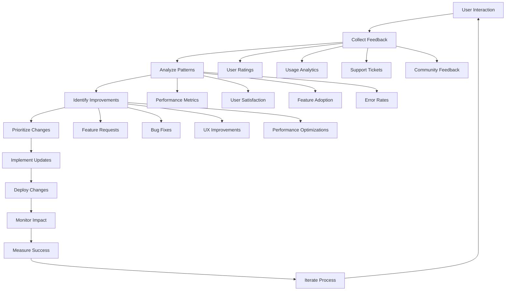

## Workflow Summary

The CrewAI Agent Builder Platform provides a comprehensive workflow that supports:

1. **User Onboarding** - Smooth registration and authentication process
2. **Content Creation** - Intuitive agent, tool, and scenario builders
3. **Simulation Execution** - Robust CrewAI-powered simulation engine
4. **Community Interaction** - Rich marketplace and collaboration features
5. **Resource Management** - Intelligent fallback and resource tracking
6. **Performance Optimization** - Scalable architecture with caching and CDN
7. **Security** - Multi-layered security approach
8. **Feedback Integration** - Continuous improvement based on user input

Each workflow is designed to be user-friendly while providing powerful capabilities for both novice and expert users. The platform scales from individual learning to enterprise-level business training scenarios.
