# User Workflow Documentation

## Overview

This document outlines the complete user journey through the **AI Agent Education Platform**, from PDF upload to immersive simulation experiences. The platform is designed around a **PDF-to-simulation pipeline** with integrated **ChatOrchestrator** system, enabling educators and students to transform business case studies into engaging, linear, multi-scene learning experiences with dynamic AI persona interactions.

## User Personas

### 1. **Educator** - Uploads business case PDFs and creates educational simulations for classroom use
### 2. **Student** - Participates in immersive simulations and learns through AI persona interactions
### 3. **Content Creator** - Develops and publishes scenarios for the community marketplace
### 4. **Business Professional** - Uses simulations for training and professional development

## Platform Architecture Alignment

The platform follows a **PDF-to-simulation pipeline** where:

- **PDF Documents** are intelligently processed to extract business scenarios, key figures, and learning opportunities
- **AI Analysis** transforms case studies into structured scenarios with personas, scenes, and objectives
- **Linear Simulations** provide sequential learning experiences with clear progression and goals
- **ChatOrchestrator** manages multi-scene interactions with AI personas based on personality traits
- **Community Marketplace** enables sharing and discovery of educational content

This architecture ensures that:
1. **Content is contextual** - Scenarios are derived from real business case studies
2. **Learning is structured** - Clear progression through scenes with defined objectives
3. **Interactions are meaningful** - AI personas respond based on their roles and personalities
4. **Experiences are immersive** - Rich visual scenes and natural conversation flow

## Complete User Journey

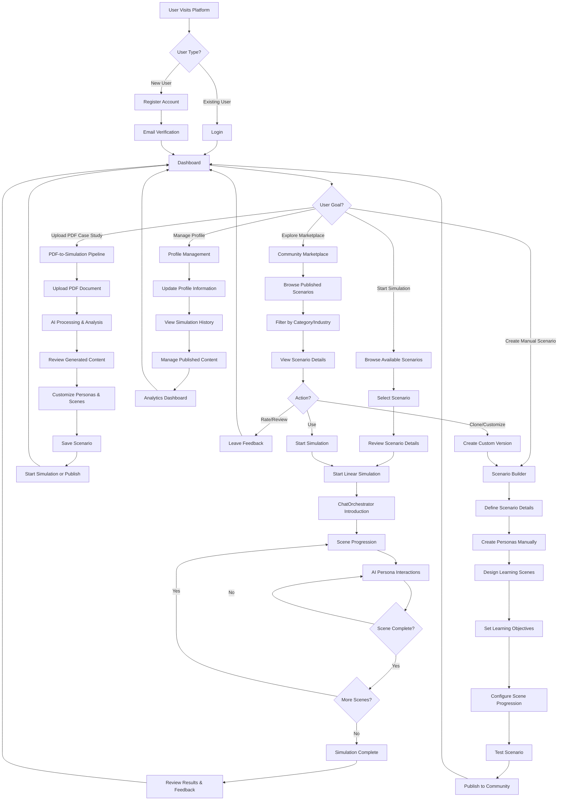

## Detailed Workflow Breakdown

### 1. Authentication & Onboarding Flow

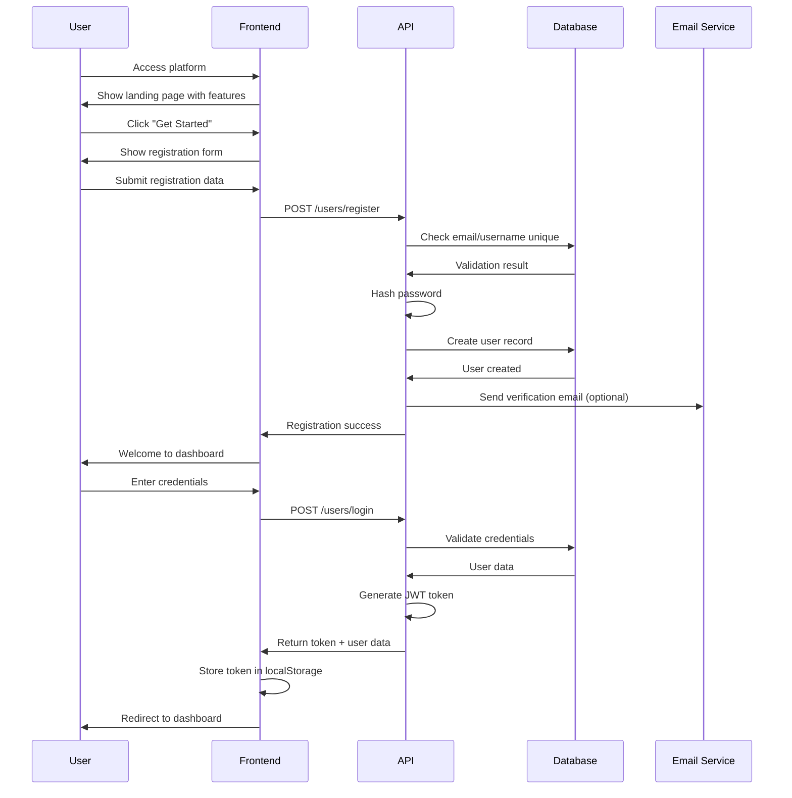

### 2. PDF-to-Simulation Pipeline

```mermaid
flowchart TD
    A[Start PDF Upload] --> B[Select PDF File]
    B --> C[Drag & Drop or Browse]
    C --> D[File Validation]
    D --> E{Valid PDF?}
    E -->|No| F[Show Error Message]
    E -->|Yes| G[Upload to Server]
    
    F --> C
    G --> H[Show Upload Progress]
    H --> I[LlamaParse Processing]
    I --> J[Extract Text & Structure]
    J --> K[OpenAI Analysis]
    K --> L[Generate Scenario Data]
    
    L --> M[Extract Key Figures → Personas]
    M --> N[Identify Learning Scenes]
    N --> O[Create Learning Objectives]
    O --> P[Generate Scene Images]
    P --> Q[Save to Database]
    
    Q --> R[Show Generated Content]
    R --> S{User Review}
    S -->|Needs Changes| T[Edit Personas & Scenes]
    S -->|Looks Good| U[Save Scenario]
    
    T --> V[Update Content]
    V --> U
    U --> W{Next Action?}
    W -->|Start Simulation| X[Begin Linear Experience]
    W -->|Publish| Y[Share with Community]
    W -->|Save Draft| Z[Return to Dashboard]
    
    X --> AA[Simulation Ready]
    Y --> BB[Published Successfully]
    Z --> CC[Draft Saved]
```

### 3. Linear Simulation Experience with ChatOrchestrator

```mermaid
flowchart TD
    A[User Starts Simulation] --> B[Load Scenario & Personas]
    B --> C[Initialize ChatOrchestrator]
    C --> D[Display Scene 1 Introduction]
    D --> E[Show Available Commands]
    E --> F[User Types 'begin']
    
    F --> G[Generate Scene Context]
    G --> H[Introduce AI Personas]
    H --> I[Present Learning Objective]
    I --> J[Start Conversation]
    
    J --> K{User Input Type?}
    K -->|@mention| L[Direct Persona Interaction]
    K -->|help| M[Show Available Commands]
    K -->|general chat| N[Multi-Persona Response]
    K -->|progress command| O[Check Scene Status]
    
    L --> P[Persona-Specific Response]
    M --> Q[Command List Display]
    N --> R[AI Orchestrator Response]
    O --> S[Scene Progress Update]
    
    P --> T[Update Conversation State]
    Q --> J
    R --> T
    S --> T
    
    T --> U{Scene Goal Achieved?}
    U -->|No| V{Max Attempts Reached?}
    U -->|Yes| W[Scene Complete]
    
    V -->|No| J
    V -->|Yes| X[Force Progression with Feedback]
    
    W --> Y[Scene Summary & Feedback]
    X --> Y
    Y --> Z{More Scenes?}
    Z -->|Yes| AA[Load Next Scene]
    Z -->|No| BB[Simulation Complete]
    
    AA --> D
    BB --> CC[Final Results & Analytics]
    CC --> DD[Return to Dashboard]
```

### 4. ChatOrchestrator Interaction Patterns

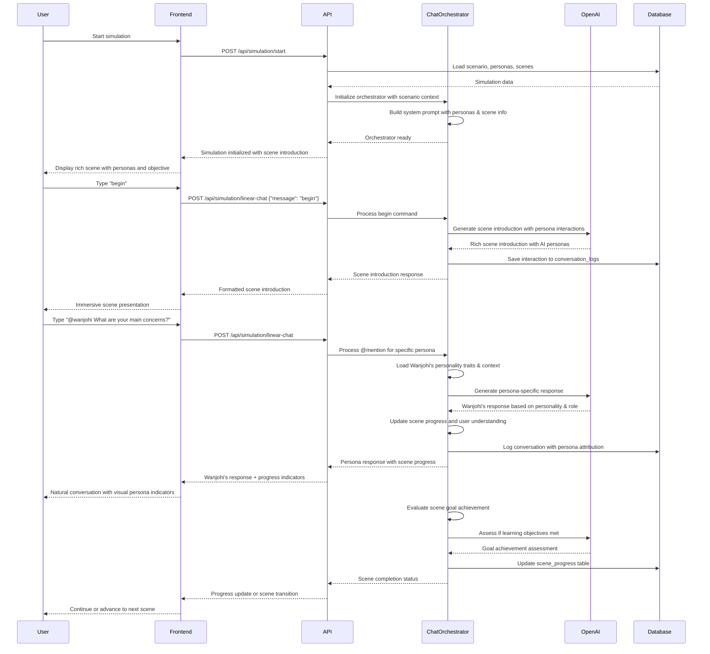

### 5. Community Marketplace Workflow

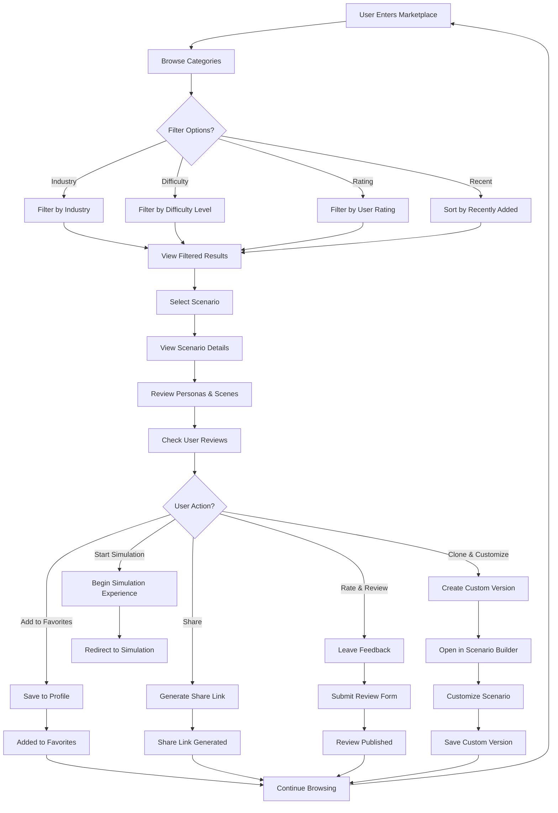

### 6. Scenario Publishing Workflow

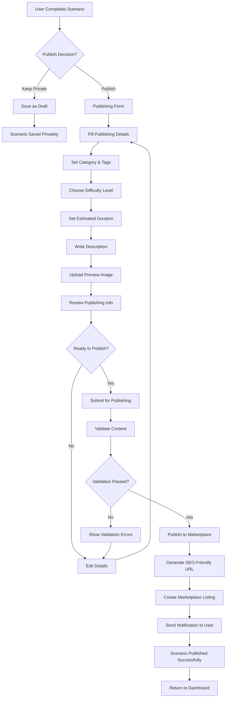

## Advanced User Interactions

### 1. Multi-Scene Progression Management

```mermaid
graph TD
    A[Scene Management System] --> B[Scene State Tracking]
    A --> C[Progress Validation]
    A --> D[Adaptive Difficulty]
    A --> E[Hint System]
    
    B --> B1[Current Scene Position]
    B --> B2[Completion Status]
    B --> B3[Time Spent Tracking]
    B --> B4[Attempt Counter]
    
    C --> C1[Learning Objective Assessment]
    C --> C2[User Understanding Level]
    C --> C3[Goal Achievement Criteria]
    C --> C4[Forced Progression Rules]
    
    D --> D1[Performance-Based Adjustments]
    D --> D2[Persona Response Complexity]
    D --> D3[Scene Difficulty Scaling]
    D --> D4[Hint Frequency Adjustment]
    
    E --> E1[Context-Sensitive Hints]
    E --> E2[Progressive Hint Levels]
    E --> E3[Hint Trigger Conditions]
    E --> E4[Learning Support System]
```

### 2. AI Persona Interaction System

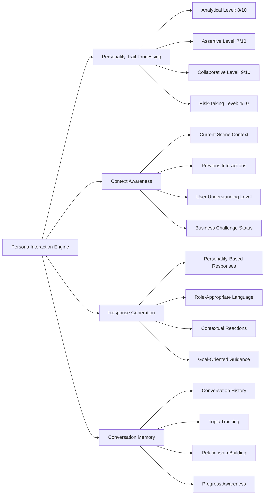

### 3. Learning Analytics & Assessment

```mermaid
graph TD
    A[Learning Analytics System] --> B[Performance Tracking]
    A --> C[Engagement Metrics]
    A --> D[Learning Outcome Assessment]
    A --> E[Progress Reporting]
    
    B --> B1[Scene Completion Times]
    B --> B2[Goal Achievement Scores]
    B --> B3[Hint Usage Patterns]
    B --> B4[Interaction Quality Metrics]
    
    C --> C1[Message Frequency]
    C --> C2[Session Duration]
    C --> C3[Return Visit Patterns]
    C --> C4[Content Interaction Depth]
    
    D --> D1[Learning Objective Mastery]
    D --> D2[Skill Development Progress]
    D --> D3[Knowledge Retention Indicators]
    D --> D4[Application Capability Assessment]
    
    E --> E1[Individual Progress Reports]
    E --> E2[Comparative Performance Analysis]
    E --> E3[Learning Path Recommendations]
    E --> E4[Achievement Certificates]
```

## Error Handling & Recovery Workflows

### 1. PDF Processing Error Recovery

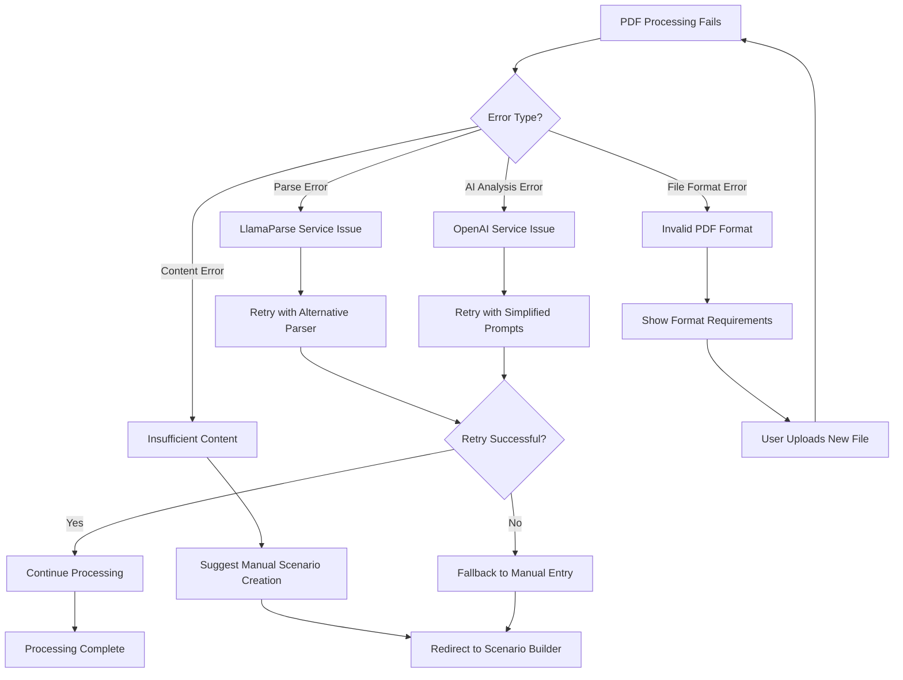

### 2. Simulation Recovery & State Management

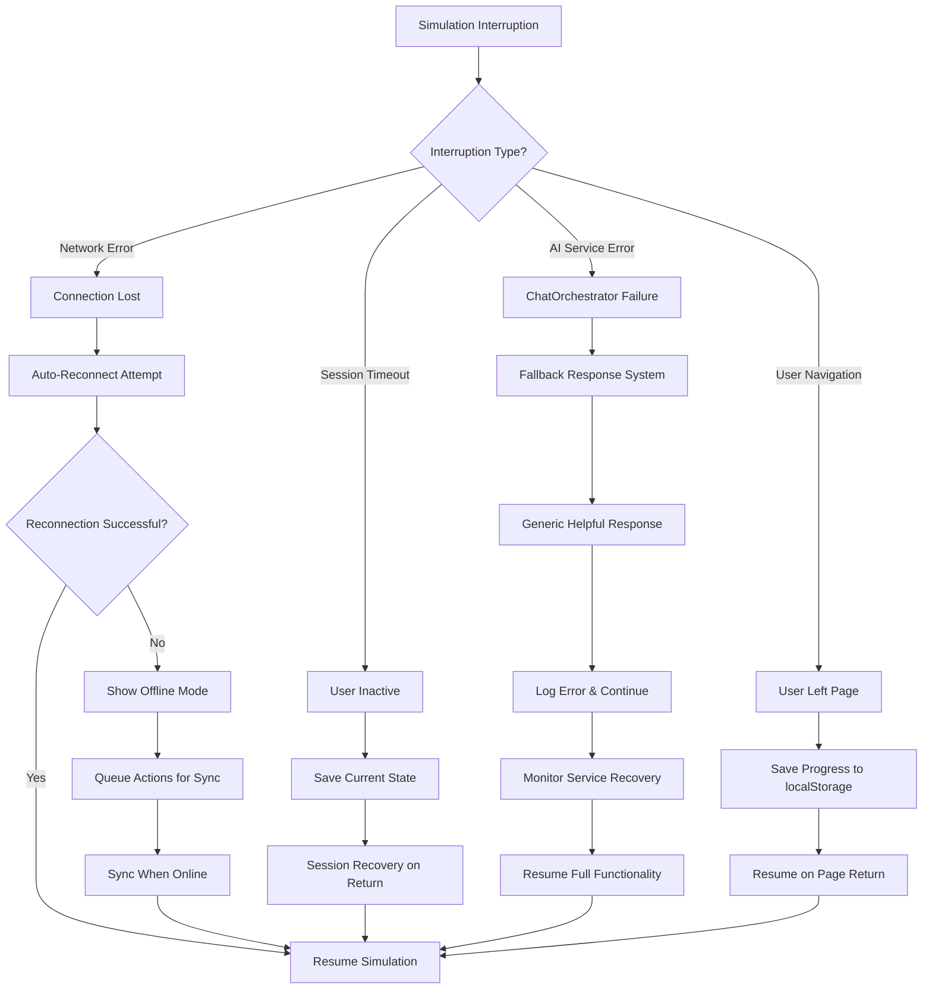

## Mobile Responsiveness & Accessibility

### 1. Mobile-First Design Workflow

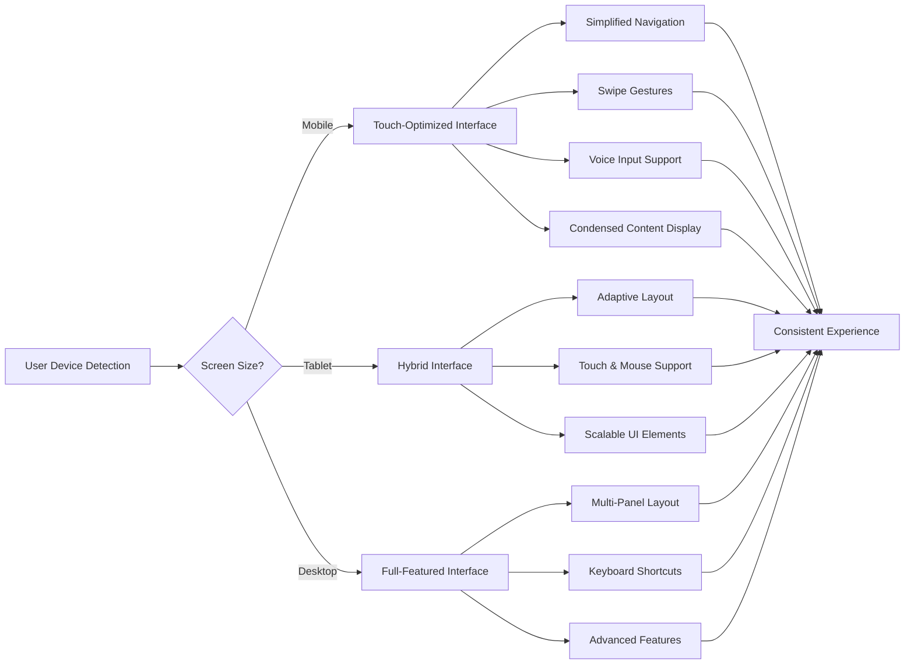

### 2. Accessibility Features

```mermaid
graph TD
    A[Accessibility System] --> B[Screen Reader Support]
    A --> C[Keyboard Navigation]
    A --> D[Visual Accessibility]
    A --> E[Cognitive Accessibility]
    
    B --> B1[ARIA Labels & Descriptions]
    B --> B2[Semantic HTML Structure]
    B --> B3[Alt Text for Images]
    B --> B4[Audio Descriptions]
    
    C --> C1[Tab Order Management]
    C --> C2[Keyboard Shortcuts]
    C --> C3[Focus Indicators]
    C --> C4[Skip Navigation Links]
    
    D --> D1[High Contrast Mode]
    D --> D2[Font Size Adjustment]
    D --> D3[Color-Blind Friendly Design]
    D --> D4[Animation Controls]
    
    E --> E1[Clear Language & Instructions]
    E --> E2[Consistent Navigation]
    E --> E3[Error Prevention & Recovery]
    E --> E4[Progress Indicators]
```

## Performance Optimization Workflows

### 1. Content Loading Strategy

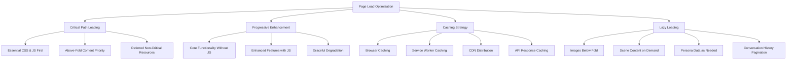

### 2. Real-Time Performance Monitoring

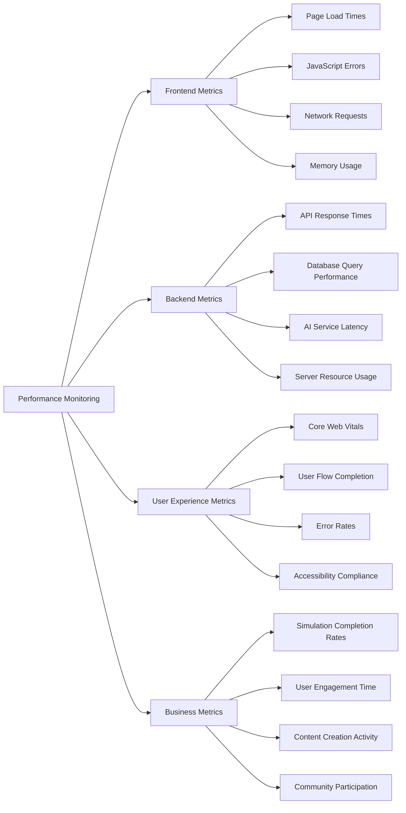

## Integration Points & External Services

### 1. AI Service Integration Workflow

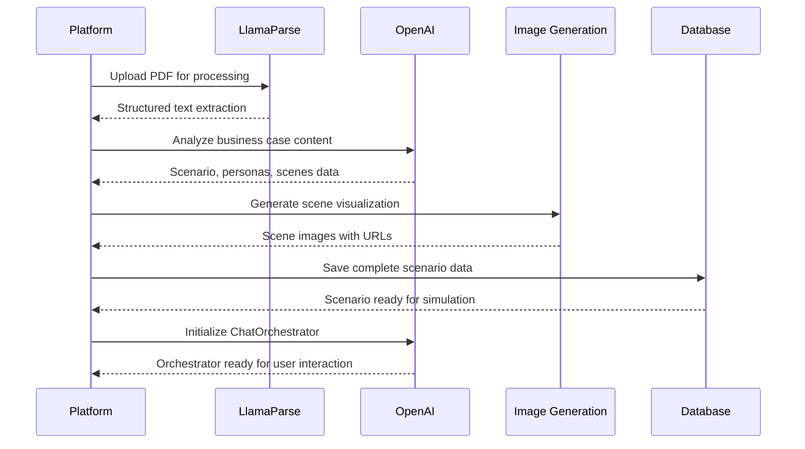

### 2. Community Integration Features

```mermaid
graph TD
    A[Community Features] --> B[Content Sharing]
    A --> C[Social Interactions]
    A --> D[Collaborative Learning]
    A --> E[Quality Assurance]
    
    B --> B1[Scenario Publishing]
    B --> B2[Content Discovery]
    B --> B3[Version Control]
    B --> B4[Remix & Customization]
    
    C --> C1[User Reviews & Ratings]
    C --> C2[Discussion Forums]
    C --> C3[User Profiles & Following]
    C --> C4[Achievement System]
    
    D --> D1[Group Simulations]
    D --> D2[Peer Learning Sessions]
    D --> D3[Instructor-Led Classes]
    D --> D4[Study Group Formation]
    
    E --> E1[Content Moderation]
    E --> E2[Quality Metrics]
    E --> E3[Community Guidelines]
    E --> E4[Reporting System]
```

## Workflow Summary

The **AI Agent Education Platform** provides comprehensive workflows that support:

1. **PDF-to-Simulation Pipeline** - Intelligent transformation of business case studies into interactive simulations
2. **Linear Simulation Experiences** - Structured, multi-scene learning with clear objectives and progression
3. **ChatOrchestrator Integration** - Natural conversation with AI personas based on personality traits and business context
4. **Community Marketplace** - Content sharing, discovery, and collaboration features
5. **Performance Optimization** - Fast, responsive, and accessible user experiences
6. **Error Recovery** - Robust handling of service interruptions and user errors
7. **Analytics & Assessment** - Comprehensive learning analytics and progress tracking

Each workflow is designed to be intuitive and educational while providing powerful capabilities for both educators and learners. The platform scales from individual learning to classroom-wide educational experiences, supporting diverse use cases and learning styles through AI-powered business simulations.
