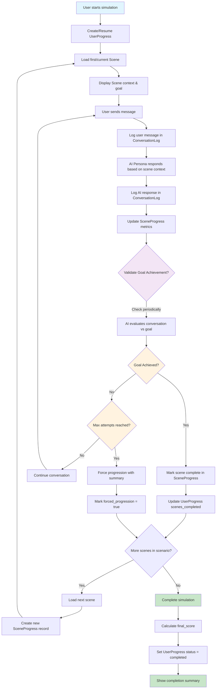

# Database Schema Documentation

## Complete Database Schema

This diagram shows all tables in the AI Agent Education Platform database, including the new sequential simulation system:

```mermaid
erDiagram
    users {
        int id PK
        string email UK
        string full_name
        string username UK
        string password_hash
        text bio
        string avatar_url
        string role
        int public_agents_count
        int public_tools_count
        int total_downloads
        float reputation_score
        boolean profile_public
        boolean allow_contact
        boolean is_active
        boolean is_verified
        datetime created_at
        datetime updated_at
    }
    
    scenarios {
        int id PK
        string title
        text description
        text challenge
        string industry
        json learning_objectives
        string source_type
        text pdf_content
        string student_role
        string category
        string difficulty_level
        int estimated_duration
        json tags
        string pdf_title
        string pdf_source
        string processing_version
        float rating_avg
        int rating_count
        boolean is_public
        boolean is_template
        boolean allow_remixes
        int usage_count
        int clone_count
        int created_by FK
        datetime created_at
        datetime updated_at
    }
    
    scenario_personas {
        int id PK
        int scenario_id FK
        string name
        string role
        text background
        text correlation
        json primary_goals
        json personality_traits
        datetime created_at
        datetime updated_at
    }
    
    scenario_scenes {
        int id PK
        int scenario_id FK
        string title
        text description
        text user_goal
        int scene_order
        int estimated_duration
        json goal_criteria
        int max_attempts
        float success_threshold
        json hint_triggers
        text scene_context
        json persona_instructions
        string image_url
        text image_prompt
        datetime created_at
        datetime updated_at
    }
    
    scene_personas {
        int scene_id FK
        int persona_id FK
        string involvement_level
        datetime created_at
    }
    
    scenario_files {
        int id PK
        int scenario_id FK
        string filename
        string file_path
        int file_size
        string file_type
        text original_content
        text processed_content
        string processing_status
        json processing_log
        string llamaparse_job_id
        datetime uploaded_at
        datetime processed_at
    }
    
    scenario_reviews {
        int id PK
        int scenario_id FK
        int reviewer_id FK
        int rating
        text review_text
        json pros
        json cons
        string use_case
        int helpful_votes
        int total_votes
        datetime created_at
    }
    
    user_progress {
        int id PK
        int user_id FK
        int scenario_id FK
        int current_scene_id FK
        string simulation_status
        json scenes_completed
        int total_attempts
        int hints_used
        int forced_progressions
        float completion_percentage
        float average_attempts_per_scene
        int total_time_spent
        int session_count
        datetime last_activity
        float final_score
        text completion_notes
        datetime started_at
        datetime completed_at
        datetime created_at
        datetime updated_at
    }
    
    scene_progress {
        int id PK
        int user_progress_id FK
        int scene_id FK
        string status
        int attempts
        int hints_used
        boolean goal_achieved
        boolean forced_progression
        int time_spent
        int messages_sent
        int ai_responses
        float goal_achievement_score
        float interaction_quality
        text scene_feedback
        datetime started_at
        datetime completed_at
        datetime created_at
        datetime updated_at
    }
    
    conversation_logs {
        int id PK
        int user_progress_id FK
        int scene_id FK
        string message_type
        string sender_name
        int persona_id FK
        text message_content
        int message_order
        int attempt_number
        boolean is_hint
        json ai_context_used
        string ai_model_version
        float processing_time
        string user_reaction
        boolean led_to_progress
        datetime timestamp
    }
    
    agents {
        int id PK
        string name
        string role
        text goal
        text backstory
        json tools
        boolean verbose
        boolean allow_delegation
        boolean reasoning
        string category
        json tags
        boolean is_public
        boolean is_template
        boolean allow_remixes
        int original_agent_id FK
        int usage_count
        int clone_count
        float average_rating
        int rating_count
        string version
        text version_notes
        int created_by FK
        datetime created_at
        datetime updated_at
    }
    
    tasks {
        int id PK
        string title
        text description
        text expected_output
        json tools
        string agent_role
        boolean async_execution
        text context
        string output_format
        int scenario_id FK
        string category
        json tags
        boolean is_public
        boolean is_template
        boolean allow_remixes
        int original_task_id FK
        int usage_count
        int clone_count
        float average_rating
        int rating_count
        string version
        text version_notes
        int created_by FK
        datetime created_at
        datetime updated_at
    }
    
    simulations {
        int id PK
        int scenario_id FK
        int user_id FK
        string status
        json crew_config
        text final_output
        json execution_log
        json performance_metrics
        datetime started_at
        datetime completed_at
        datetime created_at
        datetime updated_at
    }

    %% Relationships
    users ||--o{ scenarios : creates
    users ||--o{ scenario_reviews : writes
    users ||--o{ user_progress : tracks
    users ||--o{ agents : creates
    users ||--o{ tasks : creates
    users ||--o{ simulations : runs
    
    scenarios ||--o{ scenario_personas : contains
    scenarios ||--o{ scenario_scenes : contains
    scenarios ||--o{ scenario_files : has
    scenarios ||--o{ scenario_reviews : receives
    scenarios ||--o{ user_progress : tracked_in
    scenarios ||--o{ tasks : contains
    scenarios ||--o{ simulations : used_in
    
    scenario_scenes ||--o{ scene_progress : tracked_in
    scenario_scenes ||--o{ conversation_logs : occurs_in
    scenario_scenes }o--o{ scenario_personas : scene_personas
    
    scenario_personas ||--o{ conversation_logs : speaks_in
    
    user_progress ||--o{ scene_progress : contains
    user_progress ||--o{ conversation_logs : generates
    
    agents ||--o{ agents : original_agent_id
    tasks ||--o{ tasks : original_task_id
```

## Sequential Simulation System Tables (NEW)

Focus on the new simulation system tables and their relationships:

```mermaid
erDiagram
    users {
        int id PK
        string email UK
        string username UK
        string full_name
        datetime created_at
    }
    
    scenarios {
        int id PK
        string title
        text description
        string student_role
        string category
        string difficulty_level
        int estimated_duration
        boolean is_public
        int created_by FK
    }
    
    scenario_scenes {
        int id PK
        int scenario_id FK
        string title
        text description
        text user_goal
        int scene_order
        int max_attempts
        float success_threshold
        json goal_criteria
        json hint_triggers
        text scene_context
        json persona_instructions
        string image_url
    }
    
    scenario_personas {
        int id PK
        int scenario_id FK
        string name
        string role
        text background
        text correlation
        json primary_goals
        json personality_traits
    }
    
    scene_personas {
        int scene_id FK
        int persona_id FK
        string involvement_level
    }
    
    user_progress {
        int id PK "🔥 NEW TABLE"
        int user_id FK
        int scenario_id FK
        int current_scene_id FK
        string simulation_status
        json scenes_completed
        int total_attempts
        int hints_used
        int forced_progressions
        float completion_percentage
        int total_time_spent
        int session_count
        float final_score
        text completion_notes
        datetime started_at
        datetime completed_at
        datetime last_activity
    }
    
    scene_progress {
        int id PK "🔥 NEW TABLE"
        int user_progress_id FK
        int scene_id FK
        string status
        int attempts
        int hints_used
        boolean goal_achieved
        boolean forced_progression
        int time_spent
        int messages_sent
        int ai_responses
        float goal_achievement_score
        float interaction_quality
        text scene_feedback
        datetime started_at
        datetime completed_at
    }
    
    conversation_logs {
        int id PK "🔥 NEW TABLE"
        int user_progress_id FK
        int scene_id FK
        string message_type
        string sender_name
        int persona_id FK
        text message_content
        int message_order
        int attempt_number
        boolean is_hint
        json ai_context_used
        string ai_model_version
        float processing_time
        string user_reaction
        boolean led_to_progress
        datetime timestamp
    }

    %% Primary simulation flow relationships
    users ||--o{ user_progress : "starts simulations"
    scenarios ||--o{ user_progress : "simulated by users"
    scenario_scenes ||--o{ user_progress : "current scene"
    
    %% Scene and persona relationships  
    scenarios ||--o{ scenario_scenes : "contains scenes"
    scenarios ||--o{ scenario_personas : "has personas"
    scenario_scenes }o--o{ scenario_personas : scene_personas
    
    %% Progress tracking relationships
    user_progress ||--o{ scene_progress : "tracks scene progress"
    user_progress ||--o{ conversation_logs : "logs conversations"
    scenario_scenes ||--o{ scene_progress : "progress tracked"
    scenario_scenes ||--o{ conversation_logs : "conversations in"
    scenario_personas ||--o{ conversation_logs : "persona speaks"
```

## Simulation Flow Diagram

How the sequential simulation system works:

## Table Descriptions

### Core Simulation Tables (NEW)

#### `user_progress`
**Purpose**: Tracks overall user progress through a scenario simulation
- **Key Fields**: 
  - `simulation_status`: not_started, in_progress, completed, abandoned
  - `scenes_completed`: JSON array of completed scene IDs
  - `current_scene_id`: Which scene user is currently in
  - `final_score`: Overall performance score (0-100)
  - `completion_percentage`: Progress through scenario (0-100%)

#### `scene_progress` 
**Purpose**: Detailed progress tracking for each scene
- **Key Fields**:
  - `status`: not_started, in_progress, completed, skipped
  - `goal_achieved`: Whether user met the scene objective
  - `attempts`: Number of attempts in this scene
  - `goal_achievement_score`: AI-scored performance (0-100)
  - `interaction_quality`: Quality of user interactions (0-1.0)

#### `conversation_logs`
**Purpose**: Complete conversation history for analysis and replay
- **Key Fields**:
  - `message_type`: user, ai_persona, system, hint
  - `persona_id`: Which AI persona spoke (if applicable)
  - `message_order`: Sequential order within scene
  - `led_to_progress`: Whether this message led to goal achievement
  - `ai_model_version`: Which AI model generated response

### Enhanced Existing Tables

#### `scenario_scenes` (Enhanced)
**New Fields for Simulation**:
- `goal_criteria`: JSON array of specific achievement criteria
- `max_attempts`: Maximum attempts before forced progression
- `success_threshold`: AI confidence threshold for goal achievement (0-1.0)
- `scene_context`: Additional context for AI personas
- `persona_instructions`: Scene-specific instructions per persona

## Indexes for Performance

The migration script creates these indexes for optimal query performance:

- `idx_user_progress_user_scenario`: Fast lookup of user's scenario progress
- `idx_user_progress_status`: Filter by simulation status
- `idx_scene_progress_user_scene`: Scene progress by user and scene
- `idx_conversation_logs_user_scene`: Conversation logs by user and scene
- `idx_conversation_logs_timestamp`: Chronological conversation queries
- `idx_conversation_logs_message_order`: Sequential message ordering

## Data Relationships

### Primary Flow
1. **User** starts simulation → **UserProgress** created
2. **UserProgress** tracks current **ScenarioScene**
3. **SceneProgress** tracks detailed scene metrics
4. **ConversationLogs** capture all interactions

### Multi-Persona System
- **ScenarioPersonas** define AI characters
- **scene_personas** junction table links personas to scenes
- **ConversationLogs** track which persona spoke

### Analytics & Performance
- **UserProgress** stores overall performance metrics
- **SceneProgress** provides scene-level analytics
- **ConversationLogs** enable detailed interaction analysis 