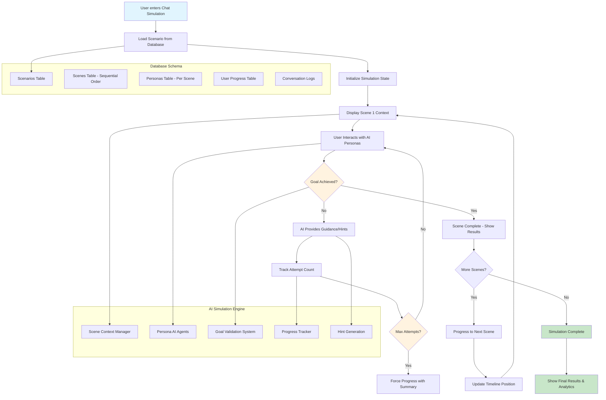
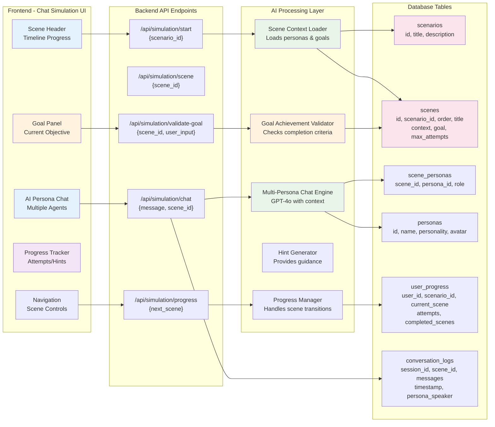
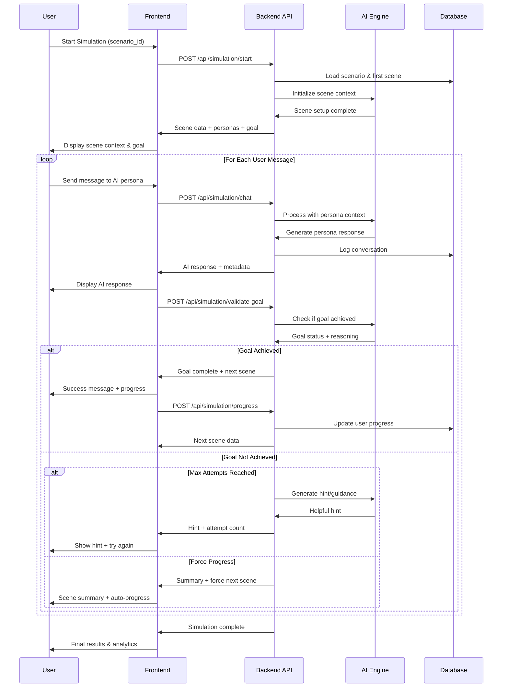

# Sequential Timeline Simulation Architecture

## Overview
This document outlines the architecture for the sequential timeline simulation system where users progress through database-driven scenarios, interacting with AI personas to achieve specific goals at each scene.

## Core Architecture Flow

## Technical Architecture & Data Flow

## Conversation Flow Sequence

## Key Features

### Database-Driven Simulation Flow
- **Scenarios** contain multiple **Scenes** in sequential order
- Each **Scene** has specific **Goals**, **Personas**, and **Context**
- **User Progress** tracks current scene, attempts, and completion status

### Multi-Persona AI Conversations
- Multiple AI agents per scene (e.g., CEO, Customer, Analyst)
- Each persona has distinct personality and role context
- Users must interact with different personas to gather information/achieve goals

### Goal-Based Progression System
- **Clear Objectives**: Each scene has specific, measurable goals
- **Validation Engine**: AI determines when goals are achieved
- **Attempt Tracking**: Limited tries with hints/guidance
- **Forced Progression**: Auto-advance after max attempts with summary

### Enhanced User Experience
- **Timeline Visualization**: Show progress through scenario scenes
- **Goal Panel**: Always visible current objectives
- **Persona Indicators**: Clear identification of which AI is speaking
- **Progress Feedback**: Attempts, hints, completion status

## Implementation Plan

### Backend Changes
1. **New API Endpoints**: Start simulation, scene management, goal validation
2. **AI Engine Enhancement**: Multi-persona context management
3. **Database Extensions**: User progress tracking, conversation logs
4. **Goal Validation**: AI-powered achievement detection

### Frontend Changes
1. **Scene-Based UI**: Replace free chat with structured scenes
2. **Timeline Component**: Visual progress indicator
3. **Goal Dashboard**: Always-visible objectives panel
4. **Persona Management**: Multiple AI avatars and context switching

### Data Flow
1. **Load Scenario** → **Initialize First Scene** → **Set Goals**
2. **User Chats with Personas** → **AI Validates Goals** → **Progress or Retry**
3. **Scene Complete** → **Load Next Scene** → **Repeat Until Simulation End** 