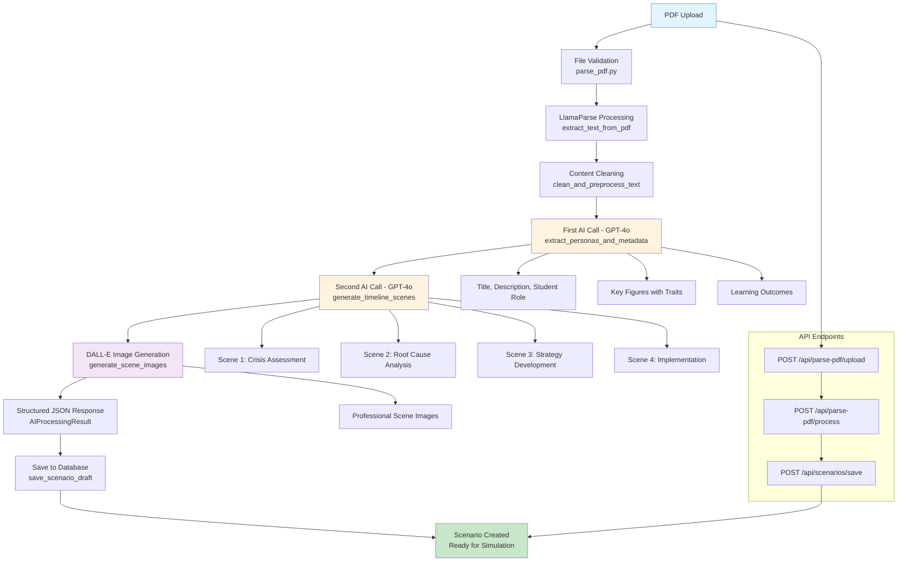
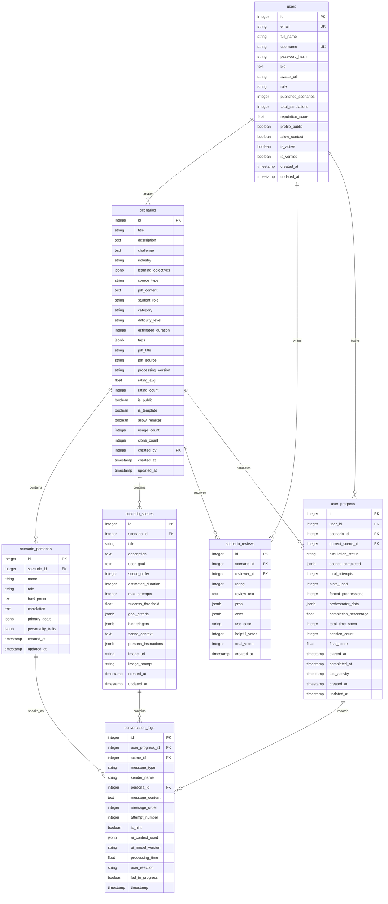
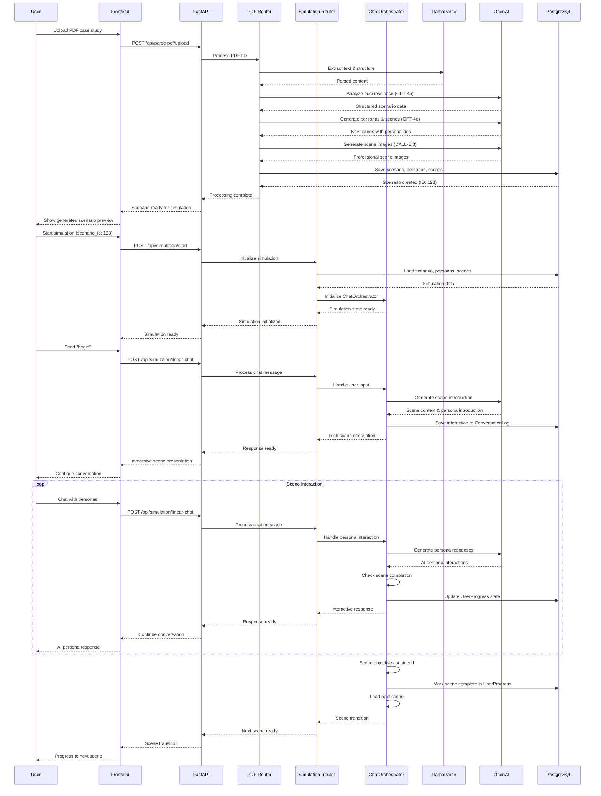
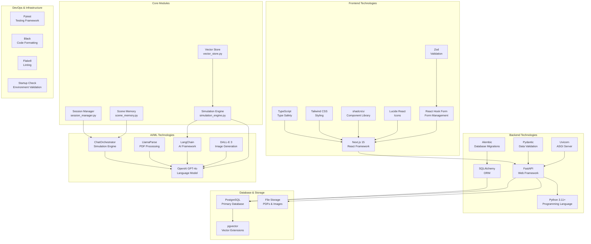
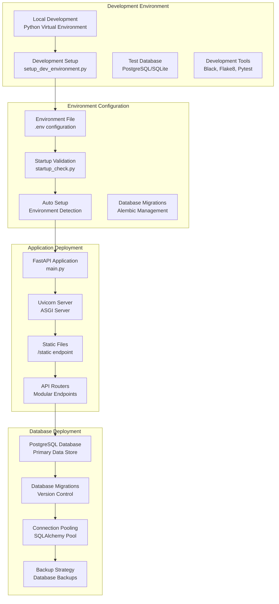

# AI Agent Education Platform - Architecture Diagram

## System Overview

This document provides a comprehensive visual representation of the AI Agent Education Platform architecture, showing the complete system from user interface to data storage, including the PDF-to-simulation pipeline and ChatOrchestrator integration.

## High-Level System Architecture

```mermaid
graph TB
    %% User Layer
    subgraph "User Interface Layer"
        WEB[Web Browser<br/>Next.js 15 Frontend]
        MOBILE[Mobile Interface<br/>Responsive Design]
    end
    
    %% Frontend Components
    subgraph "Frontend Application (Next.js 15)"
        DASHBOARD[Dashboard<br/>/dashboard]
        CHATBOX[Chat Interface<br/>/chat-box]
        SIMULATION_BUILDER[Simulation Builder<br/>/simulation-builder]
        AGENT_BUILDER[Agent Builder<br/>/agent-builder]
        SIGNUP[Signup Page<br/>/signup]
        LOGIN[Login Page<br/>/login]
        COHORTS[Cohorts<br/>/cohorts]
        RESOURCES[Resources<br/>/resources]
        PROFILE[Profile<br/>/profile]
    end
    
    %% API Gateway
    subgraph "API Gateway & Middleware"
        FASTAPI[FastAPI Server<br/>main.py]
        AUTH[Authentication<br/>JWT Middleware]
        CORS[CORS Middleware<br/>Cross-Origin Support]
        STATIC[Static Files<br/>/static]
    end
    
    %% API Routers
    subgraph "API Routers"
        PDF_ROUTER[PDF Router<br/>/api/parse-pdf]
        SIMULATION_ROUTER[Simulation Router<br/>/api/simulation]
        PUBLISHING_ROUTER[Publishing Router<br/>/api/scenarios]
    end
    
    %% Core Modules
    subgraph "Core Modules"
        CHAT_ORCHESTRATOR[ChatOrchestrator<br/>chat_orchestrator.py]
        SIMULATION_ENGINE[Simulation Engine<br/>simulation_engine.py]
        SESSION_MANAGER[Session Manager<br/>session_manager.py]
        SCENE_MEMORY[Scene Memory<br/>scene_memory.py]
        VECTOR_STORE[Vector Store<br/>vector_store.py]
        LANGCHAIN_CONFIG[LangChain Config<br/>langchain_config.py]
    end
    
    %% AI Agents
    subgraph "AI Agents"
        PERSONA_AGENT[Persona Agent<br/>persona_agent.py]
        SUMMARIZATION_AGENT[Summarization Agent<br/>summarization_agent.py]
        GRADING_AGENT[Grading Agent<br/>grading_agent.py]
    end
    
    %% External AI Services
    subgraph "External AI Services"
        OPENAI[OpenAI GPT-4<br/>Language Model]
        LLAMAPARSE[LlamaParse API<br/>PDF Processing]
        DALL_E[DALL-E 3<br/>Image Generation]
    end
    
    %% Data Layer
    subgraph "Data Storage Layer"
        POSTGRES[(PostgreSQL Database<br/>Primary Data Store)]
        FILE_STORAGE[File Storage<br/>PDFs & Images]
        ALEMBIC[Alembic<br/>Database Migrations]
    end
    
    %% Database Models
    subgraph "Database Models"
        USER_MODEL[User Model]
        SCENARIO_MODEL[Scenario Model]
        PERSONA_MODEL[ScenarioPersona Model]
        SCENE_MODEL[ScenarioScene Model]
        PROGRESS_MODEL[UserProgress Model]
        CONVERSATION_MODEL[ConversationLog Model]
    end
    
    %% User Interface Connections
    WEB --> DASHBOARD
    WEB --> CHATBOX
    WEB --> SIMULATION_BUILDER
    WEB --> AGENT_BUILDER
    WEB --> SIGNUP
    WEB --> COHORTS
    WEB --> RESOURCES
    WEB --> PROFILE
    MOBILE --> DASHBOARD
    
    %% Frontend to API Gateway
    DASHBOARD --> FASTAPI
    CHATBOX --> FASTAPI
    SIMULATION_BUILDER --> FASTAPI
    AGENT_BUILDER --> FASTAPI
    SIGNUP --> FASTAPI
    COHORTS --> FASTAPI
    RESOURCES --> FASTAPI
    PROFILE --> FASTAPI
    
    %% API Gateway Processing
    FASTAPI --> AUTH
    FASTAPI --> CORS
    FASTAPI --> STATIC
    
    %% API Router Connections
    FASTAPI --> PDF_ROUTER
    FASTAPI --> SIMULATION_ROUTER
    FASTAPI --> PUBLISHING_ROUTER
    
    %% Core Module Connections
    PDF_ROUTER --> CHAT_ORCHESTRATOR
    SIMULATION_ROUTER --> CHAT_ORCHESTRATOR
    SIMULATION_ROUTER --> SIMULATION_ENGINE
    CHAT_ORCHESTRATOR --> SESSION_MANAGER
    CHAT_ORCHESTRATOR --> SCENE_MEMORY
    SIMULATION_ENGINE --> VECTOR_STORE
    SIMULATION_ENGINE --> LANGCHAIN_CONFIG
    
    %% AI Agent Connections
    PERSONA_AGENT --> LANGCHAIN_CONFIG
    SUMMARIZATION_AGENT --> LANGCHAIN_CONFIG
    GRADING_AGENT --> LANGCHAIN_CONFIG
    LANGCHAIN_CONFIG --> OPENAI
    
    %% External Service Connections
    PDF_ROUTER --> LLAMAPARSE
    PDF_ROUTER --> OPENAI
    PDF_ROUTER --> DALL_E
    SIMULATION_ENGINE --> OPENAI
    CHAT_ORCHESTRATOR --> OPENAI
    
    %% Data Layer Connections
    PDF_ROUTER --> POSTGRES
    SIMULATION_ROUTER --> POSTGRES
    PUBLISHING_ROUTER --> POSTGRES
    POSTGRES --> ALEMBIC
    
    %% Database Model Connections
    POSTGRES --> USER_MODEL
    POSTGRES --> SCENARIO_MODEL
    POSTGRES --> PERSONA_MODEL
    POSTGRES --> SCENE_MODEL
    POSTGRES --> PROGRESS_MODEL
    POSTGRES --> CONVERSATION_MODEL
    
    %% File Storage Connections
    PDF_ROUTER --> FILE_STORAGE
    SIMULATION_ENGINE --> FILE_STORAGE
```



## PDF-to-Simulation Pipeline Architecture



## ChatOrchestrator System Architecture

```mermaid
graph LR
    A[ChatOrchestrator Engine<br/>chat_orchestrator.py] --> B[SimulationState<br/>State Management]
    A --> C[Scene Progression<br/>Manager]
    A --> D[Persona Interaction<br/>Engine]
    A --> E[Command Processor<br/>Command Handling]
    
    B --> B1[Current Scene ID]
    B --> B2[Turn Count]
    B --> B3[Scene Completed]
    B --> B4[User Ready State]
    
    C --> C1[Scene Transition Logic]
    C --> C2[Progress Monitoring]
    C --> C3[Goal Achievement Detection]
    C --> C4[Next Scene Loading]
    
    D --> D1[AI Persona Responses<br/>generate_persona_response]
    D --> D2[Personality-Based Interactions<br/>personality_traits]
    D --> D3[@Mention Handling<br/>handle_mentions]
    D --> D4[Multi-Character Conversations<br/>conversation_history]
    
    E --> E1[begin Command<br/>start_simulation]
    E --> E2[help Command<br/>show_help]
    E --> E3[@mention Commands<br/>handle_persona_mention]
    E --> E4[Progress Commands<br/>check_progress]
    
    A --> F[Session Manager<br/>session_manager.py]
    A --> G[Scene Memory<br/>scene_memory.py]
    A --> H[LangChain Integration<br/>langchain_config.py]
    
    F --> I[Session State<br/>Persistence]
    G --> J[Scene Context<br/>Memory]
    H --> K[OpenAI GPT-4<br/>Integration]
    
    D1 --> K
    D2 --> K
    E1 --> L[Database State<br/>Persistence]
    C3 --> L
```

## Database Schema Architecture



## Data Flow Architecture



## Technology Stack Architecture



## Security Architecture

```mermaid
graph TD
    subgraph "Authentication & Authorization"
        JWT[JWT Token System<br/>auth.py]
        RBAC[Role-Based Access<br/>require_admin]
        SESSION[Session Management<br/>get_current_user]
        API_SEC[API Security<br/>CORS Middleware]
    end
    
    subgraph "Data Protection"
        ENCRYPTION[Data Encryption<br/>SSL/TLS Connections]
        HASHING[Password Hashing<br/>bcrypt]
        VALIDATION[Input Validation<br/>Pydantic Schemas]
        PRIVACY[Privacy Controls<br/>User Data Protection]
    end
    
    subgraph "AI Service Security"
        API_KEYS[API Key Management<br/>Environment Variables]
        CONTENT_FILTER[Content Filtering<br/>OpenAI Safety]
        MONITORING[Usage Monitoring<br/>Logging]
        ERROR_HANDLING[Secure Error<br/>HTTPException]
    end
    
    subgraph "Infrastructure Security"
        HTTPS[HTTPS/TLS<br/>Encrypted Communication]
        CORS_SEC[CORS Protection<br/>FastAPI Middleware]
        STATIC_SEC[Static File Security<br/>/static endpoint]
        DB_SEC[Database Security<br/>Connection Pooling]
    end
    
    %% Security Flow
    JWT --> RBAC
    RBAC --> SESSION
    SESSION --> API_SEC
    
    ENCRYPTION --> HASHING
    HASHING --> VALIDATION
    VALIDATION --> PRIVACY
    
    API_KEYS --> CONTENT_FILTER
    CONTENT_FILTER --> MONITORING
    MONITORING --> ERROR_HANDLING
    
    HTTPS --> CORS_SEC
    CORS_SEC --> STATIC_SEC
    STATIC_SEC --> DB_SEC
```



## Performance & Scalability Architecture


## Deployment Architecture



## Key Architecture Principles

### 1. **PDF-to-Simulation Pipeline**
- Intelligent document processing using LlamaParse and OpenAI GPT-4o
- Two-stage AI processing: persona extraction and scene generation
- Automated extraction of business scenarios, personas, and learning objectives
- DALL-E 3 integration for professional scene visualization
- Structured transformation into interactive simulation experiences

### 2. **Linear Simulation Design**
- Sequential scene progression with clear learning objectives
- ChatOrchestrator managing multi-persona interactions
- Scene state management with progress tracking
- Adaptive difficulty and hint systems for optimal learning

### 3. **AI-Powered Personas**
- Personality-based AI responses using trait scoring
- Context-aware interactions based on business scenarios
- Natural conversation flow with @mention capabilities
- LangChain integration for enhanced AI interactions

### 4. **Modular API Architecture**
- FastAPI with modular router design (/api/parse-pdf, /api/simulation, /api/scenarios)
- Pydantic schemas for data validation
- JWT-based authentication with role-based access control
- Comprehensive error handling and logging

### 5. **Database-First Design**
- PostgreSQL with Alembic migrations for version control
- Comprehensive data models for scenarios, personas, scenes, and progress
- JSONB fields for flexible data storage
- Connection pooling for performance optimization

### 6. **Development & Deployment**
- Environment-based configuration with startup validation
- Automated development setup with dependency management
- Static file serving for images and assets
- Health monitoring and system status endpoints

### 7. **Security & Privacy**
- JWT-based authentication with role-based access control
- Secure API key management through environment variables
- Input validation and sanitization
- Secure AI service integration with content filtering

This architecture provides a robust, scalable, and secure foundation for transforming traditional business case studies into engaging, interactive learning experiences through AI-powered simulations.
