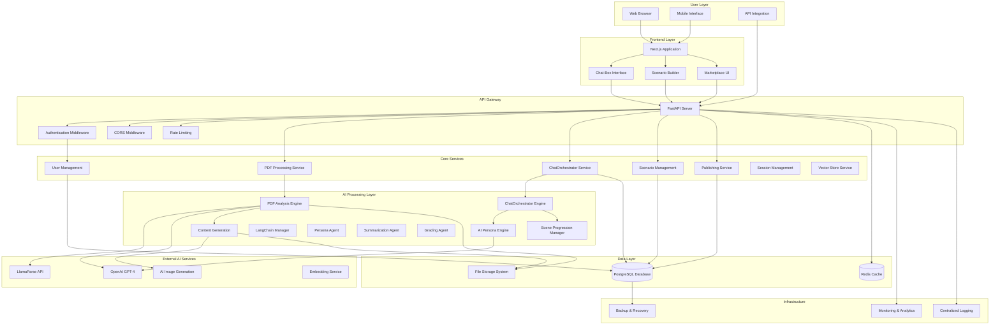
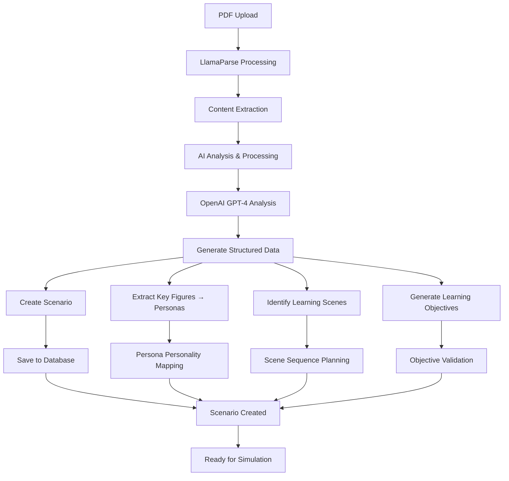
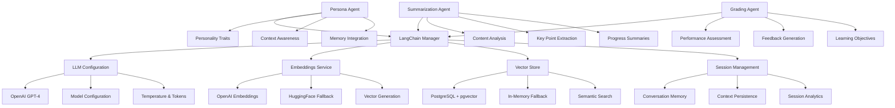
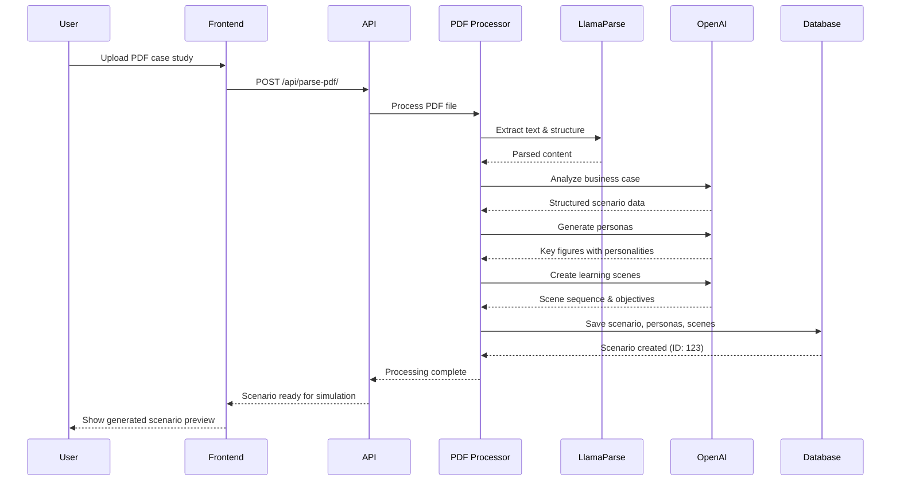
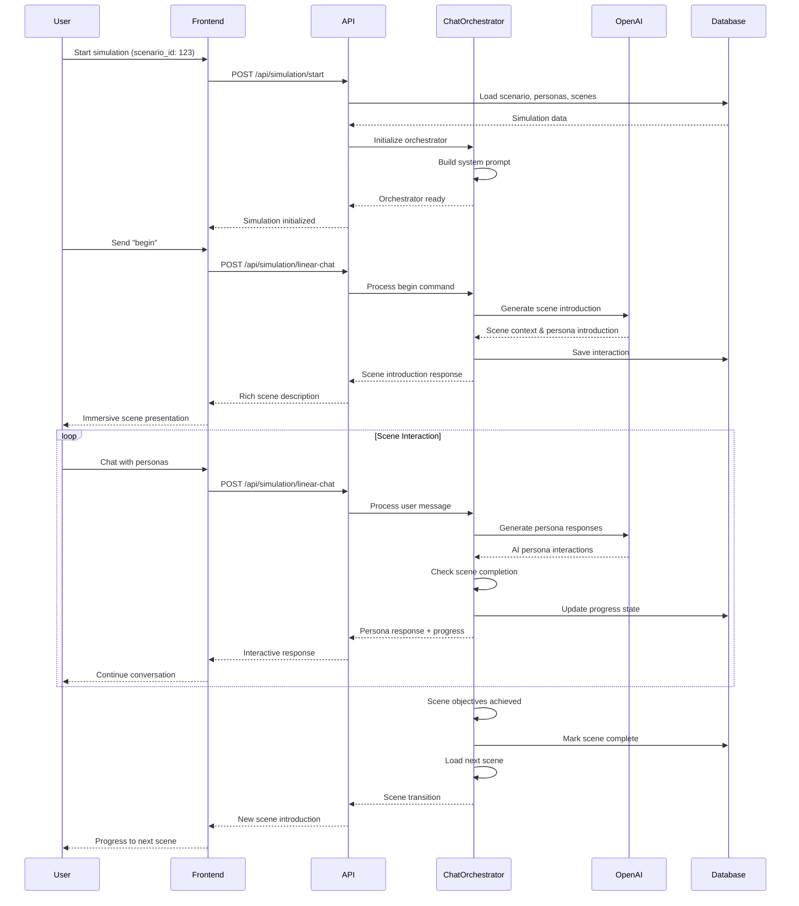

# System Architecture Overview

## Platform Vision

The **AI Agent Education Platform** is a comprehensive educational platform where users can transform business case studies into immersive AI-powered simulations. The platform combines **PDF-to-simulation pipeline** with an integrated **ChatOrchestrator** system, enabling educators and students to create and experience linear, multi-scene business simulations with dynamic AI persona interactions.

**The platform architecture focuses on educational effectiveness through structured learning experiences**, where PDF documents are intelligently processed to extract business scenarios, key figures become AI personas with distinct personalities, and students progress through carefully designed scenes with clear learning objectives.

## High-Level Architecture



## Detailed Backend Architecture

### Organized File Structure

```
backend/
├── main.py                      # FastAPI application entry point
├── requirements.txt             # Python dependencies
├── langchain_config.py         # LangChain configuration and setup
├── startup_check.py            # Application startup validation
├── setup_dev_environment.py    # Development environment setup
├── clear_database.py           # Database cleanup utilities
├── 
├── database/                    # Database layer
│   ├── __init__.py
│   ├── connection.py           # Database connection setup
│   ├── models.py               # SQLAlchemy models (scenarios, personas, scenes, user_progress)
│   ├── schemas.py              # Pydantic schemas for API validation
│   └── migrations/             # Alembic database migrations
│       ├── versions/           # Migration files
│       └── env.py              # Alembic environment
│
├── agents/                      # AI Agent implementations
│   ├── __init__.py
│   ├── persona_agent.py        # Persona-specific AI interactions
│   ├── summarization_agent.py  # Content summarization agent
│   └── grading_agent.py        # Assessment and grading agent
│
├── services/                   # Core business services
│   ├── __init__.py
│   ├── simulation_engine.py   # Linear simulation orchestration
│   ├── session_manager.py     # Session and memory management
│   ├── vector_store.py        # Vector embeddings and search
│   └── scene_memory.py        # Scene-specific memory handling
│
├── utilities/                   # Shared utilities
│   ├── __init__.py
│   ├── auth.py                 # Authentication utilities
│   └── image_storage.py        # Image handling utilities
│
├── api/                        # API layer organization
│   ├── __init__.py
│   ├── chat_orchestrator.py   # ChatOrchestrator endpoint logic
│   ├── parse_pdf.py           # PDF processing endpoints
│   ├── simulation.py          # Linear simulation endpoints
│   ├── publishing.py          # Marketplace publishing endpoints
│   └── chat_box.py            # Chat interface endpoints
│
├── db_admin/                   # Database administration tools
│   ├── app.py                  # Flask admin interface
│   ├── simple_viewer.py       # Database viewer
│   └── templates/              # Admin templates
│
└── docs/                      # Comprehensive documentation
    ├── API_Reference.md       # Complete API documentation
    ├── API_Testing_Guide.md   # API testing examples
    └── architecture/          # Architecture documentation
        ├── README.md
        ├── system-overview.md
        ├── database-schema.md
        └── user-workflow.md
```

## Component Details

### 1. PDF-to-Simulation Pipeline



### 2. ChatOrchestrator Architecture

```mermaid
graph LR
    A[ChatOrchestrator] --> B[System Prompt Manager]
    A --> C[Scene State Manager]
    A --> D[Persona Interaction Engine]
    A --> E[Command Processor]
    
    B --> B1[Scenario Context]
    B --> B2[Scene Objectives]
    B --> B3[Persona Personalities]
    B --> B4[Turn Management]
    
    C --> C1[Current Scene Tracking]
    C --> C2[Progress Monitoring]
    C --> C3[Scene Transition Logic]
    C --> C4[Goal Achievement Detection]
    
    D --> D1[AI Persona Responses]
    D --> D2[Personality-Based Interactions]
    D --> D3[@Mention Handling]
    D --> D4[Multi-Character Conversations]
    
    E --> E1[begin Command]
    E --> E2[help Command]
    E --> E3[@mention Commands]
    E --> E4[Progress Commands]
    
    B1 --> F[OpenAI GPT-4 Integration]
    C3 --> G[Database State Persistence]
    D2 --> F
    E1 --> H[Simulation Initialization]
```

### 3. Database Architecture for Educational Simulations

```mermaid
graph TD
    A[Database Layer] --> B[Scenario Management]
    A --> C[Persona System]
    A --> D[Scene Progression]
    A --> E[User Progress Tracking]
    A --> F[Publishing System]
    
    B --> B1[scenarios table]
    B --> B2[Scenario metadata]
    B --> B3[Learning objectives]
    B --> B4[Source PDF tracking]
    
    C --> C1[personas table]
    C --> C2[Personality traits (JSON)]
    C --> C3[Background & goals]
    C --> C4[Role definitions]
    
    D --> D1[scenes table]
    D --> D2[Scene sequence order]
    D --> D3[User goals & objectives]
    D --> D4[Scene descriptions & images]
    
    E --> E1[user_progress table]
    E --> E2[Current scene tracking]
    E --> E3[Completion status]
    E --> E4[Progress metrics]
    
    F --> F1[published_scenarios table]
    F --> F2[Community ratings]
    F --> F3[Usage analytics]
    F --> F4[Marketplace metadata]
```

### 4. LangChain Integration & AI Agents



### 5. Linear Simulation Flow

```mermaid
graph TD
    A[User Starts Simulation] --> B[Load Scenario & Personas]
    B --> C[Initialize ChatOrchestrator]
    C --> D[Set Current Scene]
    D --> E[Generate System Prompt]
    E --> F[Wait for User Input]
    
    F --> G{Command Type?}
    G -->|begin| H[Start Scene Introduction]
    G -->|help| I[Show Available Commands]
    G -->|@mention| J[Direct Persona Interaction]
    G -->|regular chat| K[General Scene Interaction]
    
    H --> L[Generate Scene Context]
    I --> F
    J --> M[Persona-Specific Response]
    K --> N[Multi-Persona Response]
    
    L --> O[Present Scene to User]
    M --> P[Update Conversation State]
    N --> P
    
    O --> P
    P --> Q{Scene Complete?}
    Q -->|No| F
    Q -->|Yes| R[Progress to Next Scene]
    
    R --> S{More Scenes?}
    S -->|Yes| D
    S -->|No| T[Simulation Complete]
    T --> U[Generate Summary & Analytics]
```

## Data Flow Architecture

### 1. PDF Processing & AI Analysis Flow



### 2. Linear Simulation Execution Flow



## Technology Stack

### Backend Technologies
- **FastAPI** - High-performance async web framework with automatic OpenAPI documentation
- **Python 3.11+** - Modern Python with type hints and async support
- **SQLAlchemy** - Advanced ORM with PostgreSQL integration and JSON support
- **Pydantic** - Data validation, serialization, and API schema generation
- **Alembic** - Database migration management

### AI/ML Technologies
- **ChatOrchestrator** - Custom linear simulation engine with multi-scene progression
- **OpenAI GPT-4** - Advanced natural language generation for persona interactions
- **LlamaParse** - Intelligent PDF processing and structured data extraction
- **AI Image Generation** - Scene visualization and immersive imagery
- **Embedding Models** - Content similarity and search capabilities

### Frontend Technologies
- **Next.js 14** - React framework with TypeScript, App Router, and server components
- **Tailwind CSS** - Utility-first CSS framework for rapid UI development
- **shadcn/ui** - Modern, accessible component library built on Radix UI
- **React Hook Form** - Performant form management with validation
- **Zustand** - Lightweight state management for complex application state

### Database & Storage
- **PostgreSQL** - Primary database with advanced JSON support for persona traits and scene data
- **Redis** - High-performance caching for simulation state and user sessions
- **File Storage** - Secure storage for PDF documents and AI-generated scene images
- **Vector Database** - Embedding storage for content similarity and intelligent search

### DevOps & Infrastructure
- **Docker** - Containerization for consistent development and deployment
- **GitHub Actions** - CI/CD pipeline with automated testing and deployment
- **Pytest** - Comprehensive testing framework with fixtures and mocking
- **Black & Flake8** - Code formatting and linting for maintainable Python code

## Security Architecture

### Data Protection & Privacy
- **File Upload Security** - PDF validation, sanitization, and malware scanning
- **AI Content Filtering** - Safe content generation policies and output validation
- **User Data Privacy** - GDPR-compliant data handling and user consent management
- **Simulation State Security** - Encrypted storage of user progress and conversation history

### Authentication & Authorization
- **JWT Token System** - Stateless authentication with secure token management
- **Role-Based Access Control** - User permissions for content creation and publishing
- **Session Management** - Secure simulation state tracking across user sessions
- **API Security** - Rate limiting, input validation, and CORS protection

### AI Service Security
- **API Key Management** - Secure storage and rotation of external service keys
- **Content Validation** - Input sanitization and output filtering for AI services
- **Usage Monitoring** - Tracking and alerting for unusual AI service usage patterns
- **Error Handling** - Secure error responses without exposing sensitive information

## Performance Optimization

### Backend Performance
- **Async Processing** - Non-blocking PDF processing and AI content generation
- **Intelligent Caching** - Redis caching for simulation state, user sessions, and frequently accessed data
- **Database Optimization** - Indexed queries, connection pooling, and query optimization
- **Background Tasks** - Asynchronous processing for time-intensive operations

### Frontend Performance
- **Server-Side Rendering** - Next.js SSR for fast initial page loads
- **Code Splitting** - Lazy loading of simulation components and AI interactions
- **Image Optimization** - Compressed and responsive images for scene visualization
- **Progressive Enhancement** - Core functionality works without JavaScript

### AI Service Optimization
- **Request Batching** - Efficient API usage for multiple AI operations
- **Response Caching** - Cache similar AI responses to reduce API calls
- **Prompt Optimization** - Efficient prompt engineering for faster and more accurate responses
- **Fallback Strategies** - Graceful degradation when AI services are unavailable

## Scalability Considerations

### Horizontal Scaling
- **Stateless API Design** - Easy scaling across multiple server instances
- **Load Balancing** - Intelligent request distribution with health checks
- **Database Sharding** - User-based data partitioning for large-scale deployments
- **Microservices Architecture** - Independent scaling of PDF processing, orchestration, and publishing services

### Vertical Scaling
- **Resource Optimization** - Efficient CPU and memory usage for AI processing
- **Connection Pooling** - Optimized database connections and resource management
- **Caching Strategies** - Multi-layer caching for different data types and access patterns
- **Background Processing** - Separate workers for CPU-intensive tasks

### AI Service Management
- **Rate Limiting** - Intelligent throttling of AI API requests
- **Quota Management** - User-based limits for AI processing and storage
- **Service Monitoring** - Real-time monitoring of AI service health and performance
- **Cost Optimization** - Efficient use of external AI services to manage operational costs

## Monitoring & Observability

### Application Monitoring
- **Health Endpoints** - Comprehensive system health checks for all services
- **Performance Metrics** - Response time tracking, throughput monitoring, and resource usage
- **Error Tracking** - Detailed exception monitoring with context and stack traces
- **User Analytics** - Simulation completion rates, engagement metrics, and learning outcomes

### AI Service Monitoring
- **API Usage Tracking** - Monitor OpenAI and LlamaParse API usage and costs
- **Content Quality Metrics** - Track AI-generated content quality and user satisfaction
- **Processing Time Analytics** - Monitor PDF processing and simulation response times
- **Failure Rate Monitoring** - Track and alert on AI service failures and degradations

### Business Intelligence
- **Educational Metrics** - Learning outcome tracking, scenario effectiveness, and student progress
- **Content Performance** - Popular scenarios, high-rated simulations, and user engagement
- **Community Growth** - User acquisition, retention, and content creation metrics
- **Revenue Analytics** - Subscription metrics, usage patterns, and cost analysis

## Future Architecture Enhancements

### Phase 1: Advanced AI Integration (Q2 2024)
- **Multi-Modal AI** - Integration of text, image, and voice AI for richer simulations
- **Custom Model Training** - Fine-tuned models for specific educational domains
- **Real-Time Collaboration** - Multi-user simulations with shared learning experiences
- **Advanced Analytics** - AI-powered learning outcome prediction and optimization

### Phase 2: Enterprise Features (Q3 2024)
- **SSO Integration** - Enterprise authentication with SAML and OAuth2
- **Learning Management System Integration** - LMS compatibility for institutional use
- **Advanced Reporting** - Comprehensive analytics dashboards for educators and administrators
- **White-Label Solutions** - Customizable branding and deployment options for institutions

### Phase 3: Platform Expansion (Q4 2024)
- **Mobile Native Apps** - iOS and Android applications for mobile learning
- **API Marketplace** - Third-party integrations and custom simulation extensions
- **Webhook System** - Event-driven architecture for external integrations
- **GraphQL API** - Flexible data fetching for complex frontend requirements

## Deployment Architecture

### Development Environment
- **Local Development** - Docker Compose setup with hot reloading and debugging
- **AI Service Mocking** - Local mocks for OpenAI and LlamaParse during development
- **Test Database** - Isolated PostgreSQL instance with test data and migrations
- **Development Tools** - Integrated debugging, profiling, and testing tools

### Staging Environment
- **Cloud Deployment** - Production-like infrastructure with real AI services
- **Continuous Integration** - Automated testing, security scanning, and deployment
- **Performance Testing** - Load testing for PDF processing and simulation endpoints
- **User Acceptance Testing** - Staging environment for final testing before production

### Production Environment
- **High Availability** - Multi-zone deployment with automatic failover
- **Auto Scaling** - Dynamic resource allocation based on usage patterns
- **Disaster Recovery** - Automated backup and recovery procedures
- **Security Hardening** - Production security measures, monitoring, and compliance

This architecture provides a robust, scalable, and secure foundation for the AI Agent Education Platform, supporting both current educational requirements and future growth in the AI-powered learning space. The system is designed to transform traditional business case studies into engaging, interactive learning experiences through intelligent PDF processing and immersive AI persona interactions. 