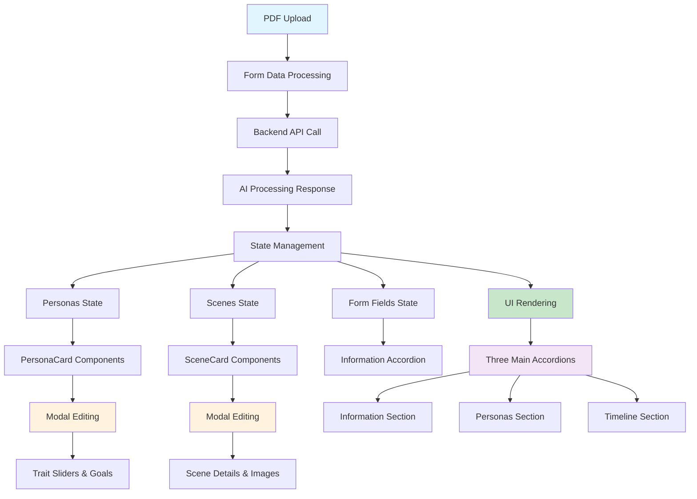

# Scenario Builder Architecture

## Overview

The Scenario Builder is a React-based frontend interface that enables users to create interactive business case study simulations. It integrates with the PDF parser backend to automatically generate scenarios from uploaded documents, while providing manual editing capabilities for personas, scenes, and learning objectives.

## Architecture Flow



## Key Components

### 1. **File Upload System**
- Drag-and-drop PDF upload interface
- File validation and preview
- Context files support for additional materials
- Visual feedback for upload states

### 2. **State Management**
- `personas`: Permanent persona data with traits and goals
- `tempPersonas`: Draft personas being created/edited
- `scenes`: Timeline scenes with descriptions and images
- Form fields: `name`, `description`, `learningOutcomes`

### 3. **Three-Section Accordion Layout**
- **Information**: Core scenario details and learning outcomes
- **Personas**: Character management with personality traits
- **Timeline**: Sequential scene creation with visual assets

### 4. **Modal Editing System**
- Full-screen editing for personas and scenes
- Real-time trait adjustment with sliders
- Image preview and persona selection
- Save/cancel functionality with validation

### 5. **Component Architecture**
```typescript
ScenarioBuilder (Main Container)
├── Modal (Overlay System)
├── PersonaCard (Character Display/Edit)
├── SceneCard (Timeline Scene Management)
└── Accordion Sections
    ├── Information (Form Fields)
    ├── Personas (Character Grid)
    └── Timeline (Scene Sequence)
```

## Data Processing Flow

### 1. **PDF to Personas Conversion**
- Filters out main character (student role)
- Maps AI personality traits to 1-5 scale sliders
- Formats goals and background descriptions
- Handles both temporary and permanent persona states

### 2. **Scene Generation Processing**
- Sorts scenes by sequence order
- Associates personas with each scene
- Integrates generated images from DALL-E
- Maintains user goals and descriptions

### 3. **Real-time State Updates**
- Immediate UI feedback for all changes
- Separate handling of draft vs. saved content
- Automatic form population from AI results

## UI/UX Features

- **Responsive Design**: Works across desktop and tablet devices
- **Visual Feedback**: Loading states, progress bars, and success indicators
- **Intuitive Editing**: Click-to-edit cards with modal overlays
- **Drag-and-Drop**: Modern file upload experience
- **Accessibility**: Proper ARIA labels and keyboard navigation

## API Integration

`POST /api/parse-pdf/` - Sends PDF and context files, receives structured scenario data with personas, scenes, and metadata for immediate UI population. 